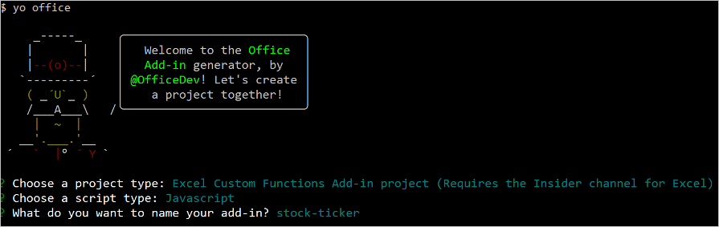
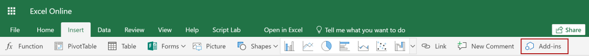
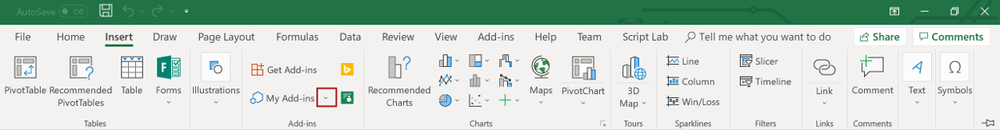
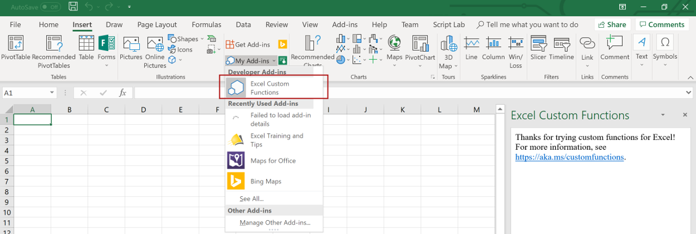

# Tutorial: Create custom functions in Excel (preview)

Custom functions enable you to add new functions to Excel by defining those functions in JavaScript as part of an add-in. Users within Excel can access custom functions as they would any native function in Excel, such as `SUM()`. You can create custom functions that perform simple tasks like calculations or more complex tasks such as streaming real-time data from the web into a worksheet.

In this tutorial, you will:
> [!div class="checklist"]
> * Create a custom function add-in using the [Yeoman generator for Office Add-ins](https://www.npmjs.com/package/generator-office). 
> * Use a prebuilt custom function to perform a simple calculation.
> * Create a custom function that gets data from the web.
> * Create a custom function that streams real-time data from the web.

[!include[Excel custom functions note](../includes/excel-custom-functions-note.md)]

## Prerequisites

[!include[Yeoman generator prerequisites](../includes/quickstart-yo-prerequisites.md)]

* Excel for Windows (64-bit version 1810 or later) or Excel Online

* Join the [Office Insider program](https://products.office.com/office-insider) (**Insider** level -- formerly called "Insider Fast")

## Create a custom functions project

 To start, you'll create the code project to build your custom function add-in. The [Yeoman generator for Office Add-ins](https://www.npmjs.com/package/generator-office) will set up your project with some prebuilt custom functions that you can try out.

1. Run the following command and then answer the prompts as follows.
    
    ```command&nbsp;line
    yo office
    ```
    
    * **Choose a project type:** `Excel Custom Functions Add-in project (...)`
    * **Choose a script type:** `JavaScript`
    * **What do you want to name your add-in?** `stock-ticker`

    
    
    The Yeoman generator will create the project files and install supporting Node components.

2. Navigate to the root folder of the project.
    
    ```command&nbsp;line
    cd stock-ticker
    ```

3. Build the project.
    
    ```command&nbsp;line
    npm run build
    ```

4. Start the local web server, which runs in Node.js. You can try out the custom function add-in in Excel for Windows or Excel Online.

# [Excel for Windows](#tab/excel-windows)

To test your add-in in Excel for Windows, run the following command. When you run this command, the local web server will start and Excel for Windows will open with your add-in loaded.

```command&nbsp;line
npm run start:desktop
```

> [!NOTE]
> Office Add-ins should use HTTPS, not HTTP, even when you are developing. If you are prompted to install a certificate after you run `npm run start:desktop`, accept the prompt to install the certificate that the Yeoman generator provides. 

# [Excel Online](#tab/excel-online)

To test your add-in in Excel Online, run the following command. When you run this command, the local web server will start.

```command&nbsp;line
npm run start:web
```

> [!NOTE]
> Office Add-ins should use HTTPS, not HTTP, even when you are developing. If you are prompted to install a certificate after you run `npm run start:web`, accept the prompt to install the certificate that the Yeoman generator provides. 

To use your custom functions add-in, open a new workbook in Excel Online. In this workbook, complete the following steps to sideload your add-in.

1. In Excel Online, choose the **Insert** tab and then choose **Add-ins**.

   
   
2. Choose **Manage My Add-ins** and select **Upload My Add-in**.

3. Choose **Browse...** and navigate to the root directory of the project that the Yeoman generator created.

4. Select the file **manifest.xml** and choose **Open**, then choose **Upload**.

--- 
    
## Try out a prebuilt custom function

The custom functions project that you created contains some prebuilt custom functions, defined within the **./src/functions/functions.js** file. The **./manifest.xml** file specifies that all custom functions belong to the `CONTOSO` namespace. You'll use the CONTOSO namespace to access the custom functions in Excel.

Next you'll try out the `ADD` custom function by completing the following steps:

1. In Excel, go to any cell and enter `=CONTOSO`. Notice that the autocomplete menu shows the list of all functions in the `CONTOSO` namespace.

2. Run the `CONTOSO.ADD` function, with numbers `10` and `200` as input parameters, by typing the value `=CONTOSO.ADD(10,200)` in the cell and pressing enter.

The `ADD` custom function computes the sum of the two numbers that you provided and returns the result of **210**.

## Create a custom function that requests data from the web

Integrating data from the Web is a great way to extend Excel through custom functions. Next you’ll create a custom function named `stockPrice` that gets a stock quote from a Web API and returns the result to the cell of a worksheet. You’ll use the IEX Trading API, which is free and does not require authentication.

1. In the **stock-ticker** project, find the file **./src/functions/functions.js** and open it in your code editor.

2. In **functions.js**, locate the `increment` function and add the following code after that function.

    ```js
    /**
    * Fetches current stock price
    * @customfunction 
    * @param {string} ticker Stock symbol
    * @returns {number} The current stock price.
    */
    function stockPrice(ticker) {
        var url = "https://api.iextrading.com/1.0/stock/" + ticker + "/price";
        return fetch(url)
            .then(function(response) {
                return response.text();
            })
            .then(function(text) {
                return parseFloat(text);
            });

        // Note: in case of an error, the returned rejected Promise
        //    will be bubbled up to Excel to indicate an error.
    }
    CustomFunctions.associate("STOCKPRICE", stockPrice);
    ```

    The `CustomFunctions.associate` code associates the `id` of the function with the function address of `increment` in JavaScript so that Excel can call your function.

3. Complete the following steps (for either Excel for Windows or Excel Online) to re-register the add-in in Excel. You must complete these steps before the new function will be available. 

# [Excel for Windows](#tab/excel-windows)

1. Close Excel and then reopen Excel.

2. In Excel, choose the **Insert** tab and then choose the down-arrow located to the right of **My Add-ins**.
    

3. In the list of available add-ins, find the **Developer Add-ins** section and select the **stock-ticker** add-in to register it.
    

# [Excel Online](#tab/excel-online)

1. In Excel Online, choose the **Insert** tab and then choose **Add-ins**.
    

2. Choose **Manage My Add-ins** and select **Upload My Add-in**. 

3. Choose **Browse...** and navigate to the root directory of the project that the Yeoman generator created. 

4. Select the file **manifest.xml** and choose **Open**, then choose **Upload**.

--- 

<ol start="4">
<li> Try out the new function. In cell <strong>B1</strong>, type the text <strong>=CONTOSO.STOCKPRICE("MSFT")</strong> and press enter. You should see that the result in cell <strong>B1</strong> is the current stock price for one share of Microsoft stock.</li>
</ol>

## Create a streaming asynchronous custom function

The `stockPrice` function returns the price of a stock at a specific moment in time, but stock prices are always changing. 
Next you’ll create a custom function named `stockPriceStream` that gets the price of a stock every 1000 milliseconds.

1. In the **stock-ticker** project, add the following code to **./src/functions/functions.js** and save the file.

    ```js
    /**
    * Streams real time stock price
    * @customfunction 
    * @param {string} ticker Stock symbol
    * @param {CustomFunctions.StreamingInvocation<number>} invocation
    */
    function stockPriceStream(ticker, invocation) {
        var updateFrequency = 1000 /* milliseconds*/;
        var isPending = false;

        var timer = setInterval(function() {
            // If there is already a pending request, skip this iteration:
            if (isPending) {
                return;
            }

            var url = "https://api.iextrading.com/1.0/stock/" + ticker + "/price";
            isPending = true;

            fetch(url)
                .then(function(response) {
                    return response.text();
                })
                .then(function(text) {
                    invocation.setResult(parseFloat(text));
                })
                .catch(function(error) {
                    invocation.setResult(error);
                })
                .then(function() {
                    isPending = false;
                });
        }, updateFrequency);

        invocation.onCanceled = () => {
            clearInterval(timer);
        };
    }
    CustomFunctions.associate("STOCKPRICESTREAM", stockPriceStream);
    ```
    
    Before Excel can use your custom function, you need to describe it using metadata.
    
2. Complete the following steps (for either Excel for Windows or Excel Online) to re-register the add-in in Excel. You must complete these steps before the new function will be available. 

# [Excel for Windows](#tab/excel-windows)

1. Close Excel and then reopen Excel.

2. In Excel, choose the **Insert** tab and then choose the down-arrow located to the right of **My Add-ins**.
    

3. In the list of available add-ins, find the **Developer Add-ins** section and select the **stock-ticker** add-in to register it.
    

# [Excel Online](#tab/excel-online)

1. In Excel Online, choose the **Insert** tab and then choose **Add-ins**.
    

2. Choose **Manage My Add-ins** and select **Upload My Add-in**.

3. Choose **Browse...** and navigate to the root directory of the project that the Yeoman generator created.

4. Select the file **manifest.xml** and choose **Open**, then choose **Upload**.

--- 

<ol start="3">
<li>Try out the new function. In cell <strong>C1</strong>, type the text <strong>=CONTOSO.STOCKPRICESTREAM("MSFT")</strong> and press enter. Provided that the stock market is open, you should see that the result in cell <strong>C1</strong> is constantly updated to reflect the real-time price for one share of Microsoft stock.</li>
</ol>

## Next steps

Congratulations! You've created a new custom functions project, tried out a prebuilt function, created a custom function that requests data from the web, and created a custom function that streams real-time data from the web. You can also try out debugging this function using [the custom function debugging instructions](../excel/custom-functions-debugging.md). To learn more about custom functions in Excel, continue to the following article:

> [!div class="nextstepaction"]
> [Create custom functions in Excel](../excel/custom-functions-overview.md)

### Legal information

Data provided free by [IEX](https://iextrading.com/developer/). View [IEX's Terms of Use](https://iextrading.com/api-exhibit-a/). Microsoft's use of the IEX API in this tutorial is for educational purposes only.


