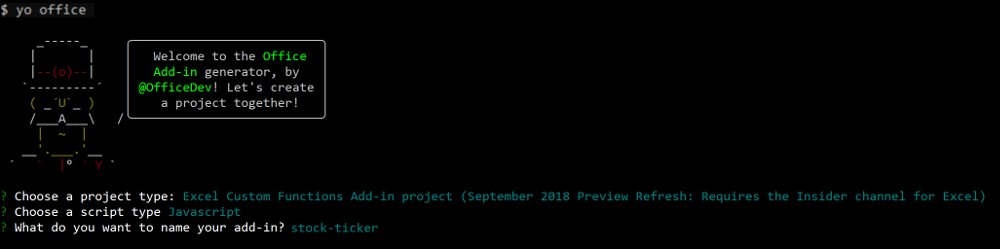

# Create a streaming Excel custom function

## Introduction

Custom functions enable you to add new functions to Excel by defining those functions in JavaScript as part of an add-in. Users within Excel can access custom functions just as they would any other native function in Excel, such as `SUM()`. You can create custom functions that perform simple tasks such as custom calculations or more complex tasks such as streaming real-time data from the web into a worksheet.

In this tutorial, you will learn how to:
> [!div class="checklist"]
> * Create a custom functions project by using the Yo Office generator
> * Use a prebuilt custom function to perform a simple calculation
> * Create a custom function that requests data from the web
> * Create a custom function that streams real-time data from the web

## Prerequisites

* [Node.js and npm](https://nodejs.org/en/)

* [Git Bash](https://git-scm.com/downloads) (or another Git client)

* The latest version of [Yeoman](http://yeoman.io/) and the [Yo Office generator](https://www.npmjs.com/package/generator-office). To install these tools globally, run the following command via the command prompt:

    ```bash
    npm install -g yo generator-office
    ```

* Excel 2016 for Windows (build number 10827 or later) or Excel Online

* [Join the Office Insider program](https://products.office.com/office-insider). 
    > [!NOTE]
    > Currently, you must join the Office Insider program in order to have access to custom functions. Custom functions are disabled across all Office builds unless you are a member of the Office Insider program.

## Create a custom functions project

You’ll begin this tutorial by using the Yo Office generator to create the files that you need for your custom functions project.

1. Run the following command and then answer the prompts as follows.

    ```bash
    yo office
    ```

    * Choose a project type: `Excel Custom Functions Add-in project (...)`
    * Choose a script type: `JavaScript`
    * What do you want to name your add-in? `stock-ticker`

    

    After you complete the wizard, the generator will create the project files and install supporting Node components.

2. Navigate to the project folder.

    ```bash
    cd stock-ticker
    ```

3. Start the local web server.

    ```bash
    npm start
    ```

4. Register your custom functions add-in in Excel by completing the following steps:

    * If you're using Excel 2016 for Windows:

        1. In Excel, select **Insert** > **My Add-ins** > **Insert an Add-in**. 
        2. In the list of available add-ins, find the **Developer Add-ins** section and select **Excel Custom Function** to register it.

    * If you're using Excel Online: 

        1. Select **Insert** > **Add-ins**. 
        2. Choose **Manage My Add-ins** and select **Upload My Add-in**. 
        3. Choose **Browse...** and navigate to the root directory of the project that the Yo Office generator created. 
        4. Select the file **manifest.xml** and choose **Open**, then choose **Upload**.

5. Update your project to add a reference to the custom functions library, by completing the following steps.

    1. In the root directory of the project that the Yo Office generator created, find the file **index.html** and open it in your code editor.

    2. In **index.html**, find the `<script>` tag that immediately follows the `<title>` tag. Remove that `<script>` tag and insert the following tag in the same location:

        ```html
        <script src="https://officedev.github.io/custom-functions/lib/custom-functions-runtime.js" type="text/javascript"></script>
        ```

## Try out a prebuilt custom function

The custom functions project that you created by using the Yo Office generator contains several prebuilt custom functions, defined within the **src/customfunction.js** file. The **manifest.xml** file in the root directory of the project specifies that all custom functions belong to the `CONTOSO` namespace.

At this point, the prebuilt custom functions in your project are loaded and available within Excel. Try out the `ADD42` custom function by completing the following steps in Excel:

1. Within a cell, type **=CONTOSO**. Notice that the autocomplete menu shows the list of all functions in the `CONTOSO` namespace.

2. Run the `CONTOSO.ADD42` function, with numbers `1` and `2` as input parameters, by specifying the following value in the cell and pressing enter:

    ```
    =CONTOSO.ADD42(1,2)
    ```

The `ADD42` custom function adds 42 to the two numbers that you specify as input parameters. Typing `=CONTOSO.ADD42(1,2)` should produce the result **45** in the cell after you press enter. When you type the formula   press enter

## Create a custom function that requests data from the web

What if you wanted a function that could fetch and display the price of Microsoft stock in real time? Custom functions are designed so you can easily request data from the web asynchronously.

Complete the following steps to create a custom function named STOCKPRICE that accepts a stock ticker (e.g., "MSFT") and returns the price of that stock. The custom function uses the IEX Trading API, that is free and does not require authentication.

1. Open your code editor of choice and navigate to the stock-ticker project folder. 
2. Copy and paste the function below and add it to **customfunctions.js**.

    You'll notice in this code that your asynchronous function returns a JavaScript Promise with the data from the IEX Trading API. Asynchronous custom functions require you to either return a new Promise or use JavaScript's async/await syntax.

    ```js
    function STOCKPRICE(ticker) {
        return new Promise(
            function(resolve) {
                let xhr = new XMLHttpRequest();
                let url = "https://api.iextrading.com/1.0/stock/" + ticker + "/price"
                //add handler for xhr
                xhr.onreadystatechange = function() {
                    if (xhr.readyState == XMLHttpRequest.DONE) {
                    //return result back to Excel
                    resolve(xhr.responseText);
                    }
                }
                //make request
                xhr.open('GET', url, true);
                xhr.send();
        });
    }
    ```

3. In order for Excel to properly run this function, you must add some metadata to the **./config/customfunctions.json** file.

    You'll notice that this JSON file describes the function, listing the types and dimensionality of the results and parameters.

    ```json
    {
        "id": "STOCKPRICE",
        "name": "STOCKPRICE",
        "description": "Multiplies number by 105",
        "helpUrl": "http://dev.office.com",
        "result": {
            "type": "number",
            "dimensionality": "scalar"
        },  
        "parameters": [
            {
                "name": "ticker",
                "description": "stock ticker name",
                "type": "string",
                "dimensionality": "scalar"
            }
        ],
    }
    ```

4. You will need to re-register this change once you have saved the file. In Excel, select **Insert > Add-ins > My Add-ins**. This will bring up a list of available add-ins. Under “Developer Add-ins" you will see your add-in, under the name “Excel Custom Function.” Select it to register it.

5. In cell B1, run the function `=CONTOSO.STOCKPRICE("MSFT")`. It should show you the current stock price for one share of Microsoft stock.

## Create a streaming asynchronous custom function

The previous function returned the stock price for Microsoft at a particular moment in time, but stock prices are always changing. With custom functions, it is possible to “stream” data from an API to get updates on stock prices in real time.

To do this, you’ll create a new function, `=CONTOSO.STOCKPRICESTREAM`. It makes a request for updated data every 1000 milliseconds. When a call is made, you may see `#GETTING_DATA` appear in a cell. Once a value is returned, this notification should disappear.

1. Copy and paste the code below into **customfunctions.js**.

    ```js
        function STOCKPRICESTREAM(ticker, caller){
        let result = 0;

        //return every second
        setInterval(function(){
        let xhr = new XMLHttpRequest();
        let url = "https://api.iextrading.com/1.0/stock/" + ticker + "/price";

        //add handler for xhr
        xhr.onreadystatechange = function() {
            if (xhr.readyState == XMLHttpRequest.DONE) {
                //return result back to Excel
                caller.setResult(xhr.responseText);
            }
        }

        //make request
        xhr.open('GET', url, true);
        xhr.send();
            }, 1000);
        }
    ```

2. Copy and paste the code below into to the **./config/customfunctions.json** file.

    You'll notice that this JSON file is very similar to the previous function's JSON file, but that a new section has been added for "options." Because this function is streaming, you must specify this as true in the JSON.

    ```json
    {
        "id": "STOCKPRICESTREAM",
        "name": "STOCKPRICESTREAM",
        "description": "Streams real time stock price",
        "helpUrl": "http://dev.office.com",
        "result": {
            "type": "number",
            "dimensionality": "scalar"
        },  
        "parameters": [
            {
                "name": "ticker",
                "description": "stock ticker name",
                "type": "string",
                "dimensionality": "scalar"
            }
        ],
        "options": {
            "stream": true
        }
    }
    ```

4. Re-register this change once you have saved the file. In Excel, select **Insert > Add-ins > My Add-ins**. This will bring up a list of available add-ins. Under “Developer Add-ins" you will see your add-in, under the name “Excel Custom Function.” Select it to register it.

5. In cell C1, run the function `=CONTOSO.STOCKPRICESTREAM("MSFT")`. You should see the price of Microsoft stock - that will update in real time right in your workbook.

## Next steps

You’ve completed the custom functions add-in tutorial. To learn more about custom functions, see [Create custom functions in Excel](../excel/custom-functions-overview.md).
> [!div class="nextstepaction"]
> [Create custom functions in Excel](../excel/custom-functions-overview.md)
