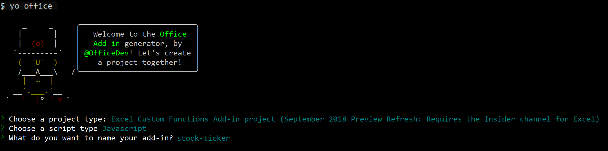

# Create a streaming Excel custom function

## Introduction

Custom functions enable you to add new functions to Excel by defining those functions in JavaScript as part of an add-in. Users within Excel can access custom functions like any other native function in Excel. You can create custom functions that perform simple tasks such as custom calculations or more complex tasks such as streaming data from the web into the worksheet in real-time.

In this tutorial, you will learn how to:
> [!div class="checklist"]
> * Create a custom function project by using the Yo Office generator
> * Create a custom function that performs a simple calculation
> * Create a custom function that requests data from the web
> * Create a custom function that streams real-time data from the web

## Prerequisites

* [Node.js and npm](https://nodejs.org/en/)
* [Git Bash](https://git-scm.com/downloads) (or another Git client)
* [Yeoman](http://yeoman.io/) and the [Yo Office generator](https://www.npmjs.com/package/generator-office)
* Office 2016 for Windows, build number 10827 or later. Also, you must [join the Office Insider program](https://products.office.com/office-insider). 

## Create your add-in project

You’ll begin this tutorial by using the Yo Office generator to create the files that you need for your custom functions project.

1. In your command line interface, run the following command and then answer the prompts as follows.

    ```bash
    yo office
    ```

    * Choose a project type: `Excel Custom Functions Add-in project (September 2018 Preview Refresh: Requires the Insider channel for Excel)`
    * Choose a script type: `JavaScript`
    * What do you want to name your add-in? `stock-ticker`

    

    After you complete the wizard, the generator will create the project files and install supporting Node components.

2. Run the following command to navigate to the project folder.

    ```bash
    cd stock-ticker
    ```

3. Run the following command to start the local web server.

    ```bash
    npm start
    ```

4. You will also need to register your custom functions add-in. In Excel, select **Insert > My Add-ins > Insert an Add-in**. This will bring up a list of available add-ins. Under "Developer Add-ins" you will see your add-in, under the name "Excel Custom Function". Select it to register it.

    Select **Insert > Add-ins**. Choose **Manage My Add-ins** and select **Upload My Add-in**. Click "Browse..." for your manifest file (`.\manifest.xml`), then click Open, select **Upload**.

5. Finally, change the script tag. Open up your add-in project in your favorite code editor. In **index.html** in the root folder, delete and replace the script tag immediately following the <title> tags with the code below:

    ```js
    <script src="https://unpkg.com/@microsoft/office-js@1.1.9-adhoc.22/dist/custom-functions-runtime.js" type="text/javascript"></script>
    ```

## Try out a basic custom function

Now the custom functions in your file will be loaded and ready to use. There are several pre-built functions for you in the Yo Office project. All are attached to a namespace called CONTOSO that is defined in the XML manifest file. When you start typing =CONTOSO in a cell, the list of available functions will appear.

Let's call the CONTOSO.ADD42() function, that adds 42 to any two numbers that you specify as arguments. In any cell, type `=CONTOSO.ADD42(1,2)`. It should deliver the answer 45.

## Create a custom function

What if you wanted a function that could fetch and display the price of Microsoft stock in real time? Custom functions are designed so you can easily request data from the web asynchronously.

Complete the following steps to create a custom function named STOCKPRICE that accepts a stock ticker (e.g., "MSFT") and returns the price of that stock. The custom function uses the IEX Trading API, that is free and does not require authentication.

1. Open your code editor of choice and navigate to the stock-ticker project folder. 
2. Copy and paste the function below and add it to **customfunctions.js**.

You'll notice in this code that your asynchronous function returns a JavaScript Promise with the data from the IEX Trading API. Asynchronous custom functions require you to either return a new Promise or use JavaScript's async/await syntax.

```js
function STOCKPRICE(ticker) {
    return new Promise(
        function(resolve) {
            let xhr = new XMLHttpRequest();
            let url = "https://api.iextrading.com/1.0/stock/" + ticker + "/price"
            //add handler for xhr
            xhr.onreadystatechange = function() {
                if (xhr.readyState == XMLHttpRequest.DONE) {
                //return result back to Excel
                resolve(xhr.responseText);
                }
            }
            //make request
            xhr.open('GET', url, true);
            xhr.send();
    });
}
```

3. In order for Excel to properly run this function, you must add some metadata to the **./config/customfunctions.json** file.

You'll notice that this JSON file describes the function, listing the types and dimensionality of the results and parameters.

```json
{
    "id": "STOCKPRICE",
    "name": "STOCKPRICE",
    "description": "Multiplies number by 105",
    "helpUrl": "http://dev.office.com",
    "result": {
        "type": "number",
        "dimensionality": "scalar"
    },  
    "parameters": [
        {
            "name": "ticker",
            "description": "stock ticker name",
            "type": "string",
            "dimensionality": "scalar"
        }
    ],
}
```

4. You will need to re-register this change once you have saved the file. In Excel, select **Insert > Add-ins > My Add-ins**. This will bring up a list of available add-ins. Under “Developer Add-ins" you will see your add-in, under the name “Excel Custom Function.” Select it to register it.

5. In cell B1, run the function `=CONTOSO.STOCKPRICE("MSFT")`. It should show you the current stock price for one share of Microsoft stock.

## Create a streaming asynchronous custom function

The previous function returned the stock price for Microsoft at a particular moment in time, but stock prices are always changing. With custom functions, it is possible to “stream” data from an API to get updates on stock prices in real time.

To do this, you’ll create a new function, `=CONTOSO.STOCKPRICESTREAM`. It makes a request for updated data every 1000 milliseconds. When a call is made, you may see `#GETTING_DATA` appear in a cell. Once a value is returned, this notification should disappear.

1. Copy and paste the code below into **customfunctions.js**.

```js
    function STOCKPRICESTREAM(ticker, caller){
    let result = 0;

    //return every second
    setInterval(function(){
    let xhr = new XMLHttpRequest();
    let url = "https://api.iextrading.com/1.0/stock/" + ticker + "/price";

    //add handler for xhr
    xhr.onreadystatechange = function() {
        if (xhr.readyState == XMLHttpRequest.DONE) {
            //return result back to Excel
            caller.setResult(xhr.responseText);
        }
    }

    //make request
    xhr.open('GET', url, true);
    xhr.send();
        }, 1000);
    }
```

3. Copy and paste the code below into to the **./config/customfunctions.json** file.

    You'll notice that this JSON file is very similar to the previous function's JSON file, but that a new section has been added for "options." Because this function is streaming, you must specify this as true in the JSON.

```json
{
    "id": "STOCKPRICESTREAM",
    "name": "STOCKPRICESTREAM",
    "description": "Streams real time stock price",
    "helpUrl": "http://dev.office.com",
    "result": {
        "type": "number",
        "dimensionality": "scalar"
    },  
    "parameters": [
        {
            "name": "ticker",
            "description": "stock ticker name",
            "type": "string",
            "dimensionality": "scalar"
        }
    ],
    "options": {
        "stream": true
    }
}
```

4. Re-register this change once you have saved the file. In Excel, select **Insert > Add-ins > My Add-ins**. This will bring up a list of available add-ins. Under “Developer Add-ins" you will see your add-in, under the name “Excel Custom Function.” Select it to register it.

5. In cell C1, run the function `=CONTOSO.STOCKPRICESTREAM("MSFT")`. You should see the price of Microsoft stock - that will update in real time right in your workbook.

## Next steps

You’ve completed the custom functions add-in tutorial. To learn more about custom functions, see [Create custom functions in Excel](../excel/custom-functions-overview.md).
> [!div class="nextstepaction"]
> [Create custom functions in Excel](../excel/custom-functions-overview.md)
