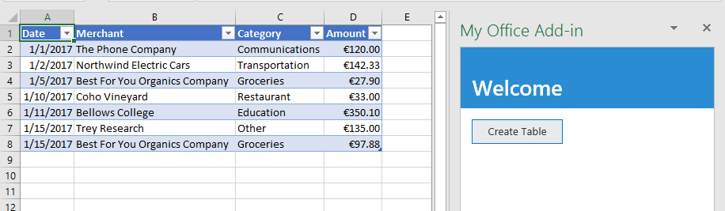
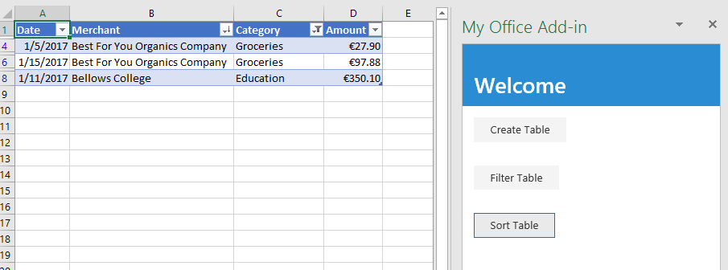
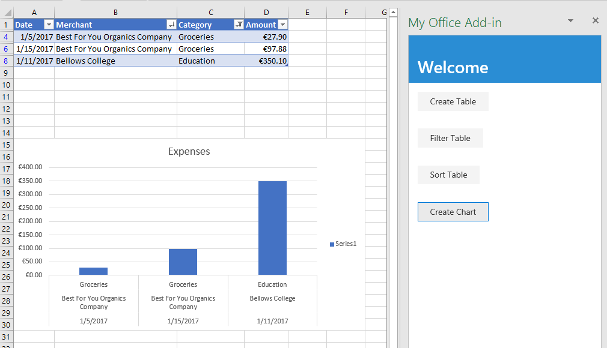
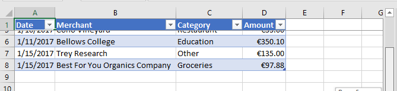
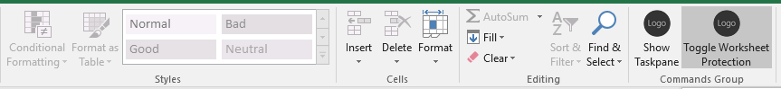
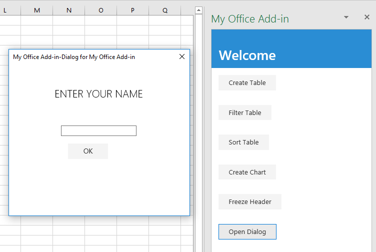

# Tutorial: Create an Excel task pane add-in

In this tutorial, you'll create an Excel task pane add-in that:

> [!div class="checklist"]
> * Creates a table
> * Filters and sorts a table
> * Creates a chart
> * Freezes a table header
> * Protects a worksheet
> * Opens a dialog

## Prerequisites

To use this tutorial, you need to have the following installed. 

- Excel 2016, version 1711 (Build 8730.1000 Click-to-Run) or later. You might need to be an Office Insider to get this version. For more information, see [Be an Office Insider](https://products.office.com/office-insider?tab=tab-1).

- [Node](https://nodejs.org/en/) 

- [Git Bash](https://git-scm.com/downloads) (or another Git client)

## Create your add-in project

Complete the following steps to create the Excel add-in project that you'll use as the basis for this tutorial.

1. Clone the GitHub repository [Excel add-in tutorial](https://github.com/OfficeDev/Excel-Add-in-Tutorial).

2. Open a Git bash window, or Node.JS-enabled system prompt, and navigate to the **Start** folder of the project.

3. Run the command `npm install` to install the tools and libraries listed in the package.json file. 

4. Carry out the steps in [Adding Self-Signed Certificates as Trusted Root Certificate](https://github.com/OfficeDev/generator-office/blob/master/src/docs/ssl.md) to trust the certificate for your development computer's operating system.

## Create a table

In this step of the tutorial, you'll programmatically test that your add-in supports the user's current version of Excel, add a table to a worksheet, populate the table with data, and format it.

### Code the add-in

1. Open the project in your code editor.

2. Open the file index.html.

3. Replace the `TODO1` with the following markup:

    ```html
    <button class="ms-Button" id="create-table">Create Table</button>
    ```

4. Open the app.js file.

5. Replace the `TODO1` with the following code. This code determines whether the user's version of Excel supports a version of Excel.js that includes all the APIs that this series of tutorials will use. In a production add-in, use the body of the conditional block to hide or disable the UI that would call unsupported APIs. This will enable the user to still make use of the parts of the add-in that are supported by their version of Excel.

    ```js
    if (!Office.context.requirements.isSetSupported('ExcelApi', 1.7)) {
        console.log('Sorry. The tutorial add-in uses Excel.js APIs that are not available in your version of Office.');
    }
    ```

6. Replace the `TODO2` with the following code:

    ```js
    $('#create-table').click(createTable);
    ```

7. Replace the `TODO3` with the following code. Note:

   - Your Excel.js business logic will be added to the function that is passed to `Excel.run`. This logic does not execute immediately. Instead, it is added to a queue of pending commands.

   - The `context.sync` method sends all queued commands to Excel for execution.

   - The `Excel.run` is followed by a `catch` block. This is a best practice that you should always follow. 

    ```js
    function createTable() {
        Excel.run(function (context) {

            // TODO4: Queue table creation logic here.

            // TODO5: Queue commands to populate the table with data.

            // TODO6: Queue commands to format the table.

            return context.sync();
        })
        .catch(function (error) {
            console.log("Error: " + error);
            if (error instanceof OfficeExtension.Error) {
                console.log("Debug info: " + JSON.stringify(error.debugInfo));
            }
        });
    }
    ```

8. Replace `TODO4` with the following code. Note:

   - The code creates a table by using `add` method of a worksheet's table collection, which always exists even if it is empty. This is the standard way that Excel.js objects are created. There are no class constructor APIs, and you never use a `new` operator to create an Excel object. Instead, you add to a parent collection object.

   - The first parameter of the `add` method is the range of only the top row of the table, not the entire range the table will ultimately use. This is because when the add-in populates the data rows (in the next step), it will add new rows to the table instead of writing values to the cells of existing rows. This is a more common pattern because the number of rows that a table will have is often not known when the table is created.

   - Table names must be unique across the entire workbook, not just the worksheet.

    ```js
    const currentWorksheet = context.workbook.worksheets.getActiveWorksheet();
    const expensesTable = currentWorksheet.tables.add("A1:D1", true /*hasHeaders*/);
    expensesTable.name = "ExpensesTable";
    ```

9. Replace `TODO5` with the following code. Note:

   - The cell values of a range are set with an array of arrays.

   - New rows are created in a table by calling the `add` method of the table's row collection. You can add multiple rows in a single call of `add` by including multiple cell value arrays in the parent array that is passed as the second parameter.

    ```js
    expensesTable.getHeaderRowRange().values =
        [["Date", "Merchant", "Category", "Amount"]];

    expensesTable.rows.add(null /*add at the end*/, [
        ["1/1/2017", "The Phone Company", "Communications", "120"],
        ["1/2/2017", "Northwind Electric Cars", "Transportation", "142.33"],
        ["1/5/2017", "Best For You Organics Company", "Groceries", "27.9"],
        ["1/10/2017", "Coho Vineyard", "Restaurant", "33"],
        ["1/11/2017", "Bellows College", "Education", "350.1"],
        ["1/15/2017", "Trey Research", "Other", "135"],
        ["1/15/2017", "Best For You Organics Company", "Groceries", "97.88"]
    ]);
    ```

10. Replace `TODO6` with the following code. Note:

   - The code gets a reference to the **Amount** column by passing its zero-based index to the `getItemAt` method of the table's column collection.

     > [!NOTE]
     > Excel.js collection objects, such as `TableCollection`, `WorksheetCollection`, and `TableColumnCollection` have an `items` property that is an array of the child object types, such as `Table` or `Worksheet` or `TableColumn`; but a `*Collection` object is not itself an array.

   - The code then formats the range of the **Amount** column as Euros to the second decimal. 

   - Finally, it ensures that the width of the columns and height of the rows is big enough to fit the longest (or tallest) data item. Notice that the code must get `Range` objects to format. `TableColumn` and `TableRow` objects do not have format properties.

        ```js
        expensesTable.columns.getItemAt(3).getRange().numberFormat = [['€#,##0.00']];
        expensesTable.getRange().format.autofitColumns();
        expensesTable.getRange().format.autofitRows();
        ```

### Test the add-in

1. Open a Git bash window, or Node.JS-enabled system prompt, and navigate to the **Start** folder of the project.

2. Run the command `npm run build` to transpile your ES6 source code to an earlier version of JavaScript that is supported by Internet Explorer (which is used under-the-hood by Excel to run Excel add-ins).

3. Run the command `npm start` to start a web server running on localhost.

4. Sideload the add-in by using one of the following methods:

    - Windows: [Sideload Office Add-ins on Windows](../testing/create-a-network-shared-folder-catalog-for-task-pane-and-content-add-ins.md)

    - Excel Online: [Sideload Office Add-ins in Office Online](../testing/sideload-office-add-ins-for-testing.md#sideload-an-office-add-in-in-office-online)

    - iPad and Mac: [Sideload Office Add-ins on iPad and Mac](../testing/sideload-an-office-add-in-on-ipad-and-mac.md)

5. On the **Home** menu, choose **Show Taskpane**.

6. In the task pane, choose **Create Table**.

    

## Filter and sort a table

In this step of the tutorial, you'll filter and sort the table that you created previously.

### Filter the table

1. Open the project in your code editor.

2. Open the file index.html.

3. Just below the `div` that contains the `create-table` button, add the following markup:

    ```html
    <div class="padding">
        <button class="ms-Button" id="filter-table">Filter Table</button>
    </div>
    ```

4. Open the app.js file.

5. Just below the line that assigns a click handler to the `create-table` button, add the following code:

    ```js
    $('#filter-table').click(filterTable);
    ```

6. Just below the `createTable` function, add the following function:

    ```js
    function filterTable() {
        Excel.run(function (context) {

            // TODO1: Queue commands to filter out all expense categories except
            //        Groceries and Education.

            return context.sync();
        })
        .catch(function (error) {
            console.log("Error: " + error);
            if (error instanceof OfficeExtension.Error) {
                console.log("Debug info: " + JSON.stringify(error.debugInfo));
            }
        });
    }
    ```

7. Replace `TODO1` with the following code. Note:

   - The code first gets a reference to the column that needs filtering by passing the column name to the `getItem` method, instead of passing its index to the `getItemAt` method as the `createTable` method does. Since users can move table columns, the column at a given index might change after the table is created. Hence, it is safer to use the column name to get a reference to the column. We used `getItemAt` safely in the preceding tutorial, because we used it in the very same method that creates the table, so there is no chance that a user has moved the column.

   - The `applyValuesFilter` method is one of several filtering methods on the `Filter` object.

    ```js
    const currentWorksheet = context.workbook.worksheets.getActiveWorksheet();
    const expensesTable = currentWorksheet.tables.getItem('ExpensesTable');
    const categoryFilter = expensesTable.columns.getItem('Category').filter;
    categoryFilter.applyValuesFilter(["Education", "Groceries"]);
    ``` 

### Sort the table

1. Open the file index.html.

2. Below the `div` that contains the `filter-table` button, add the following markup:

    ```html
    <div class="padding">
        <button class="ms-Button" id="sort-table">Sort Table</button>
    </div>
    ```

3. Open the app.js file.

4. Below the line that assigns a click handler to the `filter-table` button, add the following code:

    ```js
    $('#sort-table').click(sortTable);
    ```

5. Below the `filterTable` function add the following function.

    ```js
    function sortTable() {
        Excel.run(function (context) {

            // TODO1: Queue commands to sort the table by Merchant name.

            return context.sync();
        })
        .catch(function (error) {
            console.log("Error: " + error);
            if (error instanceof OfficeExtension.Error) {
                console.log("Debug info: " + JSON.stringify(error.debugInfo));
            }
        });
    }
    ```

6. Replace `TODO1` with the following code. Note:

   - The code creates an array of `SortField` objects which has just one member since the add-in only sorts on the Merchant column.

   - The `key` property of a `SortField` object is the zero-based index of the column to sort-on.

   - The `sort` member of a `Table` is a `TableSort` object, not a method. The `SortField`s are passed to the `TableSort` object's `apply` method.

    ```js
    const currentWorksheet = context.workbook.worksheets.getActiveWorksheet();
    const expensesTable = currentWorksheet.tables.getItem('ExpensesTable');
    const sortFields = [
        {
            key: 1,            // Merchant column
            ascending: false,
        }
    ];

    expensesTable.sort.apply(sortFields);
    ```

### Test the add-in

1. If the Git bash window, or Node.JS-enabled system prompt, from the previous stage tutorial is still open, enter Ctrl-C twice to stop the running web server. Otherwise, open a Git bash window, or Node.JS-enabled system prompt, and navigate to the **Start** folder of the project.

     > [!NOTE]
     > Although the browser-sync server reloads your add-in in the task pane every time you make a change to any file, including the app.js file, it does not retranspile the JavaScript, so you must repeat the build command in order for your changes to app.js to take effect. In order to do this, you need to kill the server process so that you can get a prompt to enter the build command. After the build, you restart the server. The next few steps carry out this process.

2. Run the command `npm run build` to transpile your ES6 source code to an earlier version of JavaScript that is supported by Internet Explorer (which is used under-the-hood by Excel to run Excel add-ins).

3. Run the command `npm start` to start a web server running on localhost.

4. Reload the task pane by closing it, and then on the **Home** menu, select **Show Taskpane** to reopen the add-in.

5. If for any reason the table is not in the open worksheet, in the task pane, choose **Create Table**.

6. Choose the **Filter Table** and **Sort Table** buttons, in either order.

    

## Create a chart

In this step of the tutorial, you'll create a chart using data from the table that you created previously, and then format the chart.

### Chart a chart using table data

1. Open the project in your code editor.

2. Open the file index.html.

3. Below the `div` that contains the `sort-table` button, add the following markup:

    ```html
    <div class="padding">
        <button class="ms-Button" id="create-chart">Create Chart</button>
    </div>
    ```

4. Open the app.js file.

5. Below the line that assigns a click handler to the `sort-chart` button, add the following code:

    ```js
    $('#create-chart').click(createChart);
    ```

6. Below the `sortTable` function add the following function.

    ```js
    function createChart() {
        Excel.run(function (context) {

            // TODO1: Queue commands to get the range of data to be charted.

            // TODO2: Queue command to create the chart and define its type.

            // TODO3: Queue commands to position and format the chart.

            return context.sync();
        })
        .catch(function (error) {
            console.log("Error: " + error);
            if (error instanceof OfficeExtension.Error) {
                console.log("Debug info: " + JSON.stringify(error.debugInfo));
            }
        });
    }
    ```

7. Replace `TODO1` with the following code. Note that in order to exclude the header row, the code uses the `Table.getDataBodyRange` method to get the range of data you want to chart instead of the `getRange` method.

    ```js
    const currentWorksheet = context.workbook.worksheets.getActiveWorksheet();
    const expensesTable = currentWorksheet.tables.getItem('ExpensesTable');
    const dataRange = expensesTable.getDataBodyRange();
    ```

8. Replace `TODO2` with the following code. Note the following parameters:

   - The first parameter to the `add` method specifies the type of chart. There are several dozen types.

   - The second parameter specifies the range of data to include in the chart.

   - The third parameter determines whether a series of data points from the table should be charted row-wise or column-wise. The option `auto` tells Excel to decide the best method.

    ```js
    let chart = currentWorksheet.charts.add('ColumnClustered', dataRange, 'auto');
    ```

9. Replace `TODO3` with the following code. Most of this code is self-explanatory. Note:
   
   - The parameters to the `setPosition` method specify the upper left and lower right cells of the worksheet area that should contain the chart. Excel can adjust things like line width to make the chart look good in the space it has been given.
   
   - A "series" is a set of data points from a column of the table. Since there is only one non-string column in the table, Excel infers that the column is the only column of data points to chart. It interprets the other columns as chart labels. So there will be just one series in the chart and it will have index 0. This is the one to label with "Value in €".

    ```js
    chart.setPosition("A15", "F30");
    chart.title.text = "Expenses";
    chart.legend.position = "right"
    chart.legend.format.fill.setSolidColor("white");
    chart.dataLabels.format.font.size = 15;
    chart.dataLabels.format.font.color = "black";
    chart.series.getItemAt(0).name = 'Value in €';
    ```

### Test the add-in

1. If the Git bash window, or Node.JS-enabled system prompt, from the previous stage tutorial is still open, enter Ctrl-C twice to stop the running web server. Otherwise, open a Git bash window, or Node.JS-enabled system prompt, and navigate to the **Start** folder of the project.

     > [!NOTE]
     > Although the browser-sync server reloads your add-in in the task pane every time you make a change to any file, including the app.js file, it does not retranspile the JavaScript, so you must repeat the build command in order for your changes to app.js to take effect. In order to do this, you need to kill the server process in so that you can get a prompt to enter the build command. After the build, you restart the server. The next few steps carry out this process.

2. Run the command `npm run build` to transpile your ES6 source code to an earlier version of JavaScript that is supported by Internet Explorer (which is used under-the-hood by Excel to run Excel add-ins).

3. Run the command `npm start` to start a web server running on localhost.

4. Reload the task pane by closing it, and then on the **Home** menu, select **Show Taskpane** to reopen the add-in.

5. If for any reason the table is not in the open worksheet, in the task pane, choose **Create Table** and then **Filter Table** and **Sort Table** buttons, in either order.

6. Choose the **Create Chart** button. A chart is created and only the data from the rows that have been filtered are included. The labels on the data points across the bottom are in the sort order of the chart; that is, merchant names in reverse alphabetical order.

    

## Freeze a table header

When a table is long enough that a user must scroll to see some rows, the header row can scroll out of sight. In this step of the tutorial, you'll freeze the header row of the table that you created previously, so that it remains visible even as the user scrolls down the worksheet.

### Freeze the table's header row

1. Open the project in your code editor.

2. Open the file index.html.

3. Below the `div` that contains the `create-chart` button, add the following markup:

    ```html
    <div class="padding">
        <button class="ms-Button" id="freeze-header">Freeze Header</button>
    </div>
    ```

4. Open the app.js file.

5. Below the line that assigns a click handler to the `create-chart` button, add the following code:

    ```js
    $('#freeze-header').click(freezeHeader);
    ```

6. Below the `createChart` function add the following function:

    ```js
    function freezeHeader() {
        Excel.run(function (context) {

            // TODO1: Queue commands to keep the header visible when the user scrolls.

            return context.sync();
        })
        .catch(function (error) {
            console.log("Error: " + error);
            if (error instanceof OfficeExtension.Error) {
                console.log("Debug info: " + JSON.stringify(error.debugInfo));
            }
        });
    }
    ```

7. Replace `TODO1` with the following code. Note:

   - The `Worksheet.freezePanes` collection is a set of panes in the worksheet that are pinned, or frozen, in place when the worksheet is scrolled.

   - The `freezeRows` method takes as a parameter the number of rows, from the top that are to be pinned in place. We pass `1` to pin the first row in place.

    ```js
    const currentWorksheet = context.workbook.worksheets.getActiveWorksheet();
    currentWorksheet.freezePanes.freezeRows(1);
    ```

### Test the add-in

1. If the Git bash window, or Node.JS-enabled system prompt, from the previous stage tutorial is still open, enter Ctrl-C twice to stop the running web server. Otherwise, open a Git bash window, or Node.JS-enabled system prompt, and navigate to the **Start** folder of the project.

     > [!NOTE]
     > Although the browser-sync server reloads your add-in in the task pane every time you make a change to any file, including the app.js file, it does not retranspile the JavaScript, so you must repeat the build command in order for your changes to app.js to take effect. In order to do this, you need to kill the server process in so that you can get a prompt to enter the build command. After the build, you restart the server. The next few steps carry out this process.

2. Run the command `npm run build` to transpile your ES6 source code to an earlier version of JavaScript that is supported by Internet Explorer (which is used under-the-hood by Excel to run Excel add-ins).

3. Run the command `npm start` to start a web server running on localhost.

4. Reload the task pane by closing it, and then on the **Home** menu, select **Show Taskpane** to reopen the add-in.

5. If the table is in the worksheet, delete it.

6. In the task pane, choose **Create Table**.

7. Choose the **Freeze Header** button.

8. Scroll down the worksheet enough to to see that the table header remains visible at the top even when the higher rows scroll out of sight.

    

## Protect a worksheet

In this step of the tutorial, you'll add another button to the ribbon that, when chosen, executes a function that you'll define to toggle worksheet protection on and off.

### Configure the manifest to add a second ribbon button

1. Open the manifest file my-office-add-in-manifest.xml.

2. Find the `<Control>` element. This element defines the **Show Taskpane** button on the **Home** ribbon you have been using to launch the add-in. We're going to add a second button to the same group on the **Home** ribbon. In between the end Control tag (`</Control>`) and the end Group tag (`</Group>`), add the following markup.

    ```xml
    <Control xsi:type="Button" id="<!--TODO1: Unique (in manifest) name for button -->">
        <Label resid="<!--TODO2: Button label -->" />
        <Supertip>            
            <Title resid="<!-- TODO3: Button tool tip title -->" />
            <Description resid="<!-- TODO4: Button tool tip description -->" />
        </Supertip>
        <Icon>
            <bt:Image size="16" resid="Contoso.tpicon_16x16" />
            <bt:Image size="32" resid="Contoso.tpicon_32x32" />
            <bt:Image size="80" resid="Contoso.tpicon_80x80" />
        </Icon>
        <Action xsi:type="<!-- TODO5: Specify the type of action-->">
            <!-- TODO6: Identify the function.-->
        </Action>
    </Control>
    ```

3. Replace `TODO1` with a string that gives the button an ID that is unique within this manifest file. There's only one other button in the manifest, so this isn't difficult. Since our button is going to toggle protection of the worksheet on and off, use "ToggleProtection". When you are done, the entire start Control tag should look like the following:

    ```xml
    <Control xsi:type="Button" id="ToggleProtection">
    ```

4. The next three `TODO`s set "resid"s, which is short for resource ID. A resource is a string, and you'll create these three strings in a later step. For now, you need to give IDs to the resources. The button label should read "Toggle Protection", but the *ID* of this string should be "ProtectionButtonLabel", so the completed `Label` element should look like the following code:

    ```xml
    <Label resid="ProtectionButtonLabel" />
    ```

5. The `SuperTip` element defines the tool tip for the button. The tool tip title should be the same as the button label, so we use the very same resource ID: "ProtectionButtonLabel". The tool tip description will be "Click to turn protection of the worksheet on and off". But the `ID` should be "ProtectionButtonToolTip". So, when you are done, the whole `SuperTip` markup should look like the following code: 

    ```xml
    <Supertip>            
        <Title resid="ProtectionButtonLabel" />
        <Description resid="ProtectionButtonToolTip" />
    </Supertip>
    ```

   > [!NOTE] 
   > In a production add-in, you would not want to use the same icon for two different buttons; but to simplify this tutorial, we'll do that. So the `Icon` markup in our new `Control` is just a copy of the `Icon` element from the existing `Control`. 

6. The `Action` element inside the original `Control` element that was already present in the manifest, has its type set to `ShowTaskpane`, but our new button isn't going to open a task pane; it's going to run a custom function that you create in a later step. So replace `TODO5` with `ExecuteFunction` which is the action type for buttons that trigger custom functions. The start `Action` tag should look like the following code:
 
    ```xml
    <Action xsi:type="ExecuteFunction">
    ```

7. The original `Action` element has child elements that specify a task pane ID and a URL of the page that should be opened in the task pane. But an `Action` element of the `ExecuteFunction` type has a single child element that names the function that the control executes. You'll create that function in a later step, and it will be called `toggleProtection`. So, replace `TODO6` with the following markup:
 
    ```xml
    <FunctionName>toggleProtection</FunctionName>
    ```

    The entire `Control` markup should now look like the following:

    ```xml
    <Control xsi:type="Button" id="ToggleProtection">
        <Label resid="ProtectionButtonLabel" />
        <Supertip>            
            <Title resid="ProtectionButtonLabel" />
            <Description resid="ProtectionButtonToolTip" />
        </Supertip>
        <Icon>
            <bt:Image size="16" resid="Contoso.tpicon_16x16" />
            <bt:Image size="32" resid="Contoso.tpicon_32x32" />
            <bt:Image size="80" resid="Contoso.tpicon_80x80" />
        </Icon>
        <Action xsi:type="ExecuteFunction">
           <FunctionName>toggleProtection</FunctionName>
        </Action>
    </Control>
    ```

8. Scroll down to the `Resources` section of the manifest.

9. Add the following markup as a child of the `bt:ShortStrings` element.

    ```xml
    <bt:String id="ProtectionButtonLabel" DefaultValue="Toggle Worksheet Protection" />
    ```

10. Add the following markup as a child of the `bt:LongStrings` element.

    ```xml
    <bt:String id="ProtectionButtonToolTip" DefaultValue="Click to protect or unprotect the current worksheet." />
    ```

11. Save the file.

### Create the function that protects the sheet

1. Open the file \function-file\function-file.js.

2. The file already has an Immediately Invoked Function Expression (IFFE). No custom initialization logic is needed, so leave the function that is assigned to `Office.initialize` with an empty body. (But do not delete it. The `Office.initialize` property cannot be null or undefined.) *Outside of the IIFE*, add the following code. Note that we specify an `args` parameter to the method and the very last line of the method calls `args.completed`. This is a requirement for all add-in commands of type **ExecuteFunction**. It signals the Office host application that the function has finished and the UI can become responsive again.

    ```javascript
    function toggleProtection(args) {
        Excel.run(function (context) {
            
            // TODO1: Queue commands to reverse the protection status of the current worksheet.

            return context.sync();
        })
        .catch(function (error) {
            console.log("Error: " + error);
            if (error instanceof OfficeExtension.Error) {
                console.log("Debug info: " + JSON.stringify(error.debugInfo));
            }
        });
		args.completed();
    }
    ```

3. Replace `TODO1` with the following code. This code uses the worksheet object's protection property in a standard toggle pattern. The `TODO2` will be explained in the next section.

    ```javascript
    const sheet = context.workbook.worksheets.getActiveWorksheet();

    // TODO2: Queue command to load the sheet's "protection.protected" property from
    //        the document and re-synchronize the document and task pane.

     if (sheet.protection.protected) {
        sheet.protection.unprotect();
    } else {
        sheet.protection.protect();
    }
    ``` 

### Add code to fetch document properties into the task pane's script objects

In all the earlier functions in this series of tutorials, you queued commands to *write* to the Office document. Each function ended with a call to the `context.sync()` method which sends the queued commands to the document to be executed. But the code you added in the last step calls the `sheet.protection.protected` property, and this is a significant difference from the earlier functions you wrote, because the `sheet` object is only a proxy object that exists in your task pane's script. It doesn't know what the actual protection state of the document is, so its `protection.protected` property can't have a real value. It is necessary to first fetch the protection status from the document and use it set the value of `sheet.protection.protected`. Only then can `sheet.protection.protected` be called without causing an exception to be thrown. This fetching process has three steps:

   1. Queue a command to load (that is; fetch) the properties that your code needs to read.

   2. Call the context object's `sync` method to send the queued command to the document for execution and return the requested information.

   3. Because the `sync` method is asynchronous, ensure that it has completed before your code calls the properties that were fetched.

These steps must be completed whenever your code needs to *read* information from the Office document.

1. In the `toggleProtection` function, replace `TODO2` with the following code. Note:
   
   - Every Excel object has a `load` method. You specify the properties of the object that you want to read in the parameter as a string of comma-delimited names. In this case, the property you need to read is a subproperty of the `protection` property. You reference the subproperty almost exactly as you would anywhere else in your code, with the exception that you use a forward slash ('/') character instead of a "." character.

   - To ensure that the toggle logic, which reads `sheet.protection.protected`, does not run until after the `sync` is complete and the `sheet.protection.protected` has been assigned the correct value that is fetched from the document, it will be moved (in the next step) into a `then` function that won't run until the `sync` has completed. 

    ```javascript
    sheet.load('protection/protected');
    return context.sync()
        .then(
            function() {
                // TODO3: Move the queued toggle logic here.
            }
        )
        // TODO4: Move the final call of `context.sync` here and ensure that it
        //        does not run until the toggle logic has been queued.
    ``` 

2. You can't have two `return` statements in the same unbranching code path, so delete the final line `return context.sync();` at the end of the `Excel.run`. You will add a new final `context.sync`, in a later step.

3. Cut the `if ... else` structure in the `toggleProtection` function and paste it in place of `TODO3`.

4. Replace `TODO4` with the following code. Note:

   - Passing the `sync` method to a `then` function ensures that it does not run until either `sheet.protection.unprotect()` or `sheet.protection.protect()` has been queued.

   - The `then` method invokes whatever function is passed to it, and you don't want `sync` to be invoked twice, so leave off the "()" from the end of `context.sync`.

    ```javascript
    .then(context.sync);
    ```

   When you are done, the entire function should look like the following:

    ```javascript
    function toggleProtection(args) {
        Excel.run(function (context) {            
          const sheet = context.workbook.worksheets.getActiveWorksheet();          
          sheet.load('protection/protected');

          return context.sync()
              .then(
                  function() {
                    if (sheet.protection.protected) {
                        sheet.protection.unprotect();
                    } else {
                        sheet.protection.protect();
                    }
                  }
              )
              .then(context.sync);
        })
        .catch(function (error) {
            console.log("Error: " + error);
            if (error instanceof OfficeExtension.Error) {
                console.log("Debug info: " + JSON.stringify(error.debugInfo));
            }
        });
        args.completed();
    }
    ```

### Configure the script-loading HTML file

Open the /function-file/function-file.html file. This is a UI-less HTML file that is called when the user presses the **Toggle Worksheet Protection** button. Its purpose is to load the JavaScript method that should run when the button is pushed. You are not going to change this file. Simply note that the second `<script>` tag loads the functionfile.js.

   > [!NOTE]
   > The function-file.html file and the function-file.js file that it loads run in an entirely separate IE process from the add-in's task pane. If the function-file.js was transpiled into the same bundle.js file as the app.js file, then the add-in would have to load two copies of the bundle.js file, which defeats the purpose of bundling. In addition, the function-file.js file does not contain any JavaScript that is unsupported by IE. For these two reasons, this add-in does not transpile the function-file.js at all. 

### Test the add-in

1. Close all Office applications, including Excel. 

2. Delete the Office cache by deleting the contents of the cache folder. This is necessary to completely clear the old version of the add-in from the host. 

    - For Windows: `%LOCALAPPDATA%\Microsoft\Office\16.0\Wef\`.

    - For Mac: `/Users/{your_name_on_the_device}/Library/Containers/com.Microsoft.OsfWebHost/Data/`.

3. If for any reason, your server is not running, then in a Git Bash window, or Node.JS-enabled system prompt, navigate to the **Start** folder of the project and run the command `npm start`. You do not need to rebuild the project because the only JavaScript file you changed is not part of the built bundle.js.

4. Using the new version of the changed manifest file, repeat the sideloading process by using one of the following methods. *You should overwrite the previous copy of the manifest file.*

    - Windows: [Sideload Office Add-ins on Windows](../testing/create-a-network-shared-folder-catalog-for-task-pane-and-content-add-ins.md)

    - Excel Online: [Sideload Office Add-ins in Office Online](../testing/sideload-office-add-ins-for-testing.md#sideload-an-office-add-in-in-office-online)

    - iPad and Mac: [Sideload Office Add-ins on iPad and Mac](../testing/sideload-an-office-add-in-on-ipad-and-mac.md)

5. Open any worksheet in Excel.

6. On the **Home** ribbon, choose **Toggle Worksheet Protection**. Note that most of the controls on the ribbon are disabled (and visually grayed-out) as seen in screenshot below. 

7. Choose a cell as you would if you wanted to change its content. You get an error telling you that the worksheet is protected.

8. Choose **Toggle Worksheet Protection** again, and the controls are reenabled, and you can change cell values again.

    

## Open a dialog

In this final step of the tutorial, you'll open a dialog in your add-in, pass a message from the dialog process to the task pane process, and close the dialog. Office Add-in dialogs are *nonmodal*: a user can continue to interact with both the document in the host Office application and with the host page in the task pane.

### Create the dialog page

1. Open the project in your code editor.

2. Create a file in the root of the project (where index.html is) called popup.html.

3. Add the following markup to popup.html. Note:

   - The page has a `<input>` where the user will enter their name and a button that will send the name to the page in the task pane where it will be displayed.

   - The markup loads a script called popup.js that you will create in a later step.

   - It also loads the Office.JS library and jQuery because they will be used in popup.js.

    ```html
    <!DOCTYPE html>
    <html>
        <head lang="en">
            <title>Dialog for My Office Add-in</title>
            <meta charset="UTF-8">
            <meta name="viewport" content="width=device-width, initial-scale=1">

            <link rel="stylesheet" href="node_modules/office-ui-fabric-js/dist/css/fabric.min.css" />
            <link rel="stylesheet" href="node_modules/office-ui-fabric-js/dist/css/fabric.components.css" />
            <link rel="stylesheet" href="app.css" />

            <script type="text/javascript" src="https://appsforoffice.microsoft.com/lib/1.1/hosted/office.js"></script>
            <script type="text/javascript" src="https://ajax.aspnetcdn.com/ajax/jQuery/jquery-2.2.1.min.js"></script>
            <script type="text/javascript" src="popup.js"></script>

        </head>
        <body style="display:flex;flex-direction:column;align-items:center;justify-content:center">
            <div class="padding">
                <p class="ms-font-xl">ENTER YOUR NAME</p>
            </div>
            <div class="padding">
                <input id="name-box" type="text"/>
            </div>
            <div class="padding">
                <button id="ok-button" class="ms-Button">OK</button>
            </div>
        </body>
    </html>
    ```

4. Create a file in the root of the project called popup.js.

5. Add the following code to popup.js. Note:

   - *Every page that calls APIs in the Office.JS library must assign a function to the `Office.initialize` property.* If no initialization is needed, then the function can have an empty body, but the property must not be left undefined, assigned to null or to a non-function value. For an example, see the app.js file in the project root. The code that makes the assignment must run before any calls to Office.JS; hence the assignment is in a script file that is loaded by the page, as it is in this case.
   
   - The jQuery `ready` function is called inside the `initialize` method. It is an almost universal rule that the loading, initializing, or bootstrapping code of other JavaScript libraries should be inside the `Office.initialize` function.

    ```js
    (function () {
    "use strict";

        Office.initialize = function() {
            $(document).ready(function () {  

                // TODO1: Assign handler to the OK button.

            });
        }

        // TODO2: Create the OK button handler

    }());
    ```

6. Replace `TODO1` with the following code. You'll create the `sendStringToParentPage` function in the next step.

    ```js
    $('#ok-button').click(sendStringToParentPage);
    ```

7. Replace `TODO2` with the following code. The `messageParent` method passes its parameter to the parent page, in this case, the page in the task pane. The parameter can be a boolean or a string, which includes anything that can be serialized as a string, such as XML or JSON.

    ```js
    function sendStringToParentPage() {
        var userName = $('#name-box').val();
        Office.context.ui.messageParent(userName);
    }
    ```

8. Save the file.

   > [!NOTE]
   > The popup.html file, and the popup.js file that it loads, run in an entirely separate Internet Explorer process from the add-in's task pane. If the popup.js was transpiled into the same bundle.js file as the app.js file, then the add-in would have to load two copies of the bundle.js file, which defeats the purpose of bundling. In addition, the popup.js file does not contain any JavaScript that is unsupported by IE. For these two reasons, this add-in does not transpile the popup.js file at all.

### Open the dialog from the task pane

1. Open the file index.html.

2. Below the `div` that contains the `freeze-header` button, add the following markup:

    ```html
    <div class="padding">
        <button class="ms-Button" id="open-dialog">Open Dialog</button>
    </div>
    ```

3. The dialog will prompt the user to enter a name and pass the user's name to the task pane. The task pane will display it in a label. Immediately below the `div` that you just added, add the following markup:

    ```html
    <div class="padding">
        <label id="user-name"></label>
    </div>
    ```

4. Open the app.js file.

5. Below the line that assigns a click handler to the `freeze-header` button, add the following code. You'll create the `openDialog` method in a later step.

    ```js
    $('#open-dialog').click(openDialog);
    ```

6. Below the `freezeHeader` function add the following declaration. This variable is used to hold an object in the parent page's execution context that acts as an intermediator to the dialog page's execution context.

    ```js
    let dialog = null;
    ```

7. Below the declaration of `dialog`, add the following function. The important thing to notice about this code is what is *not* there: there is no call of `Excel.run`. This is because the API to open a dialog is shared among all Office hosts, so it is part of the Office JavaScript Common API, not the Excel-specific API.

    ```js
    function openDialog() {
        // TODO1: Call the Office Common API that opens a dialog
    }
    ```

8. Replace `TODO1` with the following code. Note:

   - The `displayDialogAsync` method opens a dialog in the center of the screen.

   - The first parameter is the URL of the page to open.

   - The second parameter passes options. `height` and `width` are percentages of the size of the Office application's window.

    ```js
    Office.context.ui.displayDialogAsync(
        'https://localhost:3000/popup.html',
        {height: 45, width: 55},

        // TODO2: Add callback parameter.
    );
    ```

### Process the message from the dialog and close the dialog

1. Continue in the app.js file, and replace `TODO2` with the following code. Note:

   - The callback is executed immediately after the dialog successfully opens and before the user has taken any action in the dialog.

   - The `result.value` is the object that acts as a kind of middleman between the execution contexts of the parent and dialog pages.

   - The `processMessage` function will be created in a later step. This handler will process any values that are sent from the dialog page with calls of the `messageParent` function.

    ```js
    function (result) {
        dialog = result.value;
        dialog.addEventHandler(Microsoft.Office.WebExtension.EventType.DialogMessageReceived, processMessage);
    }
    ```

2. Below the `openDialog` function, add the following function.

    ```js
    function processMessage(arg) {
        $('#user-name').text(arg.message);
        dialog.close();
    }
    ```

### Test the add-in

1. If the Git bash window, or Node.JS-enabled system prompt, from the previous stage tutorial is still open, enter Ctrl-C twice to stop the running web server. Otherwise, open a Git bash window, or Node.JS-enabled system prompt, and navigate to the **Start** folder of the project.

     > [!NOTE]
     > Although the browser-sync server reloads your add-in in the task pane every time you make a change to any file, including the app.js file, it does not retranspile the JavaScript, so you must repeat the build command in order for your changes to app.js to take effect. In order to do this, you need to kill the server process in so that you can get a prompt to enter the build command. After the build, you restart the server. The next few steps carry out this process.

2. Run the command `npm run build` to transpile your ES6 source code to an earlier version of JavaScript that is supported by Internet Explorer (which is used under-the-hood by Excel to run Excel add-ins).

3. Run the command `npm start` to start a web server running on localhost.

4. Reload the task pane by closing it, and then on the **Home** menu, select **Show Taskpane** to reopen the add-in.

5. Choose the **Open Dialog** button in the task pane.

6. While the dialog is open, drag it and resize it. Note that you can interact with the worksheet and press other buttons on the task pane. But you cannot launch a second dialog from the same task pane page.

7. In the dialog, enter a name and choose **OK**. The name appears on the task pane and the dialog closes.

8. Optionally, comment out the line `dialog.close();` in the `processMessage` function. Then repeat the steps of this section. The dialog stays open and you can change the name. You can close it manually by pressing the **X** button in the upper right corner.

    

## Next steps

In this tutorial, you've created an Excel task pane add-in that interacts with tables, charts, worksheets, and dialogs in an Excel workbook. To learn more about building Excel add-ins, continue to the following article:

> [!div class="nextstepaction"]
> [Excel add-ins overview](../excel/excel-add-ins-overview.md)
