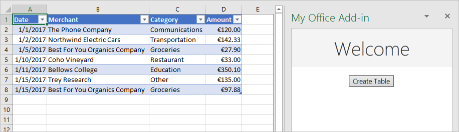
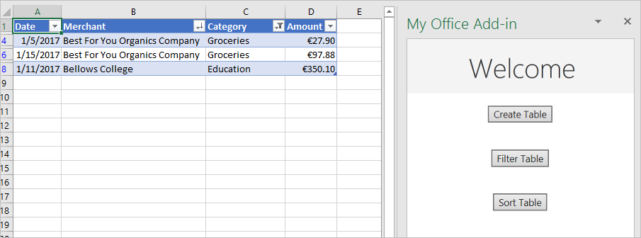
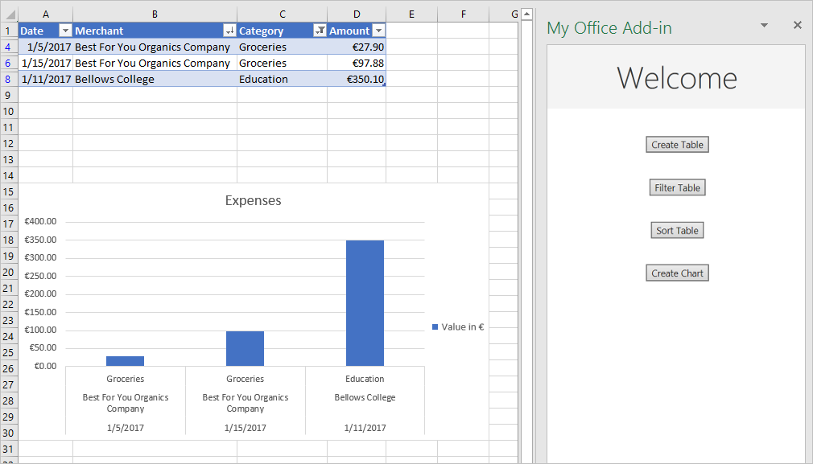
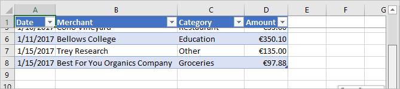
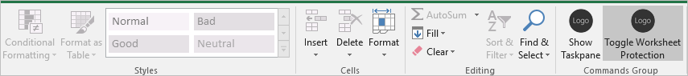
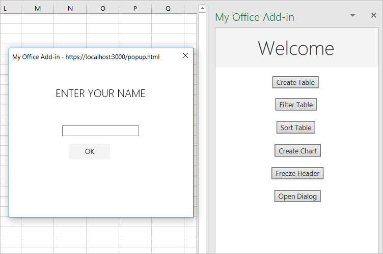

---
title: Excel add-in tutorial
description: Build an Excel add-in that creates, populates, filters, and sorts a table, creates a chart, freezes a table header, protects a worksheet, and opens a dialog.
ms.date: 02/12/2025
ms.service: excel
#Customer intent: As a developer, I want to build a Excel add-in that can interact with content in a Excel document.
ms.localizationpriority: high
---

# Tutorial: Create an Excel task pane add-in

In this tutorial, you'll create an Excel task pane add-in that:

> [!div class="checklist"]
>
> - Creates a table
> - Filters and sorts a table
> - Creates a chart
> - Freezes a table header
> - Protects a worksheet
> - Opens a dialog

> [!TIP]
> If you've already completed the [Build an Excel task pane add-in](../quickstarts/excel-quickstart-jquery.md) quick start using the Yeoman generator, and want to use that project as a starting point for this tutorial, go directly to the [Create a table](#create-a-table) section to start this tutorial.
>
> If you want a completed version of this tutorial, visit the [Office Add-ins samples repo on GitHub](https://github.com/OfficeDev/Office-Add-in-samples/tree/main/Samples/tutorials/excel-tutorial).

## Prerequisites

[!include[Yeoman generator prerequisites](../includes/quickstart-yo-prerequisites.md)]

## Create your add-in project

[!include[Yeoman generator create project guidance](../includes/yo-office-command-guidance.md)]

- **Choose a project type:** `Office Add-in Task Pane project`
- **Choose a script type:** `JavaScript`
- **What do you want to name your add-in?** `My Office Add-in`
- **Which Office client application would you like to support?** `Excel`


Next, select the type of manifest that you'd like to use, either the **unified manifest for Microsoft 365** or the **add-in only manifest**. Most of the steps in this tutorial are the same regardless of the manifest type, but the [Protect a worksheet](#protect-a-worksheet) section has separate steps for each manifest type.

> [!NOTE]
> Using the unified manifest for Microsoft 365 with Excel add-ins is in public developer preview. The unified manifest for Microsoft 365 shouldn't be used in production Excel add-ins. We invite you to try it out in test or development environments. For more information, see the [Microsoft 365 app manifest schema reference](/microsoft-365/extensibility/schema).

After you complete the wizard, the generator creates the project and installs supporting Node components. You may need to manually run `npm install` in the root folder of your project if something fails during the initial setup.

## Create a table

In this step of the tutorial, you'll programmatically test that your add-in supports the user's current version of Excel, add a table to a worksheet, populate the table with data, and format it.

### Code the add-in

1. Open the project in your code editor.

1. Open the file **./src/taskpane/taskpane.html**.  This file contains the HTML markup for the task pane.

1. Locate the `<main>` element and delete all lines that appear after the opening `<main>` tag and before the closing `</main>` tag.

1. Add the following markup immediately after the opening `<main>` tag.

    ```html
    <button class="ms-Button" id="create-table">Create Table</button><br/><br/>
    ```

1. Open the file **./src/taskpane/taskpane.js**. This file contains the Office JavaScript API code that facilitates interaction between the task pane and the Office client application.

1. Remove all references to the `run` button and the `run()` function by doing the following:

    - Locate and delete the line `document.getElementById("run").onclick = run;`.

    - Locate and delete the entire `run()` function.

1. Within the `Office.onReady` function call, locate the line `if (info.host === Office.HostType.Excel) {` and add the following code immediately after that line. Note:

    - This code adds an event handler for the `create-table` button.
    - The `createTable` function is wrapped in a call to `tryCatch` (both functions will be added next step). This allows any errors generated by the Office JavaScript layer to be handled separate from your service code.

    ```js
    // Assign event handlers and other initialization logic.
    document.getElementById("create-table").onclick = () => tryCatch(createTable);
    ```

1. Add the following functions to the end of the file. Note:

    - Your Excel.js business logic will be added to the function that is passed to `Excel.run`. This logic does not execute immediately. Instead, it is added to a queue of pending commands.

    - The `context.sync` method sends all queued commands to Excel for execution.

    - The `tryCatch` function will be used by all the functions interacting with the workbook from the task pane. Catching Office JavaScript errors in this fashion is a convenient way to generically handle any uncaught errors.

    > [!NOTE]
    > The following code uses ES6 JavaScript, which isn't compatible with [older versions of Office that use the Trident (Internet Explorer 11) browser engine](/office/dev/add-ins/concepts/browsers-used-by-office-web-add-ins). For information on how to support those platforms in production, see [Support older Microsoft webviews and Office versions](/office/dev/add-ins/develop/support-ie-11). You might qualify for a Microsoft 365 E5 developer subscription, which has the latest Office applications, to use for development through the [Microsoft 365 Developer Program](https://aka.ms/m365devprogram); for details, see the [FAQ](/office/developer-program/microsoft-365-developer-program-faq#who-qualifies-for-a-microsoft-365-e5-developer-subscription-). Alternatively, you can [sign up for a 1-month free trial](https://www.microsoft.com/microsoft-365/try) or [purchase a Microsoft 365 plan](https://www.microsoft.com/microsoft-365/business/compare-all-microsoft-365-business-products-g).

    ```js
    async function createTable() {
        await Excel.run(async (context) => {

            // TODO1: Queue table creation logic here.

            // TODO2: Queue commands to populate the table with data.

            // TODO3: Queue commands to format the table.

            await context.sync();
        });
    }

    /** Default helper for invoking an action and handling errors. */
    async function tryCatch(callback) {
        try {
            await callback();
        } catch (error) {
            // Note: In a production add-in, you'd want to notify the user through your add-in's UI.
            console.error(error);
        }
    }
    ```

1. Within the `createTable()` function, replace `TODO1` with the following code. Note:

    - The code creates a table by using the `add` method of a worksheet's table collection, which always exists even if it is empty. This is the standard way that Excel.js objects are created. There are no class constructor APIs, and you never use a `new` operator to create an Excel object. Instead, you add to a parent collection object.

    - The first parameter of the `add` method is the range of only the top row of the table, not the entire range the table will ultimately use. This is because when the add-in populates the data rows (in the next step), it will add new rows to the table instead of writing values to the cells of existing rows. This is a common pattern, because the number of rows a table will have is often unknown when the table is created.

    - Table names must be unique across the entire workbook, not just the worksheet.

    ```js
    const currentWorksheet = context.workbook.worksheets.getActiveWorksheet();
    const expensesTable = currentWorksheet.tables.add("A1:D1", true /*hasHeaders*/);
    expensesTable.name = "ExpensesTable";
    ```

1. Within the `createTable()` function, replace `TODO2` with the following code. Note:

    - The cell values of a range are set with an array of arrays.

    - New rows are created in a table by calling the `add` method of the table's row collection. You can add multiple rows in a single call of `add` by including multiple cell value arrays in the parent array that is passed as the second parameter.

    ```js
    expensesTable.getHeaderRowRange().values =
        [["Date", "Merchant", "Category", "Amount"]];

    expensesTable.rows.add(null /*add at the end*/, [
        ["1/1/2017", "The Phone Company", "Communications", "120"],
        ["1/2/2017", "Northwind Electric Cars", "Transportation", "142.33"],
        ["1/5/2017", "Best For You Organics Company", "Groceries", "27.9"],
        ["1/10/2017", "Coho Vineyard", "Restaurant", "33"],
        ["1/11/2017", "Bellows College", "Education", "350.1"],
        ["1/15/2017", "Trey Research", "Other", "135"],
        ["1/15/2017", "Best For You Organics Company", "Groceries", "97.88"]
    ]);
    ```

1. Within the `createTable()` function, replace `TODO3` with the following code. Note:

    - The code gets a reference to the **Amount** column by passing its zero-based index to the `getItemAt` method of the table's column collection.

        > [!NOTE]
        > Excel.js collection objects, such as `TableCollection`, `WorksheetCollection`, and `TableColumnCollection` have an `items` property that is an array of the child object types, such as `Table` or `Worksheet` or `TableColumn`; but a `*Collection` object is not itself an array.

    - The code then formats the range of the **Amount** column as Euros to the second decimal. Learn more about the Excel number format syntax in the article [Number format codes](https://support.microsoft.com/office/5026bbd6-04bc-48cd-bf33-80f18b4eae68)/

    - Finally, it ensures that the width of the columns and height of the rows is big enough to fit the longest (or tallest) data item. Notice that the code must get `Range` objects to format. `TableColumn` and `TableRow` objects do not have format properties.

    ```js
    expensesTable.columns.getItemAt(3).getRange().numberFormat = [['\u20AC#,##0.00']];
    expensesTable.getRange().format.autofitColumns();
    expensesTable.getRange().format.autofitRows();
    ```

1. Verify that you've saved all of the changes you've made to the project.

### Test the add-in

1. Complete the following steps to start the local web server and sideload your add-in.

    [!INCLUDE [alert use https](../includes/alert-use-https.md)]

    > [!TIP]
    > If you're testing your add-in on Mac, run the following command in the root directory of your project before proceeding. When you run this command, the local web server starts.
    >
    > ```command&nbsp;line
    > npm run dev-server
    > ```

    - To test your add-in in Excel, run the following command in the root directory of your project. This starts the local web server (if it's not already running) and opens Excel with your add-in loaded.

        ```command&nbsp;line
        npm start
        ```

    - To test your add-in in Excel on the web, run the following command in the root directory of your project. When you run this command, the local web server starts. Replace "{url}" with the URL of an Excel document on your OneDrive or a SharePoint library to which you have permissions.

        [!INCLUDE [npm start on web command syntax](../includes/start-web-sideload-instructions.md)]

1. In Excel, choose the **Home** tab, and then choose the **Show Taskpane** button on the ribbon to open the add-in task pane.

    

1. In the task pane, choose the **Create Table** button.

    

1. [!include[Instructions to stop web server and uninstall dev add-in](../includes/stop-uninstall-dev-add-in.md)]

## Filter and sort a table

In this step of the tutorial, you'll filter and sort the table that you created previously.

### Filter the table

1. Open the file **./src/taskpane/taskpane.html**.

1. Locate the `<button>` element for the `create-table` button, and add the following markup after that line.

    ```html
    <button class="ms-Button" id="filter-table">Filter Table</button><br/><br/>
    ```

1. Open the file **./src/taskpane/taskpane.js**.

1. Within the `Office.onReady` function call, locate the line that assigns a click handler to the `create-table` button, and add the following code after that line.

    ```js
    document.getElementById("filter-table").onclick = () => tryCatch(filterTable);
    ```

1. Add the following function to the end of the file.

    ```js
    async function filterTable() {
        await Excel.run(async (context) => {

            // TODO1: Queue commands to filter out all expense categories except
            //        Groceries and Education.

            await context.sync();
        });
    }
    ```

1. Within the `filterTable()` function, replace `TODO1` with the following code. Note:

   - The code first gets a reference to the column that needs filtering by passing the column name to the `getItem` method, instead of passing its index to the `getItemAt` method as the `createTable` method does. Since users can move table columns, the column at a given index might change after the table is created. Hence, it is safer to use the column name to get a reference to the column. We used `getItemAt` safely in the preceding tutorial, because we used it in the very same method that creates the table, so there is no chance that a user has moved the column.

   - The `applyValuesFilter` method is one of several filtering methods on the `Filter` object.

    ```js
    const currentWorksheet = context.workbook.worksheets.getActiveWorksheet();
    const expensesTable = currentWorksheet.tables.getItem('ExpensesTable');
    const categoryFilter = expensesTable.columns.getItem('Category').filter;
    categoryFilter.applyValuesFilter(['Education', 'Groceries']);
    ```

### Sort the table

1. Open the file **./src/taskpane/taskpane.html**.

1. Locate the `<button>` element for the `filter-table` button, and add the following markup after that line.

    ```html
    <button class="ms-Button" id="sort-table">Sort Table</button><br/><br/>
    ```

1. Open the file **./src/taskpane/taskpane.js**.

1. Within the `Office.onReady` function call, locate the line that assigns a click handler to the `filter-table` button, and add the following code after that line.

    ```js
    document.getElementById("sort-table").onclick = () => tryCatch(sortTable);
    ```

1. Add the following function to the end of the file.

    ```js
    async function sortTable() {
        await Excel.run(async (context) => {

            // TODO1: Queue commands to sort the table by Merchant name.

            await context.sync();
        });
    }
    ```

1. Within the `sortTable()` function, replace `TODO1` with the following code. Note:

   - The code creates an array of `SortField` objects, which has just one member since the add-in only sorts on the Merchant column.

   - The `key` property of a `SortField` object is the zero-based index of the column used for sorting. The rows of the table are sorted based on the values in the referenced column.

   - The `sort` member of a `Table` is a `TableSort` object, not a method. The `SortField`s are passed to the `TableSort` object's `apply` method.

    ```js
    const currentWorksheet = context.workbook.worksheets.getActiveWorksheet();
    const expensesTable = currentWorksheet.tables.getItem('ExpensesTable');
    const sortFields = [
        {
            key: 1,            // Merchant column
            ascending: false,
        }
    ];

    expensesTable.sort.apply(sortFields);
    ```

1. Verify that you've saved all of the changes you've made to the project.

### Test the add-in

1. [!include[Start server and sideload add-in instructions](../includes/tutorial-excel-start-server.md)]

1. If the add-in task pane isn't already open in Excel, go to the **Home** tab and choose the **Show Taskpane** button on the ribbon to open it.

1. If the table you added previously in this tutorial is not present in the open worksheet, choose the **Create Table** button in the task pane.

1. Choose the **Filter Table** button and the **Sort Table** button, in either order.

    

## Create a chart

In this step of the tutorial, you'll create a chart using data from the table that you created previously, and then format the chart.

### Chart a chart using table data

1. Open the file **./src/taskpane/taskpane.html**.

1. Locate the `<button>` element for the `sort-table` button, and add the following markup after that line.

    ```html
    <button class="ms-Button" id="create-chart">Create Chart</button><br/><br/>
    ```

1. Open the file **./src/taskpane/taskpane.js**.

1. Within the `Office.onReady` function call, locate the line that assigns a click handler to the `sort-table` button, and add the following code after that line.

    ```js
    document.getElementById("create-chart").onclick = () => tryCatch(createChart);
    ```

1. Add the following function to the end of the file.

    ```js
    async function createChart() {
        await Excel.run(async (context) => {

            // TODO1: Queue commands to get the range of data to be charted.

            // TODO2: Queue command to create the chart and define its type.

            // TODO3: Queue commands to position and format the chart.

            await context.sync();
        });
    }
    ```

1. Within the `createChart()` function, replace `TODO1` with the following code. Note that in order to exclude the header row, the code uses the `Table.getDataBodyRange` method to get the range of data you want to chart instead of the `getRange` method.

    ```js
    const currentWorksheet = context.workbook.worksheets.getActiveWorksheet();
    const expensesTable = currentWorksheet.tables.getItem('ExpensesTable');
    const dataRange = expensesTable.getDataBodyRange();
    ```

1. Within the `createChart()` function, replace `TODO2` with the following code. Note the following parameters.

   - The first parameter to the `add` method specifies the type of chart. There are several dozen types.

   - The second parameter specifies the range of data to include in the chart.

   - The third parameter determines whether a series of data points from the table should be charted row-wise or column-wise. The option `auto` tells Excel to decide the best method.

    ```js
    const chart = currentWorksheet.charts.add('ColumnClustered', dataRange, 'Auto');
    ```

1. Within the `createChart()` function, replace `TODO3` with the following code. Most of this code is self-explanatory. Note:

   - The parameters to the `setPosition` method specify the upper left and lower right cells of the worksheet area that should contain the chart. Excel can adjust things like line width to make the chart look good in the space it has been given.

   - A "series" is a set of data points from a column of the table. Since there is only one non-string column in the table, Excel infers that the column is the only column of data points to chart. It interprets the other columns as chart labels. So there will be just one series in the chart and it will have index 0. This is the one to label with "Value in &euro;".

    ```js
    chart.setPosition("A15", "F30");
    chart.title.text = "Expenses";
    chart.legend.position = "Right";
    chart.legend.format.fill.setSolidColor("white");
    chart.dataLabels.format.font.size = 15;
    chart.dataLabels.format.font.color = "black";
    chart.series.getItemAt(0).name = 'Value in \u20AC';
    ```

1. Verify that you've saved all of the changes you've made to the project.

### Test the add-in

1. [!include[Start server and sideload add-in instructions](../includes/tutorial-excel-start-server.md)]

1. If the add-in task pane isn't already open in Excel, go to the **Home** tab and choose the **Show Taskpane** button on the ribbon to open it.

1. If the table you added previously in this tutorial is not present in the open worksheet, choose the **Create Table** button, and then the **Filter Table** button and the **Sort Table** button, in either order.

1. Choose the **Create Chart** button. A chart is created and only the data from the rows that have been filtered are included. The labels on the data points across the bottom are in the sort order of the chart; that is, merchant names in reverse alphabetical order.

    

## Freeze a table header

When a table is long enough that a user must scroll to see some rows, the header row can scroll out of sight. In this step of the tutorial, you'll freeze the header row of the table that you created previously, so that it remains visible even as the user scrolls down the worksheet.

### Freeze the table's header row

1. Open the file **./src/taskpane/taskpane.html**.

1. Locate the `<button>` element for the `create-chart` button, and add the following markup after that line.

    ```html
    <button class="ms-Button" id="freeze-header">Freeze Header</button><br/><br/>
    ```

1. Open the file **./src/taskpane/taskpane.js**.

1. Within the `Office.onReady` function call, locate the line that assigns a click handler to the `create-chart` button, and add the following code after that line.

    ```js
    document.getElementById("freeze-header").onclick = () => tryCatch(freezeHeader);
    ```

1. Add the following function to the end of the file.

    ```js
    async function freezeHeader() {
        await Excel.run(async (context) => {

            // TODO1: Queue commands to keep the header visible when the user scrolls.

            await context.sync();
        });
    }
    ```

1. Within the `freezeHeader()` function, replace `TODO1` with the following code. Note:

   - The `Worksheet.freezePanes` collection is a set of panes in the worksheet that are pinned, or frozen, in place when the worksheet is scrolled.

   - The `freezeRows` method takes as a parameter the number of rows, from the top, that are to be pinned in place. We pass `1` to pin the first row in place.

    ```js
    const currentWorksheet = context.workbook.worksheets.getActiveWorksheet();
    currentWorksheet.freezePanes.freezeRows(1);
    ```

1. Verify that you've saved all of the changes you've made to the project.

### Test the add-in

1. [!include[Start server and sideload add-in instructions](../includes/tutorial-excel-start-server.md)]

1. If the add-in task pane isn't already open in Excel, go to the **Home** tab and choose the **Show Taskpane** button on the ribbon to open it.

1. If the table you added previously in this tutorial is present in the worksheet, delete it.

1. In the task pane, choose the **Create Table** button.

1. In the task pane, choose the **Freeze Header** button.

1. Scroll down the worksheet far enough to see that the table header remains visible at the top even when the higher rows scroll out of sight.

    

## Protect a worksheet

In this step of the tutorial, you'll add a button to the ribbon that toggles worksheet protection on and off.

### Configure the manifest to add a second ribbon button

The steps vary depending on the type of manifest.

# [Unified manifest for Microsoft 365 (preview)](#tab/jsonmanifest)

> [!NOTE]
> Using the unified manifest for Microsoft 365 with Excel add-ins is in public developer preview. The unified manifest for Microsoft 365 shouldn't be used in production Excel add-ins. We invite you to try it out in test or development environments. For more information, see the [Microsoft 365 app manifest schema reference](/microsoft-365/extensibility/schema).

#### Configure the runtime for the ribbon button

1. Open the manifest file **./manifest.json**.

1. Find the **[`"extensions.runtimes"`](/microsoft-365/extensibility/schema/extension-runtimes-array?view=m365-app-prev&preserve-view=true)** array and add the following commands runtime object.

    ```json
    "runtimes": [
        {
            "id": "CommandsRuntime",
            "type": "general",
            "code": {
                "page": "https://localhost:3000/commands.html"
            },
            "lifetime": "short",
            "actions": [
                {
                    "id": <!--TODO1: Set the action ID -->,
                    "type": "executeFunction",
                }
            ]
        }       
    ]
    ```

1. Find `TODO1` and replace it with **`"toggleProtection"`**. This matches the `id` for the JavaScript function you create in a later step.

    > [!TIP]
    > The value of **[`"actions.id"`](/microsoft-365/extensibility/schema/extension-runtimes-actions-item#id)** must match the first parameter of the call to `Office.actions.associate` in your **commands.js** file.

1. Ensure that the **[`"requirements.capabilities"`](/microsoft-365/extensibility/schema/requirements-extension-element-capabilities)** array contains an object that specifies the **`"AddinCommands"`** requirement set with a **`"minVersion"`** of **`"1.1"`**.

    ```json
    "requirements": {
        "capabilities": [
            {
                "name": "AddinCommands",
                "minVersion": "1.1"
            }
        ]
    },
    ```

#### Configure the UI for the ribbon button

1. After the **`"extensions.runtimes"`** array, add the following **[`"ribbons"`](/microsoft-365/extensibility/schema/element-extensions#ribbons)** array.

    ```json
    "ribbons": [
        {
            "contexts": [
                "default"
            ],
            "tabs": [
                {
                    "builtInTabID": <!--TODO1: Set the tab ID -->,
                    "groups": [
                        {
                            "id": "worksheetProtectionGroup",
                            "label": "Contoso Add-in",
                            "controls": [    
                                {
                                    "id": "toggleProtectionButton",
                                    "type": "button",
                                    "label": <!--TODO2: Label the button -->,
                                    "icons": [
                                        {
                                            "size": 16,
                                            "url": "https://localhost:3000/assets/icon-16.png"
                                        },
                                        {
                                            "size": 32,
                                            "url": "https://localhost:3000/assets/icon-32.png"
                                        },
                                        {
                                            "size": 80,
                                            "url": "https://localhost:3000/assets/icon-80.png"
                                        }
                                    ],
                                    "supertip": {
                                        "title": "Toggle worksheet protection",
                                        "description": "Enables or disables worksheet protection."
                                    },
                                    "actionId": <!--TODO3: Set the action ID -->
                                }
                            ]
                        }
                    ]
                }
            ]
        }
    ]
    ```

1. Find `TODO1` and replace it with **"TabHome"**. This ensures that the new button displays in the Home tab in Excel. For other available tab IDs, see [Find the IDs of built-in Office ribbon tabs](../develop/built-in-ui-ids.md).

1. Find `TODO2` and replace it with **"Toggle worksheet protection"**. This is the label for your button in the Excel ribbon.

1. Find `TODO3` and replace it with **`"toggleProtection"`**. This value must match the **[`"runtimes.actions.id"`](/microsoft-365/extensibility/schema/extension-runtimes-actions-item#id)** value.

1. Save the file.

# [Add-in only manifest](#tab/xmlmanifest)

1. Open the manifest file **./manifest.xml**.

1. Locate the `<Control>` element. This element defines the **Show Taskpane** button on the **Home** ribbon you have been using to launch the add-in. We're going to add a second button to the same group on the **Home** ribbon. In between the closing **\</Control\>** tag and the closing **\</Group\>** tag, add the following markup.

    ```xml
    <Control xsi:type="Button" id="<!--TODO1: Unique (in manifest) name for button -->">
        <Label resid="<!--TODO2: Button label -->" />
        <Supertip>
            <Title resid="<!-- TODO3: Button tool tip title -->" />
            <Description resid="<!-- TODO4: Button tool tip description -->" />
        </Supertip>
        <Icon>
            <bt:Image size="16" resid="Icon.16x16"/>
            <bt:Image size="32" resid="Icon.32x32"/>
            <bt:Image size="80" resid="Icon.80x80"/>
        </Icon>
        <Action xsi:type="<!-- TODO5: Specify the type of action-->">
            <!-- TODO6: Identify the function.-->
        </Action>
    </Control>
    ```

1. Within the XML you just added to the manifest file, replace `TODO1` with a string that gives the button an ID that is unique within this manifest file. Since our button is going to toggle protection of the worksheet on and off, use "ToggleProtection". When you are done, the opening tag for the `Control` element should look like this:

    ```xml
    <Control xsi:type="Button" id="ToggleProtection">
    ```

1. The next three `TODO`s set resource IDs, or `resid`s. A resource is a string (with a maximum length of 32 characters), and you'll create these three strings in a later step. For now, you need to give IDs to the resources. The button label should read "Toggle Protection", but the *ID* of this string should be "ProtectionButtonLabel", so the `Label` element should look like this:

    ```xml
    <Label resid="ProtectionButtonLabel" />
    ```

1. The `SuperTip` element defines the tool tip for the button. The tool tip title should be the same as the button label, so we use the very same resource ID: "ProtectionButtonLabel". The tool tip description will be "Click to turn protection of the worksheet on and off". But the `resid` should be "ProtectionButtonToolTip". So, when you are done, the `SuperTip` element should look like this:

    ```xml
    <Supertip>
        <Title resid="ProtectionButtonLabel" />
        <Description resid="ProtectionButtonToolTip" />
    </Supertip>
    ```

   > [!NOTE]
   > In a production add-in, you would not want to use the same icon for two different buttons; but to simplify this tutorial, we'll do that. So the `Icon` markup in our new `Control` is just a copy of the `Icon` element from the existing `Control`.

1. The `Action` element inside the original `Control` element has its type set to `ShowTaskpane`, but our new button isn't going to open a task pane; it's going to run a custom function that you create in a later step. So, replace `TODO5` with `ExecuteFunction`, which is the action type for buttons that trigger custom functions. The opening tag for the `Action` element should look like this:

    ```xml
    <Action xsi:type="ExecuteFunction">
    ```

1. The original `Action` element has child elements that specify a task pane ID and a URL of the page that should be opened in the task pane. But an `Action` element of the `ExecuteFunction` type has a single child element that names the function that the control executes. You'll create that function in a later step, and it will be called `toggleProtection`. So, replace `TODO6` with the following markup.

    ```xml
    <FunctionName>toggleProtection</FunctionName>
    ```

    The entire `Control` markup should now look like the following:

    ```xml
    <Control xsi:type="Button" id="ToggleProtection">
        <Label resid="ProtectionButtonLabel" />
        <Supertip>
            <Title resid="ProtectionButtonLabel" />
            <Description resid="ProtectionButtonToolTip" />
        </Supertip>
        <Icon>
            <bt:Image size="16" resid="Icon.16x16"/>
            <bt:Image size="32" resid="Icon.32x32"/>
            <bt:Image size="80" resid="Icon.80x80"/>
        </Icon>
        <Action xsi:type="ExecuteFunction">
           <FunctionName>toggleProtection</FunctionName>
        </Action>
    </Control>
    ```

1. Scroll down to the `Resources` section of the manifest.

1. Add the following markup as a child of the `bt:ShortStrings` element.

    ```xml
    <bt:String id="ProtectionButtonLabel" DefaultValue="Toggle Worksheet Protection" />
    ```

1. Add the following markup as a child of the `bt:LongStrings` element.

    ```xml
    <bt:String id="ProtectionButtonToolTip" DefaultValue="Click to protect or unprotect the current worksheet." />
    ```

1. Save the file.

---

### Create the function that protects the sheet

1. Open the file **.\commands\commands.js**.

1. Add the following function immediately after the `action` function. Note that we specify an `args` parameter to the function and the very last line of the function calls `args.completed`. This is a requirement for all add-in commands of type **ExecuteFunction**. It signals the Office client application that the function has finished and the UI can become responsive again.

    ```js
    async function toggleProtection(args) {
        try {
            await Excel.run(async (context) => {

                // TODO1: Queue commands to reverse the protection status of the current worksheet.

                await context.sync();
            });
        } catch (error) {
            // Note: In a production add-in, you'd want to notify the user through your add-in's UI.
            console.error(error);
        }

        args.completed();
    }
    ```

1. Add the following line immediately after the function to register it.

    ```js
    Office.actions.associate("toggleProtection", toggleProtection);
    ```

1. Within the `toggleProtection` function, replace `TODO1` with the following code. This code uses the worksheet object's protection property in a standard toggle pattern. The `TODO2` will be explained in the next section.

    ```js
    const sheet = context.workbook.worksheets.getActiveWorksheet();

    // TODO2: Queue command to load the sheet's "protection.protected" property from
    //        the document and re-synchronize the document and task pane.

    if (sheet.protection.protected) {
        sheet.protection.unprotect();
    } else {
        sheet.protection.protect();
    }
    ```

### Add code to fetch document properties into the task pane's script objects

In each function that you've created in this tutorial until now, you queued commands to *write* to the Office document. Each function ended with a call to the `context.sync()` method, which sends the queued commands to the document to be executed. However, the code you added in the last step calls the `sheet.protection.protected property`. This is a significant difference from the earlier functions you wrote, because the `sheet` object is only a proxy object that exists in your task pane's script. The proxy object doesn't know the actual protection state of the document, so its `protection.protected` property can't have a real value. To avoid an exception error, you must first fetch the protection status from the document and use it set the value of `sheet.protection.protected`. This fetching process has three steps.

   1. Queue a command to load (that is; fetch) the properties that your code needs to read.

   1. Call the context object's `sync` method to send the queued command to the document for execution and return the requested information.

   1. Because the `sync` method is asynchronous, ensure that it has completed before your code calls the properties that were fetched.

These steps must be completed whenever your code needs to *read* information from the Office document.

1. Within the `toggleProtection` function, replace `TODO2` with the following code. Note:

   - Every Excel object has a `load` method. You specify the properties of the object that you want to read in the parameter as a string of comma-delimited names. In this case, the property you need to read is a subproperty of the `protection` property. You reference the subproperty almost exactly as you would anywhere else in your code, with the exception that you use a forward slash ('/') character instead of a "." character.

   - To ensure that the toggle logic, which reads `sheet.protection.protected`, doesn't run until after the `sync` is complete and the `sheet.protection.protected` has been assigned the correct value that is fetched from the document, it must come after the `await` operator ensures `sync` has completed.

    ```js
    sheet.load('protection/protected');
    await context.sync();
    ```

   When you are done, the entire function should look like the following:

    ```js
    async function toggleProtection(args) {
        try {
            await Excel.run(async (context) => {
                const sheet = context.workbook.worksheets.getActiveWorksheet();

                sheet.load('protection/protected');
                await context.sync();
            
                if (sheet.protection.protected) {
                    sheet.protection.unprotect();
                } else {
                    sheet.protection.protect();
                }

                await context.sync();
            });
        } catch (error) {
            // Note: In a production add-in, you'd want to notify the user through your add-in's UI.
            console.error(error);
        }

        args.completed();
    }
    ```

1. Verify that you've saved all of the changes you've made to the project.

### Test the add-in

1. Close all Office applications, including Excel (or close the browser tab if you're using Excel on the web).

1. Clear the Office cache. This is necessary to completely clear the old version of the add-in from the client application. Instructions for this process are in the article [Clear the Office cache](../testing/clear-cache.md).

1. If the local web server is already running, stop it by entering the following command in the command prompt. This should close the node command window.

    ```command&nbsp;line
    npm stop
    ```

1. Because your manifest file has been updated, you must sideload your add-in again, using the updated manifest file. Start the local web server and sideload your add-in.

    - To test your add-in in Excel, run the following command in the root directory of your project. This starts the local web server (if it's not already running) and opens Excel with your add-in loaded.

        ```command&nbsp;line
        npm start
        ```

    - To test your add-in in Excel on the web, run the following command in the root directory of your project. When you run this command, the local web server starts. Replace "{url}" with the URL of an Excel document on your OneDrive or a SharePoint library to which you have permissions.

        [!INCLUDE [npm start on web command syntax](../includes/start-web-sideload-instructions.md)]

1. On the **Home** tab in Excel, choose the **Toggle Worksheet Protection** button. Note that most of the controls on the ribbon are disabled (and visually grayed-out) as seen in the following screenshot.

    

1. Select a cell and try to edit its content. Excel displays an error message indicating that the worksheet is protected.

1. Choose the **Toggle Worksheet Protection** button again, and the controls are reenabled, and you can change cell values again.

## Open a dialog

In this final step of the tutorial, you'll open a dialog in your add-in, pass a message from the dialog process to the task pane process, and close the dialog. Office Add-in dialogs are *nonmodal*: a user can continue to interact with both the document in the Office application and with the host page in the task pane.

### Create the dialog page

1. In the **./src** folder that's located at the root of the project, create a new folder named **dialogs**.

1. In the **./src/dialogs** folder, create new file named **popup.html**.

1. Add the following markup to **popup.html**. Note:

   - The page has an `<input>` field where the user will enter their name, and a button that will send this name to the task pane where it will display.

   - The markup loads a script named **popup.js** that you will create in a later step.

   - It also loads the Office.js library because it will be used in **popup.js**.

    ```html
    <!DOCTYPE html>
    <html>
        <head lang="en">
            <title>Dialog for My Office Add-in</title>
            <meta charset="UTF-8">
            <meta name="viewport" content="width=device-width, initial-scale=1">

            <!-- For more information on Fluent UI, visit https://developer.microsoft.com/fluentui. -->
            <link rel="stylesheet" href="https://res-1.cdn.office.net/files/fabric-cdn-prod_20230815.002/office-ui-fabric-core/11.0.0/css/fabric.min.css"/>

            <script type="text/javascript" src="https://appsforoffice.microsoft.com/lib/1/hosted/office.js"></script>
            <script type="text/javascript" src="popup.js"></script>

        </head>
        <body style="display:flex;flex-direction:column;align-items:center;justify-content:center">
            <p class="ms-font-xl">ENTER YOUR NAME</p>
            <input id="name-box" type="text"/><br/><br/>
            <button id="ok-button" class="ms-Button">OK</button>
        </body>
    </html>
    ```

1. In the **./src/dialogs** folder, create new file named **popup.js**.

1. Add the following code to **popup.js**. Note the following about this code.

   - *Every page that calls APIs in the Office.js library must first ensure that the library is fully initialized.* The best way to do that is to call the `Office.onReady()` function. The call of `Office.onReady()` must run before any calls to Office.js; hence the assignment is in a script file that is loaded by the page, as it is in this case.

    ```js
    Office.onReady((info) => {
        // TODO1: Assign handler to the OK button.
    });

    // TODO2: Create the OK button handler.
    ```

1. Replace `TODO1` with the following code. You'll create the `sendStringToParentPage` function in the next step.

    ```js
    document.getElementById("ok-button").onclick = () => tryCatch(sendStringToParentPage);
    ```

1. Replace `TODO2` with the following code. The `messageParent` method passes its parameter to the parent page, in this case, the page in the task pane. The parameter must be a string, which includes anything that can be serialized as a string, such as XML or JSON, or any type that can be cast to a string. This also adds the same `tryCatch` method used in **taskpane.js** for error handling.

    ```js
    function sendStringToParentPage() {
        const userName = document.getElementById("name-box").value;
        Office.context.ui.messageParent(userName);
    }

    /** Default helper for invoking an action and handling errors. */
    async function tryCatch(callback) {
        try {
            await callback();
        } catch (error) {
            // Note: In a production add-in, you'd want to notify the user through your add-in's UI.
            console.error(error);
        }
    }
    ```

> [!NOTE]
> The **popup.html** file, and the **popup.js** file that it loads, run in an entirely separate browser runtime process from the add-in's task pane. If **popup.js** was transpiled into the same **bundle.js** file as the **app.js** file, then the add-in would have to load two copies of the **bundle.js** file, which defeats the purpose of bundling. Therefore, this add-in does not transpile the **popup.js** file at all.

### Update webpack config settings

Open the file **webpack.config.js** in the root directory of the project and complete the following steps.

1. Locate the `entry` object within the `config` object and add a new entry for `popup`.

    ```js
    popup: "./src/dialogs/popup.js"
    ```

    After you've done this, the new `entry` object will look like this.

    ```js
    entry: {
      polyfill: "@babel/polyfill",
      taskpane: "./src/taskpane/taskpane.js",
      commands: "./src/commands/commands.js",
      popup: "./src/dialogs/popup.js"
    },
    ```
  
1. Locate the `plugins` array within the `config` object and add the following object to the end of that array.

    ```js
    new HtmlWebpackPlugin({
      filename: "popup.html",
      template: "./src/dialogs/popup.html",
      chunks: ["polyfill", "popup"]
    })
    ```

    After you've done this, the new `plugins` array will look like this.

    ```js
    plugins: [
      new CleanWebpackPlugin(),
      new HtmlWebpackPlugin({
        filename: "taskpane.html",
        template: "./src/taskpane/taskpane.html",
        chunks: ['polyfill', 'taskpane']
      }),
      new CopyWebpackPlugin([
      {
        to: "taskpane.css",
        from: "./src/taskpane/taskpane.css"
      }
      ]),
      new HtmlWebpackPlugin({
        filename: "commands.html",
        template: "./src/commands/commands.html",
        chunks: ["polyfill", "commands"]
      }),
      new HtmlWebpackPlugin({
        filename: "popup.html",
        template: "./src/dialogs/popup.html",
        chunks: ["polyfill", "popup"]
      })
    ],
    ```

1. If the local web server is running, stop it by entering the following command in the command prompt. This should close the node command window.

    ```command&nbsp;line
    npm stop
    ```

1. Run the following command to rebuild the project.

    ```command&nbsp;line
    npm run build
    ```

### Open the dialog from the task pane

1. Open the file **./src/taskpane/taskpane.html**.

1. Locate the `<button>` element for the `freeze-header` button, and add the following markup after that line.

    ```html
    <button class="ms-Button" id="open-dialog">Open Dialog</button><br/><br/>
    ```

1. The dialog will prompt the user to enter a name and pass the user's name to the task pane. The task pane will display it in a label. Immediately after the `button` that you just added, add the following markup.

    ```html
    <label id="user-name"></label><br/><br/>
    ```

1. Open the file **./src/taskpane/taskpane.js**.

1. Within the `Office.onReady` function call, locate the line that assigns a click handler to the `freeze-header` button, and add the following code after that line. You'll create the `openDialog` method in a later step.

    ```js
    document.getElementById("open-dialog").onclick = openDialog;
    ```

1. Add the following declaration to the end of the file. This variable is used to hold an object in the parent page's execution context that acts as an intermediator to the dialog page's execution context.

    ```js
    let dialog = null;
    ```

1. Add the following function to the end of the file (after the declaration of `dialog`). The important thing to notice about this code is what is *not* there: there is no call of `Excel.run`. This is because the API to open a dialog is shared among all Office applications, so it is part of the Office JavaScript Common API, not the Excel-specific API.

    ```js
    function openDialog() {
        // TODO1: Call the Office Common API that opens a dialog.
    }
    ```

1. Replace `TODO1` with the following code. Note:

   - The `displayDialogAsync` method opens a dialog in the center of the screen.

   - The first parameter is the URL of the page to open.

   - The second parameter passes options. `height` and `width` are percentages of the size of the Office application's window.

    ```js
    Office.context.ui.displayDialogAsync(
        'https://localhost:3000/popup.html',
        {height: 45, width: 55},

        // TODO2: Add callback parameter.
    );
    ```

### Process the message from the dialog and close the dialog

1. Within the `openDialog` function in the file **./src/taskpane/taskpane.js**, replace `TODO2` with the following code. Note:

   - The callback is executed immediately after the dialog successfully opens and before the user has taken any action in the dialog.

   - The `result.value` is the object that acts as an intermediary between the execution contexts of the parent and dialog pages.

   - The `processMessage` function will be created in a later step. This handler will process any values that are sent from the dialog page with calls of the `messageParent` function.

    ```js
    function (result) {
        dialog = result.value;
        dialog.addEventHandler(Office.EventType.DialogMessageReceived, processMessage);
    }
    ```

1. Add the following function after the `openDialog` function.

    ```js
    function processMessage(arg) {
        document.getElementById("user-name").innerHTML = arg.message;
        dialog.close();
    }
    ```

1. Verify that you've saved all of the changes you've made to the project.

### Test the add-in

1. [!include[Start server and sideload add-in instructions](../includes/tutorial-excel-start-server.md)]

1. If the add-in task pane isn't already open in Excel, go to the **Home** tab and choose the **Show Taskpane** button on the ribbon to open it.

1. Choose the **Open Dialog** button in the task pane.

1. While the dialog is open, drag it and resize it. Note that you can interact with the worksheet and press other buttons on the task pane, but you cannot launch a second dialog from the same task pane page.

1. In the dialog, enter a name and choose the **OK** button. The name appears on the task pane and the dialog closes.

1. Optionally, in the **./src/taskpane/taskpane.js** file, comment out the line `dialog.close();` in the `processMessage` function. Then repeat the steps of this section. The dialog stays open and you can change the name. You can close it manually by pressing the **X** button in the upper right corner.

    

## Next steps

In this tutorial, you've created an Excel task pane add-in that interacts with tables, charts, worksheets, and dialogs in an Excel workbook. To learn more about building Excel add-ins, continue to the following article.

> [!div class="nextstepaction"]
> [Excel add-ins overview](../excel/excel-add-ins-overview.md)

## Code samples

- [Completed Excel add-in tutorial](https://github.com/OfficeDev/Office-Add-in-samples/tree/main/Samples/tutorials/excel-tutorial): The result of completing this tutorial.

## See also

- [Office Add-ins platform overview](../overview/office-add-ins.md)
- [Develop Office Add-ins](../develop/develop-overview.md)
- [Excel JavaScript object model in Office Add-ins](../excel/excel-add-ins-core-concepts.md)
- [Office Add-ins code samples](https://github.com/OfficeDev/Office-Add-in-samples)
