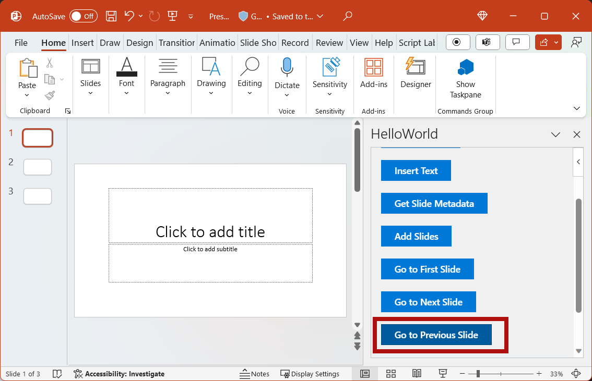

# Tutorial: Create a PowerPoint task pane add-in with Visual Studio

In this tutorial, you'll create a PowerPoint task pane add-in that:

> [!div class="checklist"]
>
> - Adds an image to a slide
> - Adds text to a slide
> - Gets slide metadata
> - Adds new slides
> - Navigates between slides

> [!TIP]
> If you want a completed version of this tutorial, visit the [Office Add-ins samples repo on GitHub](https://github.com/OfficeDev/Office-Add-in-samples/tree/main/Samples/tutorials/powerpoint-tutorial).

## Prerequisites

- [Visual Studio 2019 or later](https://www.visualstudio.com/vs/), with the **Office/SharePoint development** workload installed.

    > [!NOTE]
    > If you've previously installed Visual Studio, [use the Visual Studio Installer](/visualstudio/install/modify-visual-studio) to ensure that the **Office/SharePoint development** workload is installed.

- Office connected to a Microsoft 365 subscription (including Office on the web).

    > [!NOTE]
    > If you don't already have Office, you might qualify for a Microsoft 365 E5 developer subscription to use for development through the [Microsoft 365 Developer Program](https://aka.ms/m365devprogram); for details, see the [FAQ](/office/developer-program/microsoft-365-developer-program-faq#who-qualifies-for-a-microsoft-365-e5-developer-subscription-). Alternatively, you can [sign up for a 1-month free trial](https://www.microsoft.com/microsoft-365/try) or [purchase a Microsoft 365 plan](https://www.microsoft.com/microsoft-365/business/compare-all-microsoft-365-business-products-g).

## Create your add-in project

Complete the following steps to create a PowerPoint add-in project using Visual Studio.

1. Choose **Create a new project**.

1. Using the search box, enter **add-in**. Choose **PowerPoint Web Add-in**, then select **Next**.

1. Name the project `HelloWorld`, and select **Create**.

1. In the **Create Office Add-in** dialog window, choose **Add new functionalities to PowerPoint**, and then choose **Finish** to create the project.

1. Visual Studio creates a solution and its two projects appear in **Solution Explorer**. The **Home.html** file opens in Visual Studio.

     

1. The following NuGet packages must be installed. Install them on the **HelloWorldWeb** project using the **NuGet Package Manager** in Visual Studio. See Visual Studio help for instructions. The second of these may be installed automatically when you install the first.

   - Microsoft.AspNet.WebApi.WebHost
   - Microsoft.AspNet.WebApi.Core

   > [!IMPORTANT]
   > When you're using the **NuGet Package Manager** to install these packages, do **not** install the recommended update to jQuery. The jQuery version installed with your Visual Studio solution matches the jQuery call within the solution files.

1. Use the **NuGet Package Manager** to update the Newtonsoft.Json package to version 13.0.3 or later. Then delete the **app.config** file if it was added to the **HelloWorld** project.

### Explore the Visual Studio solution

[!include[Description of Visual Studio projects](../includes/quickstart-vs-solution.md)]

### Update code

Edit the add-in code as follows to create the framework that you'll use to implement add-in functionality in subsequent steps of this tutorial.

1. **Home.html** specifies the HTML that will be rendered in the add-in's task pane. In **Home.html**, find the **div** with `id="content-main"`, replace that entire **div** with the following markup, and save the file.

    ```html
    <!-- TODO2: Create the content-header div. -->
    <div id="content-main">
        <div class="padding">
            <!-- TODO1: Create the insert-image button. -->
            <!-- TODO3: Create the insert-text button. -->
            <!-- TODO4: Create the get-slide-metadata button. -->
            <!-- TODO5: Create the add-slides and go-to-slide buttons. -->
        </div>
    </div>
    ```

1. Open the file **Home.js** in the root of the web application project. This file specifies the script for the add-in. Replace the entire contents with the following code and save the file.

    ```js
    (function () {
        "use strict";

        let messageBanner;

        Office.onReady(function () {
            $(document).ready(function () {
                // Initialize the FabricUI notification mechanism and hide it.
                const element = document.querySelector('.MessageBanner');
                messageBanner = new components.MessageBanner(element);
                messageBanner.hideBanner();

                // TODO1: Assign event handler for insert-image button.
                // TODO4: Assign event handler for insert-text button.
                // TODO6: Assign event handler for get-slide-metadata button.
                // TODO8: Assign event handlers for add-slides and the four navigation buttons.
            });
        });

        // TODO2: Define the insertImage function.

        // TODO3: Define the insertImageFromBase64String function.

        // TODO5: Define the insertText function.

        // TODO7: Define the getSlideMetadata function.

        // TODO9: Define the addSlides and navigation functions.

        // Helper function for displaying notifications.
        function showNotification(header, content) {
            $("#notification-header").text(header);
            $("#notification-body").text(content);
            messageBanner.showBanner();
            messageBanner.toggleExpansion();
        }
    })();
    ```

## Insert an image

Complete the following steps to add code that retrieves the [Bing](https://www.bing.com) photo of the day and inserts that image into a slide.

1. Using Solution Explorer, add a new folder named **Controllers** to the **HelloWorldWeb** project.

    

1. Right-click (or select and hold) the **Controllers** folder and select **Add** > **New Scaffolded Item...**.

1. In the **Add Scaffold** dialog window, select **Web API 2 Controller - Empty** and choose the **Add** button.

1. In the **Add Controller** dialog window, enter **PhotoController** as the controller name and choose the **Add** button. Visual Studio creates and opens the **PhotoController.cs** file.

    > [!IMPORTANT]
    > The scaffolding process doesn't complete properly on some versions of Visual Studio after version 16.10.3. If you have the **Global.asax** and **./App_Start/WebApiConfig.cs** files, then skip to step 6.
    >
    > 

1. If you're missing scaffolding files from the **HelloWorldWeb** project, add them as follows.

    1. Using Solution Explorer, add a new folder named **App_Start** to the **HelloWorldWeb** project.

    1. Right-click (or select and hold) the **App_Start** folder and select **Add** > **Class...**.

    1. In the **Add New Item** dialog, name the file **WebApiConfig.cs** then choose the **Add** button.

    1. Replace the entire contents of the **WebApiConfig.cs** file with the following code.

        ```cs
        using System;
        using System.Collections.Generic;
        using System.Linq;
        using System.Web;
        using System.Web.Http;
        
        namespace HelloWorldWeb.App_Start
        {
            public static class WebApiConfig
            {
                public static void Register(HttpConfiguration config)
                {
                    config.MapHttpAttributeRoutes();
        
                    config.Routes.MapHttpRoute(
                        name: "DefaultApi",
                        routeTemplate: "api/{controller}/{id}",
                        defaults: new { id = RouteParameter.Optional }
                    );
                }
            }
        }
        ```

    1. In the Solution Explorer, right-click (or select and hold) the **HelloWorldWeb** project and select **Add** > **New Item...**.

    1. In the **Add New Item** dialog, search for "global", select **Global Application Class**, then choose the **Add** button. By default, the file is named **Global.asax**.

    1. Replace the entire contents of the **Global.asax.cs** file with the following code.

        ```cs
        using HelloWorldWeb.App_Start;
        using System;
        using System.Collections.Generic;
        using System.Linq;
        using System.Web;
        using System.Web.Http;
        using System.Web.Security;
        using System.Web.SessionState;
        
        namespace HelloWorldWeb
        {
            public class WebApiApplication : System.Web.HttpApplication
            {
                protected void Application_Start()
                {
                    GlobalConfiguration.Configure(WebApiConfig.Register);
                }
            }
        }
        ```

    1. In the Solution Explorer, right-click (or select and hold) the **Global.asax** file and choose **View Markup**.

    1. Replace the entire contents of the **Global.asax** file with the following code.

        ```XML
        <%@ Application Codebehind="Global.asax.cs" Inherits="HelloWorldWeb.WebApiApplication" Language="C#" %>
        ```

1. Replace the entire contents of the **PhotoController.cs** file with the following code that calls the Bing service to retrieve the photo of the day as a Base64-encoded string. When you use the Office JavaScript API to insert an image into a document, the image data must be specified as a Base64-encoded string.

    ```csharp
    using System;
    using System.IO;
    using System.Net;
    using System.Text;
    using System.Web.Http;
    using System.Xml;

    namespace HelloWorldWeb.Controllers
    {
        public class PhotoController : ApiController
        {
            public string Get()
            {
                string url = "http://www.bing.com/HPImageArchive.aspx?format=xml&idx=0&n=1";

                // Create the request.
                HttpWebRequest request = (HttpWebRequest)WebRequest.Create(url);
                WebResponse response = request.GetResponse();

                using (Stream responseStream = response.GetResponseStream())
                {
                    // Process the result.
                    StreamReader reader = new StreamReader(responseStream, Encoding.UTF8);
                    string result = reader.ReadToEnd();

                    // Parse the XML response and get the URL.
                    XmlDocument doc = new XmlDocument();
                    doc.LoadXml(result);
                    string photoURL = "http://bing.com" + doc.SelectSingleNode("/images/image/url").InnerText;

                    // Fetch the photo and return it as a Base64-encoded string.
                    return getPhotoFromURL(photoURL);
                }
            }

            private string getPhotoFromURL(string imageURL)
            {
                var webClient = new WebClient();
                byte[] imageBytes = webClient.DownloadData(imageURL);
                return Convert.ToBase64String(imageBytes);
            }
        }
    }
    ```

1. In the **Home.html** file, replace `TODO1` with the following markup. This markup defines the **Insert Image** button that will appear within the add-in's task pane.

    ```html
    <button class="Button Button--primary" id="insert-image">
        <span class="Button-icon"><i class="ms-Icon ms-Icon--plus"></i></span>
        <span class="Button-label">Insert Image</span>
        <span class="Button-description">Gets the photo of the day that shows on the Bing home page and adds it to the slide.</span>
    </button>
    ```

1. In the **Home.js** file, replace `TODO1` with the following code to assign the event handler for the **Insert Image** button.

    ```js
    $('#insert-image').on("click", insertImage);
    ```

1. In the **Home.js** file, replace `TODO2` with the following code to define the `insertImage` function. This function fetches the image from the Bing web service and then calls the `insertImageFromBase64String` function to insert that image into the document.

    ```js
    function insertImage() {
        // Get image from web service (as a Base64-encoded string).
        $.ajax({
            url: "/api/photo/",
            dataType: "text",
            success: function (result) {
                insertImageFromBase64String(result);
            }, error: function (xhr, status, error) {
                showNotification("Error", "Oops, something went wrong.");
            }
        });
    }
    ```

1. In the **Home.js** file, replace `TODO3` with the following code to define the `insertImageFromBase64String` function. This function uses the Office JavaScript API to insert the image into the document. Note:

    - The `coercionType` option that's specified as the second parameter of the `setSelectedDataAsync` request indicates the type of data being inserted.

    - The `asyncResult` object encapsulates the result of the `setSelectedDataAsync` request, including status and error information if the request failed.

    ```js
    function insertImageFromBase64String(image) {
        // Call Office.js to insert the image into the document.
        Office.context.document.setSelectedDataAsync(image, {
            coercionType: Office.CoercionType.Image
        },
            function (asyncResult) {
                if (asyncResult.status === Office.AsyncResultStatus.Failed) {
                    showNotification("Error", asyncResult.error.message);
                }
            });
    }
    ```

### Test the add-in

1. Using Visual Studio, test the newly created PowerPoint add-in by pressing <kbd>F5</kbd> or choosing the **Start** button to launch PowerPoint with the **Show Taskpane** add-in button displayed on the ribbon. The add-in will be hosted locally on IIS.

    

1. If the add-in task pane isn't already open in PowerPoint, select the **Show Taskpane** button on the ribbon to open it.

    

1. In the task pane, choose the **Insert Image** button to add the Bing photo of the day to the current slide.

    

    > [!NOTE]
    > If you get an error "Could not find file [...]\bin\roslyn\csc.exe", then do the following:
    >
    > 1. Open the **.\Web.config** file.
    > 1. Find the **\<compiler\>** node for the .cs `extension`, then remove the `type` attribute and its value.
    > 1. Save the file.

1. In Visual Studio, stop the add-in by pressing <kbd>Shift</kbd>+<kbd>F5</kbd> or choosing the **Stop** button. PowerPoint will automatically close when the add-in is stopped.

    

## Customize user interface (UI) elements

Complete the following steps to add markup that customizes the task pane UI.

1. In the **Home.html** file, replace `TODO2` with the following markup to add a header section and title to the task pane. Note:

    - The styles that begin with `ms-` are defined by [Fabric Core in Office Add-ins](../design/fabric-core.md), a JavaScript front-end framework for building user experiences for Office. The **Home.html** file includes a reference to the Fabric Core stylesheet.

    ```html
    <div id="content-header">
        <div class="ms-Grid ms-bgColor-neutralPrimary">
            <div class="ms-Grid-row">
                <div class="padding ms-Grid-col ms-u-sm12 ms-u-md12 ms-u-lg12"> <div class="ms-font-xl ms-fontColor-white ms-fontWeight-semibold">My PowerPoint add-in</div></div>
            </div>
        </div>
    </div>
    ```

1. In the **Home.html** file, find the **div** with `class="footer"` and delete that entire **div** to remove the footer section from the task pane.

### Test the add-in

1. Using Visual Studio, test the PowerPoint add-in by pressing <kbd>F5</kbd> or choosing the **Start** button to launch PowerPoint with the **Show Taskpane** add-in button displayed on the ribbon. The add-in will be hosted locally on IIS.

    

1. If the add-in task pane isn't already open in PowerPoint, select the **Show Taskpane** button on the ribbon to open it.

    

1. Notice that the task pane now contains a header section and title, and no longer contains a footer section.

    

1. In Visual Studio, stop the add-in by pressing <kbd>Shift</kbd>+<kbd>F5</kbd> or choosing the **Stop** button. PowerPoint will automatically close when the add-in is stopped.

    

## Insert text

Complete the following steps to add code that inserts text into the title slide which contains the [Bing](https://www.bing.com) photo of the day.

1. In the **Home.html** file, replace `TODO3` with the following markup. This markup defines the **Insert Text** button that will appear within the add-in's task pane.

    ```html
        <br /><br />
        <button class="Button Button--primary" id="insert-text">
            <span class="Button-icon"><i class="ms-Icon ms-Icon--plus"></i></span>
            <span class="Button-label">Insert Text</span>
            <span class="Button-description">Inserts text into the slide.</span>
        </button>
    ```

1. In the **Home.js** file, replace `TODO4` with the following code to assign the event handler for the **Insert Text** button.

    ```js
    $('#insert-text').on("click", insertText);
    ```

1. In the **Home.js** file, replace `TODO5` with the following code to define the `insertText` function. This function inserts text into the current slide.

    ```js
    function insertText() {
        Office.context.document.setSelectedDataAsync('Hello World!',
            function (asyncResult) {
                if (asyncResult.status === Office.AsyncResultStatus.Failed) {
                    showNotification("Error", asyncResult.error.message);
                }
            });
    }
    ```

### Test the add-in

1. Using Visual Studio, test the add-in by pressing <kbd>F5</kbd> or choosing the **Start** button to launch PowerPoint with the **Show Taskpane** add-in button displayed on the ribbon. The add-in will be hosted locally on IIS.

    

1. If the add-in task pane isn't already open in PowerPoint, select the **Show Taskpane** button on the ribbon to open it.

    

1. In the task pane, choose the **Insert Image** button to add the Bing photo of the day to the current slide and choose a design for the slide that contains a text box for the title.

    

1. Put your cursor in the text box on the title slide and then in the task pane, choose the **Insert Text** button to add text to the slide.

    

1. In Visual Studio, stop the add-in by pressing <kbd>Shift</kbd>+<kbd>F5</kbd> or choosing the **Stop** button. PowerPoint will automatically close when the add-in is stopped.

    

## Get slide metadata

Complete the following steps to add code that retrieves metadata for the selected slide.

1. In the **Home.html** file, replace `TODO4` with the following markup. This markup defines the **Get Slide Metadata** button that will appear within the add-in's task pane.

    ```html
    <br /><br />
    <button class="Button Button--primary" id="get-slide-metadata">
        <span class="Button-icon"><i class="ms-Icon ms-Icon--plus"></i></span>
        <span class="Button-label">Get Slide Metadata</span>
        <span class="Button-description">Gets metadata for the selected slides.</span>
    </button>
    ```

1. In the **Home.js** file, replace `TODO6` with the following code to assign the event handler for the **Get Slide Metadata** button.

    ```js
    $('#get-slide-metadata').on("click", getSlideMetadata);
    ```

1. In the **Home.js** file, replace `TODO7` with the following code to define the `getSlideMetadata` function. This function retrieves metadata for the selected slides and writes it to a popup dialog window within the add-in task pane.

    ```js
    function getSlideMetadata() {
        Office.context.document.getSelectedDataAsync(Office.CoercionType.SlideRange,
            function (asyncResult) {
                if (asyncResult.status === Office.AsyncResultStatus.Failed) {
                    showNotification("Error", asyncResult.error.message);
                } else {
                    showNotification("Metadata for selected slides:", JSON.stringify(asyncResult.value), null, 2);
                }
            }
        );
    }
    ```

### Test the add-in

1. Using Visual Studio, test the add-in by pressing <kbd>F5</kbd> or choosing the **Start** button to launch PowerPoint with the **Show Taskpane** add-in button displayed on the ribbon. The add-in will be hosted locally on IIS.

    

1. If the add-in task pane isn't already open in PowerPoint, select the **Show Taskpane** button on the ribbon to open it.

    

1. In the task pane, choose the **Get Slide Metadata** button to get the metadata for the selected slide. The slide metadata is written to the popup dialog window at the bottom of the task pane. In this case, the `slides` array within the JSON metadata contains one object that specifies the `id`, `title`, and `index` of the selected slide. If multiple slides had been selected when you retrieved slide metadata, the `slides` array within the JSON metadata would contain one object for each selected slide.

    

1. In Visual Studio, stop the add-in by pressing <kbd>Shift</kbd>+<kbd>F5</kbd> or choosing the **Stop** button. PowerPoint will automatically close when the add-in is stopped.

    

## Navigate between slides

Complete the following steps to add code that navigates between the slides of a document.

1. In the **Home.html** file, replace `TODO5` with the following markup. This markup defines the four navigation buttons that will appear within the add-in's task pane.

    ```html
    <br /><br />
    <button class="Button Button--primary" id="add-slides">
        <span class="Button-icon"><i class="ms-Icon ms-Icon--plus"></i></span>
        <span class="Button-label">Add Slides</span>
        <span class="Button-description">Adds 2 slides.</span>
    </button>
    <br /><br />
    <button class="Button Button--primary" id="go-to-first-slide">
        <span class="Button-icon"><i class="ms-Icon ms-Icon--plus"></i></span>
        <span class="Button-label">Go to First Slide</span>
        <span class="Button-description">Go to the first slide.</span>
    </button>
    <br /><br />
    <button class="Button Button--primary" id="go-to-next-slide">
        <span class="Button-icon"><i class="ms-Icon ms-Icon--plus"></i></span>
        <span class="Button-label">Go to Next Slide</span>
        <span class="Button-description">Go to the next slide.</span>
    </button>
    <br /><br />
    <button class="Button Button--primary" id="go-to-previous-slide">
        <span class="Button-icon"><i class="ms-Icon ms-Icon--plus"></i></span>
        <span class="Button-label">Go to Previous Slide</span>
        <span class="Button-description">Go to the previous slide.</span>
    </button>
    <br /><br />
    <button class="Button Button--primary" id="go-to-last-slide">
        <span class="Button-icon"><i class="ms-Icon ms-Icon--plus"></i></span>
        <span class="Button-label">Go to Last Slide</span>
        <span class="Button-description">Go to the last slide.</span>
    </button>
    ```

1. In the **Home.js** file, replace `TODO8` with the following code to assign the event handlers for the **Add Slides** and four navigation buttons.

    ```js
    $('#add-slides').on("click", addSlides);
    $('#go-to-first-slide').on("click", goToFirstSlide);
    $('#go-to-next-slide').on("click", goToNextSlide);
    $('#go-to-previous-slide').on("click", goToPreviousSlide);
    $('#go-to-last-slide').on("click", goToLastSlide);
    ```

1. In the **Home.js** file, replace `TODO9` with the following code to define the `addSlides` and navigation functions. Each of these functions uses the `goToByIdAsync` method to select a slide based upon its position in the document (first, last, previous, and next).

    ```js
    async function addSlides() {
        await PowerPoint.run(async function (context) {
            context.presentation.slides.add();
            context.presentation.slides.add();

            await context.sync();

            showNotification("Success", "Slides added.");
            goToLastSlide();
        });
    }

    function goToFirstSlide() {
        Office.context.document.goToByIdAsync(Office.Index.First, Office.GoToType.Index,
            function (asyncResult) {
                if (asyncResult.status == "failed") {
                    showNotification("Error", asyncResult.error.message);
                }
            });
    }

    function goToLastSlide() {
        Office.context.document.goToByIdAsync(Office.Index.Last, Office.GoToType.Index,
            function (asyncResult) {
                if (asyncResult.status == "failed") {
                    showNotification("Error", asyncResult.error.message);
                }
            });
    }

    function goToPreviousSlide() {
        Office.context.document.goToByIdAsync(Office.Index.Previous, Office.GoToType.Index,
            function (asyncResult) {
                if (asyncResult.status == "failed") {
                    showNotification("Error", asyncResult.error.message);
                }
            });
    }

    function goToNextSlide() {
        Office.context.document.goToByIdAsync(Office.Index.Next, Office.GoToType.Index,
            function (asyncResult) {
                if (asyncResult.status == "failed") {
                    showNotification("Error", asyncResult.error.message);
                }
            });
    }
    ```

### Test the add-in

1. Using Visual Studio, test the add-in by pressing <kbd>F5</kbd> or choosing the **Start** button to launch PowerPoint with the **Show Taskpane** add-in button displayed on the ribbon. The add-in will be hosted locally on IIS.

    

1. If the add-in task pane isn't already open in PowerPoint, select the **Show Taskpane** button on the ribbon to open it.

    

1. In the task pane, choose the **Add Slides** button. Two new slides are added to the document and the last slide in the document is selected and displayed.

    

1. In the task pane, choose the **Go to First Slide** button. The first slide in the document is selected and displayed.

    

1. In the task pane, choose the **Go to Next Slide** button. The next slide in the document is selected and displayed.

    

1. In the task pane, choose the **Go to Previous Slide** button. The previous slide in the document is selected and displayed.

    

1. In the task pane, choose the **Go to Last Slide** button. The last slide in the document is selected and displayed.

    

1. In Visual Studio, stop the add-in by pressing <kbd>Shift</kbd>+<kbd>F5</kbd> or choosing the **Stop** button. PowerPoint will automatically close when the add-in is stopped.

    

## Code samples

- [Completed PowerPoint add-in tutorial](https://github.com/OfficeDev/Office-Add-in-samples/tree/main/Samples/tutorials/powerpoint-tutorial): The result of completing this tutorial.

## Next steps

In this tutorial, you created a PowerPoint add-in that inserts an image, inserts text, gets slide metadata, and navigates between slides. To learn more about building PowerPoint add-ins, continue to the following articles.

> [!div class="nextstepaction"]
> [PowerPoint add-ins overview](../powerpoint/powerpoint-add-ins.md)

> [!div class="nextstepaction"]
> [Develop Office Add-ins with Visual Studio](../develop/develop-add-ins-visual-studio.md)

## See also

- [Office Add-ins platform overview](../overview/office-add-ins.md)
- [Develop Office Add-ins](../develop/develop-overview.md)
