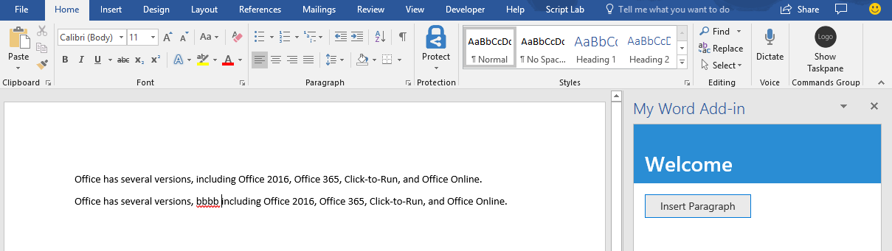
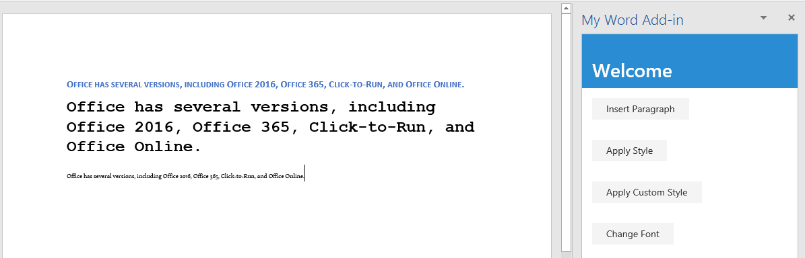
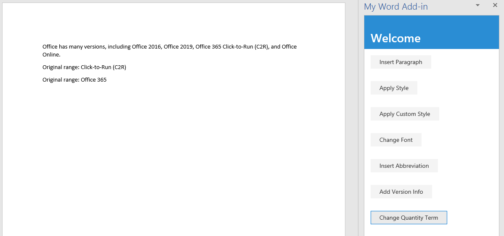
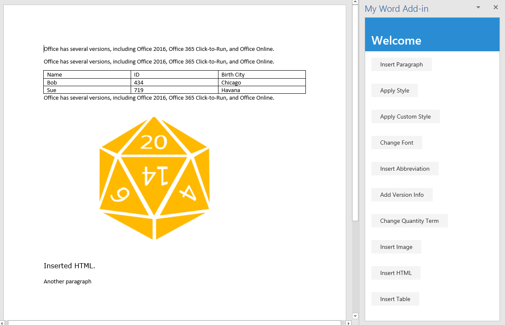

# Tutorial: Create a Word task pane add-in

In this tutorial, you'll create a Word task pane add-in that:

> [!div class="checklist"]
> * Inserts a range of text
> * Formats text
> * Replaces text and inserts text in various locations
> * Inserts images, HTML, and tables
> * Creates and updates content controls 

## Prerequisites

[!include[Yeoman generator prerequisites](../includes/quickstart-yo-prerequisites.md)]

## Create your add-in project

Use the Yeoman generator to create a Word add-in project. Run the following command and then answer the prompts as follows:

```command&nbsp;line
yo office
```

- **Choose a project type:** `Office Add-in Task Pane project`
- **Choose a script type:** `Javascript`
- **What do you want to name your add-in?** `My Office Add-in`
- **Which Office client application would you like to support?** `Word`


After you complete the wizard, the generator creates the project and installs supporting Node components.

## Insert a range of text

In this step of the tutorial, you'll programmatically test that your add-in supports the user's current version of Word, and then insert a paragraph into the document.

### Code the add-in

1. Open the project in your code editor.

2. Open the file **./src/taskpane/taskpane.html**. This file contains the HTML markup for the task pane.

3. Locate the `<main>` element and delete all lines that appear after the opening `<main>` tag and before the closing `</main>` tag.

4. Add the following markup immediately after the opening `<main>` tag:

    ```html
    <button class="ms-Button" id="insert-paragraph">Insert Paragraph</button>
    ```

5. Open the file **./src/taskpane/taskpane.js**. This file contains the Office JavaScript API code that facilitates interaction between the task pane and the Office host application.

6. Remove all references to the `run` button and the `run()` function by doing the following:

    - Locate and delete the line `document.getElementById("run").onclick = run;`.

    - Locate and delete the `run()` function.

7. Locate the line `if (info.host === Office.HostType.Word) {` within the `Office.onReady` method call and add the following code immediately after that line. Note:

    - The first part of this code determines whether the user's version of Word supports a version of Word.js that includes all the APIs that are used in all the stages of this tutorial. In a production add-in, use the body of the conditional block to hide or disable the UI that would call unsupported APIs. This will enable the user to still use the parts of the add-in that are supported by their version of Word.
    - The second part of this code adds an event handler for the `insert-paragraph` button.

    ```js
    // Determine if the user's version of Office supports all the 
    //        Office.js APIs that are used in the tutorial.
    if (!Office.context.requirements.isSetSupported('WordApi', '1.3')) {
        console.log('Sorry. The tutorial add-in uses Word.js APIs that are not available in your version of Office.');
    }

    // Assign event handlers and other initializaton logic.
    document.getElementById("insert-paragraph").onclick = insertParagraph;
    ```

8. Add the following function to the end of the file. Note:

   - Your Word.js business logic will be added to the function that is passed to `Word.run`. This logic does not execute immediately. Instead, it is added to a queue of pending commands.

   - The `context.sync` method sends all queued commands to Word for execution.

   - The `Word.run` is followed by a `catch` block. This is a best practice that you should always follow. 

    ```js
    function insertParagraph() {
        Word.run(function (context) {

            // TODO3: Queue commands to insert a paragraph into the document.

            return context.sync();
        })
        .catch(function (error) {
            console.log("Error: " + error);
            if (error instanceof OfficeExtension.Error) {
                console.log("Debug info: " + JSON.stringify(error.debugInfo));
            }
        });
    }
    ```

9. Within the `insertParagraph()` function, replace `TODO3` with the following code. Note:

   - The first parameter to the `insertParagraph` method is the text for the new paragraph.

   - The second parameter is the location within the body where the paragraph will be inserted. Other options for insert paragraph, when the parent object is the body, are "End" and "Replace".

    ```js
    var docBody = context.document.body;
    docBody.insertParagraph("Office has several versions, including Office 2016, Office 365 Click-to-Run, and Office on the web.",
                            "Start");
    ```

### Test the add-in

1. Navigate to the root folder of the project.

    ```command&nbsp;line
    cd "My Office Add-in"
    ```

2. Complete the following steps to start the local web server and sideload your add-in.

    > [!NOTE]
    > Office Add-ins should use HTTPS, not HTTP, even when you are developing. If you are prompted to install a certificate after you run one of the following commands, accept the prompt to install the certificate that the Yeoman generator provides.

    > [!TIP]
    > If you're testing your add-in on Mac, run the following command before proceeding. When you run this command, the local web server starts.
    >
    > ```command&nbsp;line
    > npm run dev-server
    > ```

    - To test your add-in in Word, run the following command in the root directory of your project. This starts the local web server (if it's not already running) and opens Word with your add-in loaded.

        ```command&nbsp;line
        npm start
        ```

    - To test your add-in in Word on a browser, run the following command in the root directory of your project. When you run this command, the local web server will start (if it's not already running).

        ```command&nbsp;line
        npm run start:web
        ```

        To use your add-in, open a new document in Word on the web and then sideload your add-in by following the instructions in [Sideload Office Add-ins in Office on the web](../testing/sideload-office-add-ins-for-testing.md#sideload-an-office-add-in-in-office-on-the-web).

3. In Word, open a new document, choose the **Home** tab, and then choose the **Show Taskpane** button in the ribbon to open the add-in task pane.

    

4. In the task pane, choose **Insert Paragraph**.

5. Make a change in the paragraph.

6. Choose **Insert Paragraph** again. Note that the new paragraph is above the previous one because the `insertParagraph` method is inserting at the start of the document's body.

    

## Format text

In this step of the tutorial, you'll apply a built-in style to text, apply a custom style to text, and change the font of text.

### Apply a built-in style to text

1. Open the project in your code editor. 

2. Open the file index.html.

3. Just below the `div` that contains the `insert-paragraph` button, add the following markup:

    ```html
    <div class="padding">            
        <button class="ms-Button" id="apply-style">Apply Style</button>            
    </div>
    ```

4. Open the app.js file.

5. Just below the line that assigns a click handler to the `insert-paragraph` button, add the following code:

    ```js
    $('#apply-style').click(applyStyle);
    ```

6. Just below the `insertParagraph` function, add the following function:

    ```js
    function applyStyle() {
        Word.run(function (context) {
            
            // TODO1: Queue commands to style text.

            return context.sync();
        })
        .catch(function (error) {
            console.log("Error: " + error);
            if (error instanceof OfficeExtension.Error) {
                console.log("Debug info: " + JSON.stringify(error.debugInfo));
            }
        });
    }
    ``` 

7. Replace `TODO1` with the following code. Note that the code applies a style to a paragraph, but styles can also be applied to ranges of text.

    ```js
    var firstParagraph = context.document.body.paragraphs.getFirst();
    firstParagraph.styleBuiltIn = Word.Style.intenseReference;
    ``` 

### Apply a custom style to text

1. Open the file index.html.

2. Below the `div` that contains the `apply-style` button, add the following markup:

    ```html
    <div class="padding">            
        <button class="ms-Button" id="apply-custom-style">Apply Custom Style</button>            
    </div>
    ```

3. Open the app.js file.

4. Below the line that assigns a click handler to the `apply-style` button, add the following code:

    ```js
    $('#apply-custom-style').click(applyCustomStyle);
    ```

5. Below the `applyStyle` function, add the following function:

    ```js
    function applyCustomStyle() {
        Word.run(function (context) {
            
            // TODO1: Queue commands to apply the custom style.

            return context.sync();
        })
        .catch(function (error) {
            console.log("Error: " + error);
            if (error instanceof OfficeExtension.Error) {
                console.log("Debug info: " + JSON.stringify(error.debugInfo));
            }
        });
    }
    ``` 

6. Replace `TODO1` with the following code. Note that the code applies a custom style that does not exist yet. You'll create a style with the name **MyCustomStyle** in the [Test the add-in](#test-the-add-in) step.

    ```js
    var lastParagraph = context.document.body.paragraphs.getLast();
    lastParagraph.style = "MyCustomStyle";
    ``` 

### Change the font of text

1. Open the file index.html.

2. Below the `div` that contains the `apply-custom-style` button, add the following markup:

    ```html
    <div class="padding">            
        <button class="ms-Button" id="change-font">Change Font</button>            
    </div>
    ```

3. Open the app.js file.

4. Below the line that assigns a click handler to the `apply-custom-style` button, add the following code:

    ```js
    $('#change-font').click(changeFont);
    ```

5. Below the `applyCustomStyle` function, add the following function:

    ```js
    function changeFont() {
        Word.run(function (context) {
            
            // TODO1: Queue commands to apply a different font.

            return context.sync();
        })
        .catch(function (error) {
            console.log("Error: " + error);
            if (error instanceof OfficeExtension.Error) {
                console.log("Debug info: " + JSON.stringify(error.debugInfo));
            }
        });
    }
    ``` 

6. Replace `TODO1` with the following code. Note that the code gets a reference to the second paragraph by using the `ParagraphCollection.getFirst` method chained to the `Paragraph.getNext` method.

    ```js
    var secondParagraph = context.document.body.paragraphs.getFirst().getNext();
    secondParagraph.font.set({
            name: "Courier New",
            bold: true,
            size: 18
        });
    ``` 

### Test the add-in

1. In the Git bash window, or Node.JS-enabled system prompt, from the previous stage tutorial is still open, enter Ctrl+C twice to stop the running web server. Otherwise, open a Git bash window, or Node.JS-enabled system prompt, and navigate to the **Start** folder of the project.

     > [!NOTE]
     > Although the browser-sync server reloads your add-in in the task pane every time you make a change to any file, including the app.js file, it does not retranspile the JavaScript, so you must repeat the build command in order for your changes to app.js to take effect. In order to do this, you need to kill the server process so that the prompt appears and you can enter the build command. After the build, you restart the server. The next few steps carry out this process.

2. Run the command `npm run build` to transpile your ES6 source code to an earlier version of JavaScript that is supported by all the hosts where Office Add-ins can run.

3. Run the command `npm start` to start a web server running on localhost.   

4. Reload the task pane by closing it, and then on the **Home** menu select **Show Taskpane** to reopen the add-in.

5. Be sure there are at least three paragraphs in the document. You can choose **Insert Paragraph** three times. *Check carefully that there's no blank paragraph at the end of the document. If there is, delete it.*

6. In Word, create a custom style named "MyCustomStyle". It can have any formatting that you want.

7. Choose the **Apply Style** button. The first paragraph will be styled with the built-in style **Intense Reference**.

8. Choose the **Apply Custom Style** button. The last paragraph will be styled with your custom style. (If nothing seems to happen, the last paragraph might be blank. If so, add some text to it.)

9. Choose the **Change Font** button. The font of the second paragraph changes to 18 pt., bold, Courier New.

    

## Replace text and insert text

In this step of the tutorial, you'll add text inside and outside of selected ranges of text, and replace the text of a selected range.

### Add text inside a range

1. Open the project in your code editor.

2. Open the file index.html.

3. Below the `div` that contains the `change-font` button, add the following markup:

    ```html
    <div class="padding">
        <button class="ms-Button" id="insert-text-into-range">Insert Abbreviation</button>
    </div>
    ```

4. Open the app.js file.

5. Below the line that assigns a click handler to the `change-font` button, add the following code:

    ```js
    $('#insert-text-into-range').click(insertTextIntoRange);
    ```

6. Below the `changeFont` function, add the following function:

    ```js
    function insertTextIntoRange() {
        Word.run(function (context) {

            // TODO1: Queue commands to insert text into a selected range.

            // TODO2: Load the text of the range and sync so that the
            //        current range text can be read.

            // TODO3: Queue commands to repeat the text of the original
            //        range at the end of the document.

            return context.sync();
        })
        .catch(function (error) {
            console.log("Error: " + error);
            if (error instanceof OfficeExtension.Error) {
                console.log("Debug info: " + JSON.stringify(error.debugInfo));
            }
        });
    }
    ``` 

7. Replace `TODO1` with the following code. Note:

   - The method is intended to insert the abbreviation ["(C2R)"] into the end of the Range whose text is "Click-to-Run". It makes a simplifying assumption that the string is present and the user has selected it.

   - The first parameter of the `Range.insertText` method is the string to insert into the `Range` object.

   - The second parameter specifies where in the range the additional text should be inserted. Besides "End", the other possible options are "Start", "Before", "After", and "Replace". 

   - The difference between "End" and "After" is that "End" inserts the new text inside the end of the existing range, but "After" creates a new range with the string and inserts the new range after the existing range. Similarly, "Start" inserts text inside the beginning of the existing range and "Before" inserts a new range. "Replace" replaces the text of the existing range with the string in the first parameter.

   - You saw in an earlier stage of the tutorial that the insert* methods of the body object do not have the "Before" and "After" options. This is because you can't put content outside of the document's body.

    ```js
    var doc = context.document;
    var originalRange = doc.getSelection();
    originalRange.insertText(" (C2R)", "End");
    ```

8. We'll skip over `TODO2` until the next section. Replace `TODO3` with the following code. This code is similar to the code you created in the first stage of the tutorial, except that now you are inserting a new paragraph at the end of the document instead of at the start. This new paragraph will demonstrate that the new text is now part of the original range.

    ```js
    doc.body.insertParagraph("Original range: " + originalRange.text, "End");
    ```

### Add code to fetch document properties into the task pane's script objects

In all the previous functions in this series of tutorials, you queued commands to *write* to the Office document. Each function ended with a call to the `context.sync()` method which sends the queued commands to the document to be executed. But the code you added in the last step calls the `originalRange.text` property, and this is a significant difference from the earlier functions you wrote, because the `originalRange` object is only a proxy object that exists in your task pane's script. It doesn't know what the actual text of the range in the document is, so its `text` property can't have a real value. It is necessary to first fetch the text value of the range from the document and use it to set the value of `originalRange.text`. Only then can `originalRange.text` be called without causing an exception to be thrown. This fetching process has three steps:

   1. Queue a command to load (that is; fetch) the properties that your code needs to read.

   2. Call the context object's `sync` method to send the queued command to the document for execution and return the requested information.

   3. Because the `sync` method is asynchronous, ensure that it has completed before your code calls the properties that were fetched.

These steps must be completed whenever your code needs to *read* information from the Office document.

1. Replace `TODO2` with the following code.
  
    ```js
    originalRange.load("text");
    return context.sync()
        .then(function() {

                // TODO4: Move the doc.body.insertParagraph line here.

            }
        )
            // TODO5: Move the final call of context.sync here and ensure
            //        that it does not run until the insertParagraph has
            //        been queued.
    ```

2. You can't have two `return` statements in the same unbranching code path, so delete the final line `return context.sync();` at the end of the `Word.run`. You'll add a new final `context.sync` later in this tutorial.

3. Cut the `doc.body.insertParagraph` line and paste in place of `TODO4`.

4. Replace `TODO5` with the following code. Note:

   - Passing the `sync` method to a `then` function ensures that it does not run until the `insertParagraph` logic has been queued.

   - The `then` method invokes whatever function is passed to it, and you don't want `sync` to be invoked twice, so leave off the "()" from the end of context.sync.

    ```js
    .then(context.sync);
    ```

When you're done, the entire function should look like the following:

```js
function insertTextIntoRange() {
    Word.run(function (context) {

        var doc = context.document;
        var originalRange = doc.getSelection();
        originalRange.insertText(" (C2R)", "End");

        originalRange.load("text");
        return context.sync()
            .then(function() {
                        doc.body.insertParagraph("Current text of original range: " + originalRange.text,
                                                "End");
                }
            )
            .then(context.sync);
    })
    .catch(function (error) {
        console.log("Error: " + error);
        if (error instanceof OfficeExtension.Error) {
            console.log("Debug info: " + JSON.stringify(error.debugInfo));
        }
    });
}
```

### Add text between ranges

1. Open the file index.html.

2. Below the `div` that contains the `insert-text-into-range` button, add the following markup:

    ```html
    <div class="padding">
        <button class="ms-Button" id="insert-text-outside-range">Add Version Info</button>
    </div>
    ```

3. Open the app.js file.

4. Below the line that assigns a click handler to the `insert-text-into-range` button, add the following code:

    ```js
    $('#insert-text-outside-range').click(insertTextBeforeRange);
    ```

5. Below the `insertTextIntoRange` function, add the following function:

    ```js
    function insertTextBeforeRange() {
        Word.run(function (context) {

            // TODO1: Queue commands to insert a new range before the
            //        selected range.

            // TODO2: Load the text of the original range and sync so that the
            //        range text can be read and inserted.

        })
        .catch(function (error) {
            console.log("Error: " + error);
            if (error instanceof OfficeExtension.Error) {
                console.log("Debug info: " + JSON.stringify(error.debugInfo));
            }
        });
    }
    ```

6. Replace `TODO1` with the following code. Note:

   - The method is intended to add a range whose text is "Office 2019, " before the range with text "Office 365". It makes a simplifying assumption that the string is present and the user has selected it.

   - The first parameter of the `Range.insertText` method is the string to add.

   - The second parameter specifies where in the range the additional text should be inserted. For more details about the location options, see the previous discussion of the `insertTextIntoRange` function.

    ```js
    var doc = context.document;
    var originalRange = doc.getSelection();
    originalRange.insertText("Office 2019, ", "Before");
    ```

7. Replace `TODO2` with the following code.

     ```js
    originalRange.load("text");
    return context.sync()
        .then(function() {

                // TODO3: Queue commands to insert the original range as a
                //        paragraph at the end of the document.

                }
            )

            // TODO4: Make a final call of context.sync here and ensure
            //        that it does not run until the insertParagraph has
            //        been queued.
    ```

8. Replace `TODO3` with the following code. This new paragraph will demonstrate the fact that the new text is ***not*** part of the original selected range. The original range still has only the text it had when it was selected.

    ```js
    doc.body.insertParagraph("Current text of original range: " + originalRange.text,
                             "End");
    ```

9. Replace `TODO4` with the following code:

    ```js
    .then(context.sync);
    ```

### Replace the text of a range

1. Open the file index.html.

2. Below the `div` that contains the `insert-text-outside-range` button, add the following markup:

    ```html
    <div class="padding">
        <button class="ms-Button" id="replace-text">Change Quantity Term</button>
    </div>
    ```

3. Open the app.js file.

4. Below the line that assigns a click handler to the `insert-text-outside-range` button, add the following code:

    ```js
    $('#replace-text').click(replaceText);
    ```

5. Below the `insertTextBeforeRange` function, add the following function:

    ```js
    function replaceText() {
        Word.run(function (context) {

            // TODO1: Queue commands to replace the text.

            return context.sync();
        })
        .catch(function (error) {
            console.log("Error: " + error);
            if (error instanceof OfficeExtension.Error) {
                console.log("Debug info: " + JSON.stringify(error.debugInfo));
            }
        });
    }
    ```

6. Replace `TODO1` with the following code. Note that the method is intended to replace the string "several" with the string "many". It makes a simplifying assumption that the string is present and the user has selected it.

    ```js
    var doc = context.document;
    var originalRange = doc.getSelection();
    originalRange.insertText("many", "Replace");
    ```

### Test the add-in

1. If the Git bash window, or Node.JS-enabled system prompt, from the previous stage tutorial is still open, enter Ctrl-C twice to stop the running web server. Otherwise, open a Git bash window, or Node.JS-enabled system prompt, and navigate to the **Start** folder of the project.

     > [!NOTE]
     > Although the browser-sync server reloads your add-in in the task pane every time you make a change to any file, including the app.js file, it does not retranspile the JavaScript, so you must repeat the build command in order for your changes to app.js to take effect. In order to do this, you need to kill the server process so that the prompt appears and you can enter the build command. After the build, restart the server. The next few steps carry out this process.

2. Run the command `npm run build` to transpile your ES6 source code to an earlier version of JavaScript that is supported by all the hosts where Office Add-ins can run.

3. Run the command `npm start` to start a web server running on localhost.

4. Reload the task pane by closing it, and then on the **Home** menu, select **Show Taskpane** to reopen the add-in.

5. In the task pane, choose **Insert Paragraph** to ensure that there is a paragraph at the start of the document.

6. Select some text. Selecting the phrase "Click-to-Run" will make the most sense. *Be careful not to include the preceding or following space in the selection.*

7. Choose the **Insert Abbreviation** button. Note that " (C2R)" is added. Note also that at the bottom of the document a new paragraph is added with the entire expanded text because the new string was added to the existing range.

8. Select some text. Selecting the phrase "Office 365" will make the most sense. *Be careful not to include the preceding or following space in the selection.*

9. Choose the **Add Version Info** button. Note that "Office 2019, " is inserted between "Office 2016" and "Office 365". Note also that at the bottom of the document a new paragraph is added but it contains only the originally selected text because the new string became a new range rather than being added to the original range.

10. Select some text. Selecting the word "several" will make the most sense. *Be careful not to include the preceding or following space in the selection.*

11. Choose the **Change Quantity Term** button. Note that "many" replaces the selected text.

    

## Insert images, HTML, and tables

In this step of the tutorial, you'll learn how to insert images, HTML, and tables into the document.

### Insert an image

1. Open the project in your code editor.

2. Open the file index.html.

3. Below the `div` that contains the `replace-text` button, add the following markup:

    ```html
    <div class="padding">
        <button class="ms-Button" id="insert-image">Insert Image</button>
    </div>
    ```

4. Open the app.js file.

5. Near the top of the file, just below the use-strict line, add the following line. This line imports a variable from another file. The variable is a base 64 string that encodes an image. To see the encoded string, open the base64Image.js file in the root of the project.

    ```js
    import { base64Image } from "./base64Image";
    ```

6. Below the line that assigns a click handler to the `replace-text` button, add the following code:

    ```js
    $('#insert-image').click(insertImage);
    ```

7. Below the `replaceText` function, add the following function:

    ```js
    function insertImage() {
        Word.run(function (context) {

            // TODO1: Queue commands to insert an image.

            return context.sync();
        })
        .catch(function (error) {
            console.log("Error: " + error);
            if (error instanceof OfficeExtension.Error) {
                console.log("Debug info: " + JSON.stringify(error.debugInfo));
            }
        });
    }
    ```

8. Replace `TODO1` with the following code. Note that this line inserts the base 64 encoded image at the end of the document. (The `Paragraph` object also has an `insertInlinePictureFromBase64` method and other `insert*` methods. See the following insertHTML section for an example.)

    ```js
    context.document.body.insertInlinePictureFromBase64(base64Image, "End");
    ```

### Insert HTML

1. Open the file index.html.

2. Below the `div` that contains the `insert-image` button, add the following markup:

    ```html
    <div class="padding">
        <button class="ms-Button" id="insert-html">Insert HTML</button>
    </div>
    ```

3. Open the app.js file.

4. Below the line that assigns a click handler to the `insert-image` button, add the following code:

    ```js
    $('#insert-html').click(insertHTML);
    ```

5. Below the `insertImage` function, add the following function:

    ```js
    function insertHTML() {
        Word.run(function (context) {

            // TODO1: Queue commands to insert a string of HTML.

            return context.sync();
        })
        .catch(function (error) {
            console.log("Error: " + error);
            if (error instanceof OfficeExtension.Error) {
                console.log("Debug info: " + JSON.stringify(error.debugInfo));
            }
        });
    }
    ```

6. Replace `TODO1` with the following code. Note:

   - The first line adds a blank paragraph to the end of the document. 

   - The second line inserts a string of HTML at the end of the paragraph; specifically two paragraphs, one formatted with Verdana font, the other with the default styling of the Word document. (As you saw in the `insertImage` method earlier, the `context.document.body` object also has the `insert*` methods.)

    ```js
    var blankParagraph = context.document.body.paragraphs.getLast().insertParagraph("", "After");
    blankParagraph.insertHtml('<p style="font-family: verdana;">Inserted HTML.</p><p>Another paragraph</p>', "End");
    ```

### Insert a table

1. Open the file index.html.

2. Below the `div` that contains the `insert-html` button, add the following markup:

    ```html
    <div class="padding">
        <button class="ms-Button" id="insert-table">Insert Table</button>
    </div>
    ```

3. Open the app.js file.

4. Below the line that assigns a click handler to the `insert-html` button, add the following code:

    ```js
    $('#insert-table').click(insertTable);
    ```

5. Below the `insertHTML` function, add the following function:

    ```js
    function insertTable() {
        Word.run(function (context) {

            // TODO1: Queue commands to get a reference to the paragraph
            //        that will proceed the table.

            // TODO2: Queue commands to create a table and populate it with data.

            return context.sync();
        })
        .catch(function (error) {
            console.log("Error: " + error);
            if (error instanceof OfficeExtension.Error) {
                console.log("Debug info: " + JSON.stringify(error.debugInfo));
            }
        });
    }
    ```

6. Replace `TODO1` with the following code. Note that this line uses the `ParagraphCollection.getFirst` method to get a reference ot the first paragraph and then uses the `Paragraph.getNext` method to get a reference to the second paragraph.

    ```js
    var secondParagraph = context.document.body.paragraphs.getFirst().getNext();
    ```

7. Replace `TODO2` with the following code. Note:

   - The first two parameters of the `insertTable` method specify the number of rows and columns.

   - The third parameter specifies where to insert the table, in this case after the paragraph.

   - The fourth parameter is a two-dimensional array that sets the values of the table cells.

   - The table will have plain default styling, but the `insertTable` method returns a `Table` object with many members, some of which are used to style the table.

    ```js
    var tableData = [
            ["Name", "ID", "Birth City"],
            ["Bob", "434", "Chicago"],
            ["Sue", "719", "Havana"],
        ];
    secondParagraph.insertTable(3, 3, "After", tableData);
    ```

### Test the add-in

1. If the Git bash window, or Node.JS-enabled system prompt, from the previous stage tutorial is still open, enter Ctrl+C twice to stop the running web server. Otherwise, open a Git bash window, or Node.JS-enabled system prompt, and navigate to the **Start** folder of the project.

     > [!NOTE]
     > Although the browser-sync server reloads your add-in in the task pane every time you make a change to any file, including the app.js file, it does not retranspile the JavaScript, so you must repeat the build command in order for your changes to app.js to take effect. In order to do this, you need to kill the server process so that the prompt appears and you can enter the build command. After the build, restart the server. The next few steps carry out this process.

2. Run the command `npm run build` to transpile your ES6 source code to an earlier version of JavaScript that is supported by all the hosts where Office Add-ins can run.

3. Run the command `npm start` to start a web server running on localhost.

4. Reload the task pane by closing it, and then on the **Home** menu, select **Show Taskpane** to reopen the add-in.

5. In the task pane, choose **Insert Paragraph** at least three times to ensure that there are a few paragraphs in the document.

6. Choose the **Insert Image** button and note that an image is inserted at the end of the document.

7. Choose the **Insert HTML** button and note that two paragraphs are inserted at the end of the document, and that the first one has Verdana font.

8. Choose the **Insert Table** button and note that a table is inserted after the second paragraph.

    

## Create and update content controls

In this step of the tutorial, you'll learn how to create Rich Text content controls in the document, and then how to insert and replace content in the controls.

> [!NOTE]
> There are several types of content controls that can be added to a Word document through the UI; but currently only Rich Text content controls are supported by Word.js.
>
> Before you start this step of the tutorial, we recommend that you create and manipulate Rich Text content controls through the Word UI, so you can be familiar with the controls and their properties. For details, see [Create forms that users complete or print in Word](https://support.office.com/article/create-forms-that-users-complete-or-print-in-word-040c5cc1-e309-445b-94ac-542f732c8c8b).

### Create a content control

1. Open the project in your code editor.

2. Open the file index.html.

3. Below the `div` that contains the `replace-text` button, add the following markup:

    ```html
    <div class="padding">
        <button class="ms-Button" id="create-content-control">Create Content Control</button>
    </div>
    ```

4. Open the app.js file.

5. Below the line that assigns a click handler to the `insert-table` button, add the following code:

    ```js
    $('#create-content-control').click(createContentControl);
    ```

6. Below the `insertTable` function, add the following function:

    ```js
    function createContentControl() {
        Word.run(function (context) {

            // TODO1: Queue commands to create a content control.

            return context.sync();
        })
        .catch(function (error) {
            console.log("Error: " + error);
            if (error instanceof OfficeExtension.Error) {
                console.log("Debug info: " + JSON.stringify(error.debugInfo));
            }
        });
    }
    ```

7. Replace `TODO1` with the following code. Note:

   - This code is intended to wrap the phrase "Office 365" in a content control. It makes a simplifying assumption that the string is present and the user has selected it.

   - The `ContentControl.title` property specifies the visible title of the content control.

   - The `ContentControl.tag` property specifies an tag that can be used to get a reference to a content control using the `ContentControlCollection.getByTag` method, which you'll use in a later function.

   - The `ContentControl.appearance` property specifies the visual look of the control. Using the value "Tags" means that the control will be wrapped in opening and closing tags, and the opening tag will have the content control's title. Other possible values are "BoundingBox" and "None".

   - The `ContentControl.color` property specifies the color of the tags or the border of the bounding box.

    ```js
    var serviceNameRange = context.document.getSelection();
    var serviceNameContentControl = serviceNameRange.insertContentControl();
    serviceNameContentControl.title = "Service Name";
    serviceNameContentControl.tag = "serviceName";
    serviceNameContentControl.appearance = "Tags";
    serviceNameContentControl.color = "blue";
    ```

### Replace the content of the content control

1. Open the file index.html.

2. Below the `div` that contains the `create-content-control` button, add the following markup:

    ```html
    <div class="padding">
        <button class="ms-Button" id="replace-content-in-control">Rename Service</button>
    </div>
    ```

3. Open the app.js file.

4. Below the line that assigns a click handler to the `create-content-control` button, add the following code:

    ```js
    $('#replace-content-in-control').click(replaceContentInControl);
    ```

5. Below the `createContentControl` function, add the following function:

    ```js
    function replaceContentInControl() {
        Word.run(function (context) {

            // TODO1: Queue commands to replace the text in the Service Name
            //        content control.

            return context.sync();
        })
        .catch(function (error) {
            console.log("Error: " + error);
            if (error instanceof OfficeExtension.Error) {
                console.log("Debug info: " + JSON.stringify(error.debugInfo));
            }
        });
    }
    ```

6. Replace `TODO1` with the following code. Note:

    - The `ContentControlCollection.getByTag` method returns a `ContentControlCollection` of all content controls of the specified tag. We use `getFirst` to get a reference to the desired control.

    ```js
    var serviceNameContentControl = context.document.contentControls.getByTag("serviceName").getFirst();
    serviceNameContentControl.insertText("Fabrikam Online Productivity Suite", "Replace");
    ```

### Test the add-in

1. If the Git bash window, or Node.JS-enabled system prompt, from the previous stage tutorial is still open, enter Ctrl+C twice to stop the running web server. Otherwise, open a Git bash window, or Node.JS-enabled system prompt, and navigate to the **Start** folder of the project.

     > [!NOTE]
     > Although the browser-sync server reloads your add-in in the task pane every time you make a change to any file, including the app.js file, it does not retranspile the JavaScript, so you must repeat the build command in order for your changes to app.js to take effect. In order to do this, you need to kill the server process so that the prompt appears and you can enter the build command. After the build, restart the server. The next few steps carry out this process.

2. Run the command `npm run build` to transpile your ES6 source code to an earlier version of JavaScript that is supported by all the hosts where Office Add-ins can run.

3. Run the command `npm start` to start a web server running on localhost.

4. Reload the task pane by closing it, and then on the **Home** menu, select **Show Taskpane** to reopen the add-in.

5. In the task pane, choose **Insert Paragraph** to ensure that there is a paragraph with "Office 365" at the top of the document.

6. Select the phrase "Office 365" in the paragraph you just added, and then choose the **Create Content Control** button. Note that the phrase is wrapped in tags labelled "Service Name".

7. Choose the **Rename Service** button and note that the text of the content control changes to "Fabrikam Online Productivity Suite".

    

## Next steps

In this tutorial, you've created a Word task pane add-in that inserts and replaces text, images, and other content in a Word document. To learn more about building Word add-ins, continue to the following article:

> [!div class="nextstepaction"]
> [Word add-ins overview](../word/word-add-ins-programming-overview.md)
