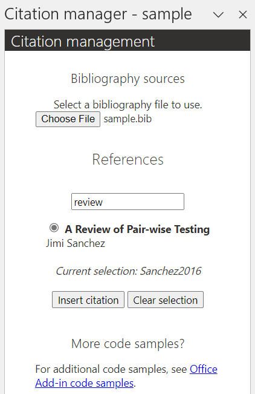

# Sample: Manage citations in a Word document using your Word add-in

Citation management is an important aspect of documents, particularly in academia and education. Each citation style has its own guidelines for how citations should be marked in a document as well as where and how the sources should be noted. Such styles include [APA](http://apastyle.apa.org/) and [MLA](https://www.mla.org/MLA-Style).

This article features a sample add-in that manages citations in a Word document. The add-in displays the references loaded from the user's .bib file that the user selects to cite in their document.

## Prerequisites

- [Visual Studio Code](https://code.visualstudio.com/Download).
- Office connected to a Microsoft 365 subscription (including Office on the web).
- [Node.js](https://nodejs.org/) version 16 or greater.
- npm version 8 or greater.
- @orcid/bibtexParseJs, a JavaScript library for parsing the selected .bib file.

## Run the sample code

The sample code for this article is named [Manage citations in a Word document](https://github.com/OfficeDev/Office-Add-in-samples/tree/main/Samples/word-citation-management). To run the sample, follow the instructions in the [readme](https://github.com/OfficeDev/Office-Add-in-samples/tree/main/Samples/word-citation-management).

## Key steps in the sample

1. The user chooses a local .bib file that contains the references they'd like to cite.
1. The add-in reads the .bib file then displays the bibliography references in the task pane. The sample uses [@orcid/bibtexParseJs](https://github.com/ORCID/bibtexParseJs#readme) to parse the .bib file.
1. The user chooses the appropriate reference then inserts it at the cursor's location (or at the end of selected text) in the document.
1. The add-in adds a reference mark at that location in the document and adds the reference to an endnote. All endnotes are automatically listed at the end of the document.

## Additional considerations for your solution

The following considerations will help you plan how to modify your solution to meet your desired functionality.

### Use single sign-on

[Enable single sign-on (SSO) in an Office Add-in](../develop/sso-in-office-add-ins.md) to support persisting user data and settings across multiple documents. If your service provides or hosts the bibliography library, an authorized user can access and select from that bibliography in their document.

### Persist add-in state and settings

[Persist add-in state and settings](../develop/persisting-add-in-state-and-settings.md) in the user's current document.

> [!CAUTION]
> Don't store sensitive information such as auth tokens or connection strings. Properties in the document aren't encrypted or protected.

### Use footnotes

List the references in [footnotes](/javascript/api/word/word.range#word-word-range-insertfootnote-member(1)) at the end of the page instead of endnotes, according to the citation style.

Alternatively, allow the user to choose where they'd like the references to be displayed. If so, you can update the add-in to persist the user's preference using a document property or as part of their authenticated experience.

### Update citation style

Update the citation style used to display the references in the endnotes (or footnotes).

Alternatively, provide various style options then allow the user to choose. If so, you can update the add-in to persist the user's preference using a document property or as part of their authenticated experience.

### Replace bibtexParseJs

Replace the .bib file parser [@orcid/bibtexParseJs](https://github.com/ORCID/bibtexParseJs#readme) with your own or another available parser, especially if this option doesn't provide the functionality you need for your solution.

## See also

- [npm](https://docs.npmjs.com/downloading-and-installing-node-js-and-npm)
- [@orcid/bibtexParseJs](https://github.com/ORCID/bibtexParseJs#readme)
