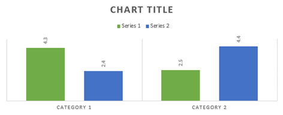
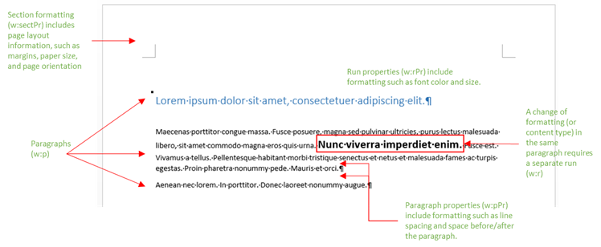

# Understand when and how to use Office Open XML in your Word add-in

**Provided by:** Stephanie Krieger, Microsoft Corporation | Juan Balmori Labra, Microsoft Corporation

If you're building Office Add-ins to run in Word, you might already know that the Office JavaScript API (Office.js) offers several formats for reading and writing document content. These are called coercion types, and they include plain text, tables, HTML, and Office Open XML.

## Options for adding rich content

So what are your options when you need to add rich content to a document, such as images, formatted tables, charts, or even just formatted text?

1. **Word JavaScript APIs.** Start with the APIs available through the [WordApi requirement sets](/javascript/api/requirement-sets/word/word-api-requirement-sets) to see if they provide what you need. For an example, see the [Insert formatted text](https://github.com/OfficeDev/office-js-snippets/blob/prod/samples/word/25-paragraph/insert-formatted-text.yaml) code snippet. You can try this and other snippets in the [Script Lab add-in](https://appsource.microsoft.com/product/office/wa104380862) on Word! To learn more about Script Lab, see [Explore Office JavaScript API using Script Lab](../overview/explore-with-script-lab.md).

1. **HTML coercion.** If APIs aren't yet available, you can use HTML for inserting some types of rich content, such as pictures. Depending on your scenario, there can be drawbacks to HTML coercion, such as limitations in the formatting and positioning options available to your content.

1. **Office Open XML.** Because Office Open XML is the language in which Word documents (such as .docx and .dotx) are written, you can insert virtually any type of content that a user can add to a Word document, with virtually any type of formatting the user can apply. Determining the Office Open XML markup you need to get it done is easier than you might think.

> [!NOTE]
> Office Open XML is also the language behind PowerPoint and Excel (and, as of Office 2013, Visio) documents. However, currently, you can coerce content as Office Open XML only in Office Add-ins created for Word. For more information about Office Open XML, including the complete language reference documentation, see the [See also](#see-also) section.

## Download the companion code sample

Download the code sample [Load and write Open XML in your Word add-in](https://github.com/OfficeDev/Office-Add-in-samples/tree/main/Samples/word-add-in-load-and-write-open-xml), which contains the Office Open XML markup and Office.js code required for inserting any of the following examples into Word.

## Learn about content types

To begin, take a look at some of the content types you can insert using Office Open XML coercion.

Throughout this article, the terms **content types** and **rich content** refer to the types of rich content you can insert into a Word document.

*Figure 1. Text with direct formatting*


Use direct formatting to specify exactly what the text will look like regardless of existing formatting in the user's document.

*Figure 2. Text formatted using a style*


Use a style to automatically coordinate the look of text you insert with the user's document.

*Figure 3. A simple image*


Use the same method for inserting any Office-supported image format.

*Figure 4. An image formatted using picture styles and effects*


Adding high quality formatting and effects to your images requires much less markup than you might expect.

*Figure 5. A content control*


Use content controls with your add-in to add content at a specified (bound) location rather than at the selection.

*Figure 6. A text box with WordArt formatting*


Text effects are available in Word for text inside a text box (as shown here) or for regular body text.

*Figure 7. A shape*


Insert built-in or custom drawing shapes, with or without text and formatting effects.

*Figure 8. A table with direct formatting*


Include text formatting, borders, shading, cell sizing, or any table formatting you need.

*Figure 9. A table formatted using a table style*


Use built-in or custom table styles just as easily as using a paragraph style for text.

*Figure 10. A SmartArt diagram*


Office offers a wide array of SmartArt diagram layouts (and you can use Office Open XML to create your own).

*Figure 11. A chart*



You can insert Excel charts as live charts in Word documents, which also means you can use them in your add-in for Word.
As you can see by the preceding examples, you can use Office Open XML coercion to insert essentially any type of content that a user can insert into their own document.
There are two simple ways to get the Office Open XML markup you need. Either add your rich content to an otherwise blank Word document and then save the file in Word XML Document format or use a test add-in with the [getSelectedDataAsync](/javascript/api/office/office.document#office-office-document-getselecteddataasync-member(1)) method to grab the markup. Both approaches provide essentially the same result.

> [!TIP]
> An Office Open XML document is actually a compressed package of files that represent the document contents. Saving the file in the Word XML Document format gives you the entire Office Open XML package flattened into one XML file, which is also what you get when using `getSelectedDataAsync` to retrieve the Office Open XML markup.

If you save the file to an XML format from Word, note that there are two options under the Save as Type list in the Save As dialog box for .xml format files. Be sure to choose **Word XML Document**, not the Word 2003 option.

Download the code sample named [Word-Add-in-Get-Set-EditOpen-XML](https://github.com/OfficeDev/Word-Add-in-Get-Set-EditOpen-XML), which you can use as a tool to retrieve and test your markup.

So is that all there is to it? Well, not quite. Yes, for many scenarios, you could use the full, flattened Office Open XML result you see with either of the preceding methods and it would work. The good news is that you probably don't need most of that markup.

If you're one of the many add-in developers seeing Office Open XML markup for the first time, trying to make sense of the massive amount of markup you get for the simplest piece of content might seem overwhelming, but it doesn't have to be.

In this topic, you'll use some common scenarios we've been hearing from the Office Add-ins developer community to show you techniques for simplifying Office Open XML for use in your add-in. We'll explore the markup for some types of content shown earlier along with the information you need for minimizing the Office Open XML payload. We'll also look at the code you need for inserting rich content into a document at the active selection and how to use Office Open XML with the bindings object to add or replace content at specified locations.

## Explore the Office Open XML document package

When you use [getSelectedDataAsync](/javascript/api/office/office.document#office-office-document-getselecteddataasync-member(1)) to retrieve the Office Open XML for a selection of content (or when you save the document in Word XML Document format), what you're getting isn't just the markup that describes your selected content; it's an entire document with many options and settings that you almost certainly don't need. In fact, if you use that method from a document that contains a task pane add-in, the markup you get even includes your task pane.

Even a simple Word document package includes parts for document properties, styles, theme (formatting settings), web settings, fonts, and then some, in addition to parts for the actual content.

For example, say that you want to insert just a paragraph of text with direct formatting, as shown earlier in Figure 1. When you grab the Office Open XML for the formatted text using  `getSelectedDataAsync`, you see a large amount of markup. That markup includes a package element that represents an entire document, which contains several parts (commonly referred to as document parts or, in the Office Open XML, as package parts), as you see listed in Figure 13. Each part represents a separate file within the package.

You can edit Office Open XML markup in a text editor like Notepad. If you open it in Visual Studio, use **Edit** > **Advanced** > **Format Document** (Ctrl+K, Ctrl+D) to format the package for easier editing. Then you can collapse or expand document parts or sections of them, as shown in Figure 12, to more easily review and edit the content of the Office Open XML package. Each document part begins with a **pkg:part** tag.

*Figure 12. Collapse and expand package parts for easier editing in Visual Studio*


*Figure 13. The parts included in a basic Word Office Open XML document package*


With all that markup, you might be surprised to discover that the only elements you actually need to insert the formatted text example are pieces of the .rels part and the document.xml part.

> [!TIP]
> The two lines of markup above the package tag (the XML declarations for version and Office program ID) are assumed when you use the Office Open XML coercion type, so you don't need to include them. Keep them if you want to open your edited markup as a Word document to test it.

Several of the other types of content shown at the start of this topic require additional parts as well (beyond those shown in Figure 13), and you'll address those later in this topic. Meanwhile, since you'll see most of the parts shown in Figure 13 in the markup for any Word document package, here's a quick summary of what each of these parts is for and when you need it:

- Inside the package tag, the first part is the .rels file, which defines relationships between the top-level parts of the package (these are typically the document properties, thumbnail (if any), and main document body). Some of the content in this part is always required in your markup because you need to define the relationship of the main document part (where your content resides) to the document package.

- The document.xml.rels part defines relationships for additional parts required by the document.xml (main body) part, if any.

   > [!IMPORTANT]
   > The .rels files in your package (such as the top-level .rels, document.xml.rels, and others you may see for specific types of content) are an extremely important tool that you can use as a guide for helping you quickly edit down your Office Open XML package. To learn more about how to do this, see [Create your own markup: best practices](#create-your-own-markup-best-practices) later in this topic.

- The document.xml part is the content in the main body of the document. You need elements of this part, of course, since that's where your content appears. But, you don't need everything you see in this part. We'll look at that in more detail later.

- Many parts are automatically ignored by the Set methods when inserting content into a document using Office Open XML coercion, so you might as well remove them. These include the theme1.xml file (the document's formatting theme), the document properties parts (core, add-in, and thumbnail), and setting files (including settings, webSettings, and fontTable).

- In the Figure 1 example, text formatting is directly applied (that is, each font and paragraph formatting setting applied individually). But, if you use a style (such as if you want your text to automatically take on the formatting of the Heading 1 style in the destination document) as shown earlier in Figure 2, then you would need part of the styles.xml part as well as a relationship definition for it. For more information, see the topic section [Add objects that use additional Office Open XML parts](#add-objects-that-use-additional-office-open-xml-parts).

## Insert document content at the selection

Let's take a look at the minimal Office Open XML markup required for the formatted text example shown in Figure 1 and the JavaScript required for inserting it at the active selection in the document.

### Simplified Office Open XML markup

The Office Open XML example shown here was edited as described in the preceding section to leave just required document parts and only required elements within each of those parts. You'll walk through how to edit the markup yourself (and we'll explain a bit more about the pieces that remain here) in the next section of the topic.

```XML
<pkg:package xmlns:pkg="http://schemas.microsoft.com/office/2006/xmlPackage">
  <pkg:part pkg:name="/_rels/.rels" pkg:contentType="application/vnd.openxmlformats-package.relationships+xml" pkg:padding="512">
    <pkg:xmlData>
      <Relationships xmlns="http://schemas.openxmlformats.org/package/2006/relationships">
        <Relationship Id="rId1" Type="http://schemas.openxmlformats.org/officeDocument/2006/relationships/officeDocument" Target="word/document.xml"/>
      </Relationships>
    </pkg:xmlData>
  </pkg:part>
  <pkg:part pkg:name="/word/document.xml" pkg:contentType="application/vnd.openxmlformats-officedocument.wordprocessingml.document.main+xml">
    <pkg:xmlData>
      <w:document xmlns:w="http://schemas.openxmlformats.org/wordprocessingml/2006/main" >
        <w:body>
          <w:p>
            <w:pPr>
              <w:spacing w:before="360" w:after="0" w:line="480" w:lineRule="auto"/>
              <w:rPr>
                <w:color w:val="70AD47" w:themeColor="accent6"/>
                <w:sz w:val="28"/>
              </w:rPr>
            </w:pPr>
            <w:r>
              <w:rPr>
                <w:color w:val="70AD47" w:themeColor="accent6"/>
                <w:sz w:val="28"/>
              </w:rPr>
              <w:t>This text has formatting directly applied to achieve its font size, color, line spacing, and paragraph spacing.</w:t>
            </w:r>
          </w:p>
        </w:body>
      </w:document>
    </pkg:xmlData>
  </pkg:part>
</pkg:package>
```

> [!NOTE]
> If you add the markup shown here to an XML file along with the XML declaration tags for version and mso-application at the top of the file (shown in Figure 13), you can open it in Word as a Word document. Or, without those tags, you can still open it using **File** > **Open** in Word. You'll see **Compatibility Mode** on the title bar in Word, because you removed the settings that tell Word this is a Word document. Since you're adding this markup to an existing Word document, that won't affect your content at all.

### JavaScript for using setSelectedDataAsync

Once you save the preceding Office Open XML as an XML file that's accessible from your solution, use the following function to set the formatted text content in the document using Office Open XML coercion.

In the following function, notice that all but the last line are used to get your saved markup for use in the [setSelectedDataAsync](/javascript/api/office/office.document#office-office-document-setselecteddataasync-member(1)) method call at the end of the function. `setSelectedDataASync` requires only that you specify the content to be inserted and the coercion type.

Replace  *yourXMLfilename* with the name and path of the XML file as you've saved it in your solution. If you aren't sure where to include XML files in your solution or how to reference them in your code, see the [Load and write Open XML in your Word add-in](https://github.com/OfficeDev/Office-Add-in-samples/tree/main/Samples/word-add-in-load-and-write-open-xml) code sample for examples of that and a working example of the markup and JavaScript shown here.

```js
function writeContent() {
    const myOOXMLRequest = new XMLHttpRequest();
    let myXML;
    myOOXMLRequest.open('GET', 'yourXMLfilename', false);
    myOOXMLRequest.send();
    if (myOOXMLRequest.status === 200) {
        myXML = myOOXMLRequest.responseText;
    }
    Office.context.document.setSelectedDataAsync(myXML, { coercionType: 'ooxml' });
}
```

## Create your own markup: best practices

Let's take a closer look at the markup you need to insert the preceding formatted text example.

For this example, start by simply deleting all document parts from the package other than .rels and document.xml. Then, you'll edit those two required parts to simplify things further.

> [!IMPORTANT]
> Use the .rels parts as a map to quickly gauge what's included in the package and determine what parts you can delete completely (that is, any parts not related to or referenced by your content). Remember that every document part must have a relationship defined in the package and those relationships appear in the .rels files. So you should see all of them listed in either .rels, document.xml.rels, or a content-specific .rels file.

The following markup shows the required .rels part before editing. Since we're deleting the add-in and core document property parts, and the thumbnail part, you need to delete those relationships from .rels as well. Notice that this will leave only the relationship (with the relationship ID "rID1" in the following example) for document.xml.

```XML
<pkg:part pkg:name="/_rels/.rels" pkg:contentType="application/vnd.openxmlformats-package.relationships+xml" pkg:padding="512">
  <pkg:xmlData>
    <Relationships xmlns="http://schemas.openxmlformats.org/package/2006/relationships">
      <Relationship Id="rId3" Type="http://schemas.openxmlformats.org/package/2006/relationships/metadata/core-properties" Target="docProps/core.xml"/>
      <Relationship Id="rId2" Type="http://schemas.openxmlformats.org/package/2006/relationships/metadata/thumbnail" Target="docProps/thumbnail.emf"/>
      <Relationship Id="rId1" Type="http://schemas.openxmlformats.org/officeDocument/2006/relationships/officeDocument" Target="word/document.xml"/>
      <Relationship Id="rId4" Type="http://schemas.openxmlformats.org/officeDocument/2006/relationships/extended-properties" Target="docProps/app.xml"/>
    </Relationships>
  </pkg:xmlData>
</pkg:part>
```

Remove the relationships (that is, the **Relationship** tag) for any parts that you completely remove from the package. Including a part without a corresponding relationship, or excluding a part and leaving its relationship in the package, will result in an error.

The following markup shows the document.xml part, which includes our sample formatted text content before editing.

```XML
<pkg:part pkg:name="/word/document.xml" pkg:contentType="application/vnd.openxmlformats-officedocument.wordprocessingml.document.main+xml">
    <pkg:xmlData>
      <w:document mc:Ignorable="w14 w15 wp14" xmlns:wpc="http://schemas.microsoft.com/office/word/2010/wordprocessingCanvas" xmlns:mc="http://schemas.openxmlformats.org/markup-compatibility/2006" xmlns:o="urn:schemas-microsoft-com:office:office" xmlns:r="http://schemas.openxmlformats.org/officeDocument/2006/relationships" xmlns:m="http://schemas.openxmlformats.org/officeDocument/2006/math" xmlns:v="urn:schemas-microsoft-com:vml" xmlns:wp14="http://schemas.microsoft.com/office/word/2010/wordprocessingDrawing" xmlns:wp="http://schemas.openxmlformats.org/drawingml/2006/wordprocessingDrawing" xmlns:w10="urn:schemas-microsoft-com:office:word" xmlns:w="http://schemas.openxmlformats.org/wordprocessingml/2006/main" xmlns:w14="http://schemas.microsoft.com/office/word/2010/wordml" xmlns:w15="http://schemas.microsoft.com/office/word/2012/wordml" xmlns:wpg="http://schemas.microsoft.com/office/word/2010/wordprocessingGroup" xmlns:wpi="http://schemas.microsoft.com/office/word/2010/wordprocessingInk" xmlns:wne="http://schemas.microsoft.com/office/word/2006/wordml" xmlns:wps="http://schemas.microsoft.com/office/word/2010/wordprocessingShape">
        <w:body>
          <w:p>
            <w:pPr>
              <w:spacing w:before="360" w:after="0" w:line="480" w:lineRule="auto"/>
              <w:rPr>
                <w:color w:val="70AD47" w:themeColor="accent6"/>
                <w:sz w:val="28"/>
              </w:rPr>
            </w:pPr>
            <w:r>
              <w:rPr>
                <w:color w:val="70AD47" w:themeColor="accent6"/>
                <w:sz w:val="28"/>
              </w:rPr>
              <w:t>This text has formatting directly applied to achieve its font size, color, line spacing, and paragraph spacing.</w:t>
            </w:r>
            <w:bookmarkStart w:id="0" w:name="_GoBack"/>
            <w:bookmarkEnd w:id="0"/>
          </w:p>
          <w:p/>
          <w:sectPr>
            <w:pgSz w:w="12240" w:h="15840"/>
            <w:pgMar w:top="1440" w:right="1440" w:bottom="1440" w:left="1440" w:header="720" w:footer="720" w:gutter="0"/>
            <w:cols w:space="720"/>
          </w:sectPr>
        </w:body>
      </w:document>
    </pkg:xmlData>
</pkg:part>
```

Since document.xml is the primary document part where you place your content, take a quick walk through that part. (Figure 14, which follows this list, provides a visual reference to show how some of the core content and formatting tags explained here relate to what you see in a Word document.)

- The opening **w:document** tag includes several namespace ( **xmlns** ) listings. Many of those namespaces refer to specific types of content and you only need them if they're relevant to your content.

    Notice that the prefix for the tags throughout a document part refers back to the namespaces. In this example, the only prefix used in the tags throughout the document.xml part is **w:**, so the only namespace that you need to leave in the opening **w:document** tag is **xmlns:w**.

    > [!TIP]
    > If you're editing your markup in Visual Studio, after you delete namespaces in any part, look through all tags of that part. If you've removed a namespace that's required for your markup, you'll see a red squiggly underline on the relevant prefix for affected tags. If you remove the **xmlns:mc** namespace, you must also remove the **mc:Ignorable** attribute that precedes the namespace listings.

- Inside the opening body tag, you see a paragraph tag ( **w:p** ), which includes our sample content for this example.

- The **w:pPr** tag includes properties for directly-applied paragraph formatting, such as space before or after the paragraph, paragraph alignment, or indents. (Direct formatting refers to attributes that you apply individually to content rather than as part of a style.) This tag also includes direct font formatting that's applied to the entire paragraph, in a nested **w:rPr** (run properties) tag, which contains the font color and size set in our sample.

    You might notice that font sizes and some other formatting settings in Word Office Open XML markup look like they're double the actual size. That's because paragraph and line spacing, as well some section formatting properties shown in the preceding markup, are specified in twips (one-twentieth of a point). Depending on the types of content you work with in Office Open XML, you may see several additional units of measure, including English Metric Units (914,400 EMUs to an inch), which are used for some Office Art (drawingML) values and 100,000 times actual value, which is used in both drawingML and PowerPoint markup. PowerPoint also expresses some values as 100 times actual and Excel commonly uses actual values.

- Within a paragraph, any content with like properties is included in a run ( **w:r** ), such as is the case with the sample text. Each time there's a change in formatting or content type, a new run starts. (That is, if just one word in the sample text was bold, it would be separated into its own run.) In this example, the content includes just the one text run.

    Notice that, because the formatting included in this sample is font formatting (that is, formatting that can be applied to as little as one character), it also appears in the properties for the individual run.

- Also notice the tags for the hidden "_GoBack" bookmark (**w:bookmarkStart** and **w:bookmarkEnd** ), which appear in Word documents by default. You can always delete the start and end tags for the GoBack bookmark from your markup.

- The last piece of the document body is the **w:sectPr** tag, or section properties. This tag includes settings such as margins and page orientation. The content you insert using **setSelectedDataAsync** will take on the active section properties in the destination document by default. So, unless your content includes a section break (in which case you'll see more than one **w:sectPr** tag), you can delete this tag.

*Figure 14. How common tags in document.xml relate to the content and layout of a Word document*



> [!TIP]
> In markup you create, you might see another attribute in several tags that includes the characters **w:rsid**, which you don't see in the examples used in this topic. These are revision identifiers. They're used in Word for the Combine Documents feature and they're on by default. You'll never need them in markup you're inserting with your add-in and turning them off makes for much cleaner markup. You can easily remove existing RSID tags or disable the feature (as described in the following procedure) so that they aren't added to your markup for new content.

Be aware that if you use the co-authoring capabilities in Word (such as the ability to simultaneously edit documents with others), you should enable the feature again when finished generating the markup for your add-in.

To turn off RSID attributes in Word for documents you create going forward, do the following:

1. In Word, choose **File** and then choose **Options**.
1. In the Word Options dialog box, choose **Trust Center** and then choose **Trust Center Settings**.
1. In the Trust Center dialog box, choose **Privacy Options** and then disable the setting **Store random numbers to improve Combine accuracy**. *Note that this setting may not be available in newer versions of Word.*

To remove RSID tags from an existing document, try the following shortcut with the document open in Office Open XML.

1. With your insertion point in the main body of the document, press **Ctrl+Home** to go to the top of the document.
1. On the keyboard, press **Spacebar**, **Delete**, **Spacebar**. Then, save the document.

After removing the majority of the markup from this package, you're left with the minimal markup that needs to be inserted for the sample, as shown in the preceding section.

## Use the same Office Open XML structure for different content types

Several types of rich content require only the .rels and document.xml components shown in the preceding example, including content controls, Office drawing shapes and text boxes, and tables (unless a style is applied to the table). In fact, you can reuse the same edited package parts and swap out just the **body** content in document.xml for the markup of your content.

To check out the Office Open XML markup for the examples of each of these content types shown earlier in Figures 5 through 8, explore the [Load and write Open XML in your Word add-in](https://github.com/OfficeDev/Office-Add-in-samples/tree/main/Samples/word-add-in-load-and-write-open-xml) code sample referenced in the overview section.

Before you move on, take a look at differences to note for a couple of these content types and how to swap out the pieces you need.

### Understand drawingML markup (Office graphics) in Word

If the markup for your shape or text box looks far more complex than you would expect, there's a reason for it. With the release of Office 2007, we saw the introduction of the Office Open XML Formats as well as the introduction of a new Office graphics engine that PowerPoint and Excel fully adopted. In the 2007 release, Word only incorporated part of that graphics engine, adopting the updated Excel charting engine, SmartArt graphics, and advanced picture tools. For shapes and text boxes, Word 2007 continued to use legacy drawing objects (VML). It was in the 2010 release that Word took the additional steps with the graphics engine to incorporate updated shapes and drawing tools.

Typically, as you see for the shape and text box examples included in the [Load and write Open XML in your Word add-in](https://github.com/OfficeDev/Office-Add-in-samples/tree/main/Samples/word-add-in-load-and-write-open-xml) code sample, the fallback markup can be removed. Word automatically adds missing fallback markup to shapes when a document is saved. However, if you prefer to keep the fallback markup to ensure that you're supporting all user scenarios, there's no harm in retaining it.

If you have grouped drawing objects included in your content, you'll see additional (and apparently repetitive) markup, but this must be retained. Portions of the markup for drawing shapes are duplicated when the object is included in a group.

> [!IMPORTANT]
> When working with text boxes and drawing shapes, be sure to check namespaces carefully before removing them from document.xml. (Or, if you're reusing markup from another object type, be sure to add back any required namespaces you might have previously removed from document.xml.) A substantial portion of the namespaces included by default in document.xml are there for drawing object requirements.

#### About graphic positioning

In the code samples [Load and write Open XML in your Word add-in](https://github.com/OfficeDev/Office-Add-in-samples/tree/main/Samples/word-add-in-load-and-write-open-xml) and [Word-Add-in-Get-Set-EditOpen-XML](https://github.com/OfficeDev/Word-Add-in-Get-Set-EditOpen-XML), the text box and shape are set up using different types of text wrapping and positioning settings. (Also be aware that the image examples in those code samples are set up using in line with text formatting, which positions a graphic object on the text baseline.)

The shape in those code samples is positioned relative to the right and bottom page margins. Relative positioning lets you more easily coordinate with a user's unknown document setup because it will adjust to the user's margins and run less risk of looking awkward because of paper size, orientation, or margin settings. To retain relative positioning settings when you insert a graphic object, you must retain the paragraph mark (w:p) in which the positioning (known in Word as an anchor) is stored. If you insert the content into an existing paragraph mark rather than including your own, you may be able to retain the same initial visual, but many types of relative references that enable the positioning to automatically adjust to the user's layout may be lost.

### Work with content controls

Content controls are an important feature in Word that can greatly enhance the power of your add-in for Word in multiple ways, including giving you the ability to insert content at designated places in the document rather than only at the selection.

In Word, find content controls on the Developer tab of the ribbon, as shown here in Figure 15.

*Figure 15. The Controls group on the Developer tab in Word*


Types of content controls in Word include rich text, plain text, picture, building block gallery, check box, dropdown list, combo box, date picker, and repeating section.

- Use the **Properties** command, shown in Figure 15, to edit the title of the control and to set preferences such as hiding the control container.

- Enable **Design Mode** to edit placeholder content in the control.

If your add-in works with a Word template, you can include controls in that template to enhance the behavior of the content. You can also use XML data binding in a Word document to bind content controls to data, such as document properties, for easy form completion or similar tasks. (Find controls that are already bound to built-in document properties in Word on the **Insert** tab, under **Quick Parts**.)

When you use content controls with your add-in, you can also greatly expand the options for what your add-in can do using a different type of binding. You can bind to a content control from within the add-in and then write content to the binding rather than to the active selection.

Don't confuse XML data binding in Word with the ability to bind to a control via your add-in. These are completely separate features. However, you can include named content controls in the content you insert via your add-in using OOXML coercion and then use code in the add-in to bind to those controls.

Also be aware that both XML data binding and Office.js can interact with custom XML parts in your app, so it's possible to integrate these powerful tools. To learn about working with custom XML parts in the Office JavaScript API, see the [See also](#see-also) section of this topic.

Working with bindings in your Word add-in is covered in the next section of this topic. First, take a look at an example of the Office Open XML required for inserting a rich text content control that you can bind to using your add-in.

> [!IMPORTANT]
> Rich text controls are the only type of content control you can use to bind to a content control from within your add-in.

```XML
<pkg:package xmlns:pkg="http://schemas.microsoft.com/office/2006/xmlPackage">
  <pkg:part pkg:name="/_rels/.rels" pkg:contentType="application/vnd.openxmlformats-package.relationships+xml" pkg:padding="512">
    <pkg:xmlData>
      <Relationships xmlns="http://schemas.openxmlformats.org/package/2006/relationships">
        <Relationship Id="rId1" Type="http://schemas.openxmlformats.org/officeDocument/2006/relationships/officeDocument" Target="word/document.xml"/>
      </Relationships>
    </pkg:xmlData>
  </pkg:part>
  <pkg:part pkg:name="/word/document.xml" pkg:contentType="application/vnd.openxmlformats-officedocument.wordprocessingml.document.main+xml">
    <pkg:xmlData>
      <w:document xmlns:w="http://schemas.openxmlformats.org/wordprocessingml/2006/main" xmlns:w15="http://schemas.microsoft.com/office/word/2012/wordml" >
        <w:body>
          <w:p/>
          <w:sdt>
              <w:sdtPr>
                <w:alias w:val="MyContentControlTitle"/>
                <w:id w:val="1382295294"/>
                <w15:appearance w15:val="hidden"/>
                <w:showingPlcHdr/>
              </w:sdtPr>
              <w:sdtContent>
                <w:p>
                  <w:r>
                  <w:t>[This text is inside a content control that has its container hidden. You can bind to a content control to add or interact with content at a specified location in the document.]</w:t>
                </w:r>
                </w:p>
              </w:sdtContent>
            </w:sdt>
          </w:body>
      </w:document>
    </pkg:xmlData>
  </pkg:part>
 </pkg:package>
```

As already mentioned, content controls, like formatted text, don't require additional document parts, so only edited versions of the .rels and document.xml parts are included here.

The **w:sdt** tag that you see within the document.xml body represents the content control. If you generate the Office Open XML markup for a content control, you'll see that several attributes have been removed from this example, including the tag and document part properties. Only essential (and a couple of best practice) elements have been retained, including the following:

- The **alias** is the title property from the Content Control Properties dialog box in Word. This is a required property (representing the name of the item) if you plan to bind to the control from within your add-in.

- The unique **id** is a required property. If you bind to the control from within your add-in, the ID is the property the binding uses in the document to identify the applicable named content control.

- The **appearance** attribute is used to hide the control container, for a cleaner look. This feature was introduced in Word 2013, as you see by the use of the w15 namespace. Because this property is used, the w15 namespace is retained at the start of the document.xml part.

- The **showingPlcHdr** attribute is an optional setting that sets the default content you include inside the control (text in this example) as placeholder content. So, if the user clicks or taps in the control area, the entire content is selected rather than behaving like editable content in which the user can make changes.

- Although the empty paragraph mark ( **w:p/** ) that precedes the **sdt** tag isn't required for adding a content control (and will add vertical space above the control in the Word document), it ensures that the control is placed in its own paragraph. This may be important, depending upon the type and formatting of content that will be added in the control.

- If you intend to bind to the control, the default content for the control (what's inside the **sdtContent** tag) must include at least one complete paragraph (as in this example), in order for your binding to accept multi-paragraph rich content.

The document part attribute that was removed from this sample **w:sdt** tag may appear in a content control to reference a separate part in the package where placeholder content information can be stored (parts located in a glossary directory in the Office Open XML package). Although document part is the term used for XML parts (that is, files) within an Office Open XML package, the term document parts as used in the sdt property refers to the same term in Word that's used to describe some content types including building blocks and document property quick parts (for example, built-in XML data-bound controls). If you see parts under a glossary directory in your Office Open XML package, you may need to retain them if the content you're inserting includes these features. For a typical content control that you intend to use to bind to from your add-in, they aren't required. Just remember that, if you do delete the glossary parts from the package, you must also remove the document part attribute from the w:sdt tag.

The next section will discuss how to create and use bindings in your Word add-in.

## Insert content at a designated location

You've already looked at how to insert content at the active selection in a Word document. If you bind to a named content control that's in the document, you can insert any of the same content types into that control.

So when might you want to use this approach?

- When you need to add or replace content at specified locations in a template, such as to populate portions of the document from a database.

- When you want the option to replace content that you're inserting at the active selection, such as to provide design element options to the user.

- When you want the user to add data in the document that you can access for use with your add-in, such as to populate fields in the task pane based upon information the user adds in the document.

Download the code sample [Word-Add-in-JavaScript-AddPopulateBindings](https://github.com/OfficeDev/Word-Add-in-JavaScript-AddPopulateBindings), which provides a working example of how to insert and bind to a content control, and how to populate the binding.

### Add and bind to a named content control

As you examine the JavaScript that follows, consider these requirements:

- As previously mentioned, you must use a rich text content control in order to bind to the control from your Word add-in.

- The content control must have a name (this is the **Title** field in the Content Control Properties dialog box, which corresponds to the **Alias** tag in the Office Open XML markup). This is how the code identifies where to place the binding.

- You can have several named controls and bind to them as needed. Use a unique content control name, unique content control ID, and a unique binding ID.

```js
function addAndBindControl() {
    Office.context.document.bindings.addFromNamedItemAsync("MyContentControlTitle", "text", { id: 'myBinding' }, function (result) {
        if (result.status == "failed") {
            if (result.error.message == "The named item does not exist.")
                const myOOXMLRequest = new XMLHttpRequest();
                let myXML;
                myOOXMLRequest.open('GET', '../../Snippets_BindAndPopulate/ContentControl.xml', false);
                myOOXMLRequest.send();
                if (myOOXMLRequest.status === 200) {
                    myXML = myOOXMLRequest.responseText;
                }
                Office.context.document.setSelectedDataAsync(myXML, { coercionType: 'ooxml' }, function (result) {
                    Office.context.document.bindings.addFromNamedItemAsync("MyContentControlTitle", "text", { id: 'myBinding' });
                });
        }
    });
}
```

The code shown here takes the following steps.

- Attempts to bind to the named content control, using [addFromNamedItemAsync](/javascript/api/office/office.bindings#office-office-bindings-addfromnameditemasync-member(1)).

  Take this step first if there's a possible scenario for your add-in where the named control could already exist in the document when the code runs. For example, you'll want to do this if the add-in was inserted into and saved with a template that's been designed to work with the add-in, where the control was placed in advance. You also need to do this if you need to bind to a control that was placed earlier by the add-in.

- The callback in the first call to the `addFromNamedItemAsync` method checks the status of the result to see if the binding failed because the named item doesn't exist in the document (that is, the content control named MyContentControlTitle in this example). If so, the code adds the control at the active selection point (using `setSelectedDataAsync`) and then binds to it.

As mentioned earlier and shown in the preceding code, the name of the content control is used to determine where to create the binding. However, in the Office Open XML markup, the code adds the binding to the document using both the name and the ID attribute of the content control.

After running code, if you examine the markup of the document in which your add-in created bindings, you'll see two parts to each binding. In the markup for the content control where a binding was added (in document.xml), you'll see the attribute **w15:webExtensionLinked/**.

In the document part named webExtensions1.xml, you'll see a list of the bindings you've created. Each is identified using the binding ID and the ID attribute of the applicable control, such as the following, where the **appref** attribute is the content control ID: **we:binding id="myBinding" type="text" appref="1382295294"/**.

> [!IMPORTANT]
> You must add the binding at the time you intend to act upon it. Don't include the markup for the binding in the Office Open XML for inserting the content control because the process of inserting that markup will strip the binding.

### Populate a binding

The code for writing content to a binding is similar to that for writing content to a selection.

```js
function populateBinding(filename) {
  const myOOXMLRequest = new XMLHttpRequest();
  let myXML;
  myOOXMLRequest.open('GET', filename, false);
  myOOXMLRequest.send();
  if (myOOXMLRequest.status === 200) {
      myXML = myOOXMLRequest.responseText;
  }
  Office.select("bindings#myBinding").setDataAsync(myXML, { coercionType: 'ooxml' });
}
```

As with `setSelectedDataAsync`, you specify the content to be inserted and the coercion type. The only additional requirement for writing to a binding is to identify the binding by ID. Notice how the binding ID used in this code (bindings#myBinding) corresponds to the binding ID established (myBinding) when the binding was created in the previous function.

> [!TIP]
> The preceding code is all you need whether you are initially populating or replacing the content in a binding. When you insert a new piece of content at a bound location, the existing content in that binding is automatically replaced. Check out an example of this in the previously-referenced code sample [Word-Add-in-JavaScript-AddPopulateBindings](https://github.com/OfficeDev/Word-Add-in-JavaScript-AddPopulateBindings), which provides two separate content samples that you can use interchangeably to populate the same binding.

## Add objects that use additional Office Open XML parts

Many types of content require additional document parts in the Office Open XML package, meaning that they either reference information in another part or the content itself is stored in one or more additional parts and referenced in document.xml.

For example, consider the following:

- Content that uses styles for formatting (such as the styled text shown earlier in Figure 2 or the styled table shown in Figure 9) requires the styles.xml part.

- Images (such as those shown in Figures 3 and 4) include the binary image data in one (and sometimes two) additional parts.

- SmartArt diagrams (such as the one shown in Figure 10) require multiple additional parts to describe the layout and content.

- Charts (such as the one shown in Figure 11) require multiple additional parts, including their own relationship (.rels) part.

You can see edited examples of the markup for all of these content types in the previously-referenced code sample [Load and write Open XML in your Word add-in](https://github.com/OfficeDev/Office-Add-in-samples/tree/main/Samples/word-add-in-load-and-write-open-xml). You can insert all of these content types using the same JavaScript code shown earlier (and provided in the referenced code samples) for inserting content at the active selection and writing content to a specified location using bindings.

Remember, if you're retaining any additional parts referenced in document.xml, you will need to retain document.xml.rels and the relationship definitions for the applicable parts you're keeping, such as styles.xml or an image file.

Before you explore the samples, take a look at a few tips for working with each of these content types.

### Working with styles

The same approach to editing the markup that you looked at for the preceding example with directly-formatted text applies when using paragraph styles or table styles to format your content. However, the markup for working with paragraph styles is considerably simpler, so that's the example described here.

#### Editing the markup for content using paragraph styles

The following markup represents the body content for the styled text example shown in Figure 2.

```XML
<w:body>
  <w:p>
    <w:pPr>
      <w:pStyle w:val="Heading1"/>
    </w:pPr>
    <w:r>
      <w:t>This text is formatted using the Heading 1 paragraph style.</w:t>
    </w:r>
  </w:p>
</w:body>
```

As you see, the markup for formatted text in document.xml is considerably simpler when you use a style, because the style contains all of the paragraph and font formatting that you otherwise need to reference individually. However, as explained earlier, you might want to use styles or direct formatting for different purposes: use direct formatting to specify the appearance of your text regardless of the formatting in the user's document; use a paragraph style (particularly a built-in paragraph style name, such as Heading 1 shown here) to have the text formatting automatically coordinate with the user's document.

Use of a style is a good example of how important it is to read and understand the markup for the content you're inserting, because it isn't explicit that another document part is referenced here. If you include the style definition in this markup and don't include the styles.xml part, the style information in document.xml will be ignored regardless of whether or not that style is in use in the user's document.

However, if you take a look at the styles.xml part, you'll see that only a small portion of this long piece of markup is required when editing markup for use in your add-in:

- The styles.xml part includes several namespaces by default. If you are only retaining the required style information for your content, in most cases you only need to keep the **xmlns:w** namespace.

- The **w:docDefaults** tag content that falls at the top of the styles part will be ignored when your markup is inserted via the add-in and can be removed.

- The largest piece of markup in a styles.xml part is for the **w:latentStyles** tag that appears after docDefaults, which provides information (such as appearance attributes for the Styles pane and Styles gallery) for every available style. This information is also ignored when inserting content via your add-in and so it can be removed.

- Following the latent styles information, you see a definition for each style in use in the document from which you're markup was generated. This includes some default styles that are in use when you create a new document and may not be relevant to your content. You can delete the definitions for any styles that aren't used by your content.

    Each built-in heading style has an associated Char style that's a character style version of the same heading format. Unless you've applied the heading style as a character style, you can remove it. If the style is used as a character style, it appears in document.xml in a run properties tag ( **w:rPr** ) rather than a paragraph properties ( **w:pPr** ) tag. This should only be the case if you've applied the style to just part of a paragraph, but it can occur inadvertently if the style was incorrectly applied.

- If you're using a built-in style for your content, you don't have to include a full definition. You only must include the style name, style ID, and at least one formatting attribute in order for the coerced Office Open XML to apply the style to your content upon insertion.

    However, it's a best practice to include a complete style definition (even if it's the default for built-in styles). If a style is already in use in the destination document, your content will take on the resident definition for the style, regardless of what you include in styles.xml. If the style isn't yet in use in the destination document, your content will use the style definition you provide in the markup.

So, for example, the only content you needed to retain from the styles.xml part for the sample text shown in Figure 2, which is formatted using Heading 1 style, is the following:

> [!NOTE]
> A complete Word definition for the Heading 1 style has been retained in this example.

```XML
<pkg:part pkg:name="/word/styles.xml" pkg:contentType="application/vnd.openxmlformats-officedocument.wordprocessingml.styles+xml">
  <pkg:xmlData>
    <w:styles xmlns:w="http://schemas.openxmlformats.org/wordprocessingml/2006/main" >
      <w:style w:type="paragraph" w:styleId="Heading1">
        <w:name w:val="heading 1"/>
        <w:basedOn w:val="Normal"/>
        <w:next w:val="Normal"/>
        <w:link w:val="Heading1Char"/>
        <w:uiPriority w:val="9"/>
        <w:qFormat/>
        <w:pPr>
          <w:keepNext/>
          <w:keepLines/>
          <w:spacing w:before="240" w:after="0" w:line="259" w:lineRule="auto"/>
          <w:outlineLvl w:val="0"/>
        </w:pPr>
        <w:rPr>
          <w:rFonts w:asciiTheme="majorHAnsi" w:eastAsiaTheme="majorEastAsia" w:hAnsiTheme="majorHAnsi" w:cstheme="majorBidi"/>
          <w:color w:val="2E74B5" w:themeColor="accent1" w:themeShade="BF"/>
          <w:sz w:val="32"/>
          <w:szCs w:val="32"/>
        </w:rPr>
      </w:style>
    </w:styles>
  </pkg:xmlData>
</pkg:part>
```

#### Edit the markup for content using table styles

When your content uses a table style, you need the same relative part of styles.xml as described for working with paragraph styles. That is, you only need to retain the information for the style you're using in your content, and you must include the name, ID, and at least one formatting attribute, but are better off including a complete style definition to address all potential user scenarios.

However, when you look at the markup both for your table in document.xml and for your table style definition in styles.xml, you see enormously more markup than when working with paragraph styles.

- In document.xml, formatting is applied by cell even if it's included in a style. Using a table style won't reduce the volume of markup. The benefit of using table styles for the content is for easy updating and easily coordinating the look of multiple tables.

- In styles.xml, you'll see a substantial amount of markup for a single table style as well, because table styles include several types of possible formatting attributes for each of several table areas, such as the entire table, heading rows, odd and even banded rows and columns (separately), the first column, etc.

### Work with images

The markup for an image includes a reference to at least one part that includes the binary data to describe your image. For a complex image, this can be hundreds of pages of markup and you can't edit it. Since you don't ever have to touch the binary parts, you can simply collapse it if you're using a structured editor such as Visual Studio, so that you can still easily review and edit the rest of the package.

If you check out the example markup for the simple image shown earlier in Figure 3, available in the previously-referenced code sample [Load and write Open XML in your Word add-in](https://github.com/OfficeDev/Office-Add-in-samples/tree/main/Samples/word-add-in-load-and-write-open-xml), you'll see that the markup for the image in document.xml includes size and position information as well as a relationship reference to the part that contains the binary image data. That reference is included in the **a:blip** tag, as follows:

```XML
<a:blip r:embed="rId4" cstate="print">
```

Be aware that, because a relationship reference is explicitly used ( **r:embed="rID4"** ) and that related part is required in order to render the image, if you don't include the binary data in your Office Open XML package, you'll get an error. This is different from styles.xml, explained previously, which won't throw an error if omitted since the relationship isn't explicitly referenced and the relationship is to a part that provides attributes to the content (formatting) rather than being part of the content itself.

When you review the markup, notice the additional namespaces used in the a:blip tag. You'll see in document.xml that the **xmlns:a** namespace (the main drawingML namespace) is dynamically placed at the beginning of the use of drawingML references rather than at the top of the document.xml part. However, the relationships namespace (r) must be retained where it appears at the start of document.xml. Check your picture markup for additional namespace requirements. Remember that you don't have to memorize which types of content require what namespaces, you can easily tell by reviewing the prefixes of the tags throughout document.xml.

### Understanding additional image parts and formatting

When you use some Office picture formatting effects on your image, such as for the image shown in Figure 4, which uses adjusted brightness and contrast settings (in addition to picture styling), a second binary data part for an HD format copy of the image data may be required. This additional HD format is required for formatting considered a layering effect, and the reference to it appears in document.xml similar to the following:

```XML
<a14:imgLayer r:embed="rId5">
```

See the required markup for the formatted image shown in Figure 4 (which uses layering effects among others) in the [Load and write Open XML in your Word add-in](https://github.com/OfficeDev/Office-Add-in-samples/tree/main/Samples/word-add-in-load-and-write-open-xml) code sample.

### Work with SmartArt diagrams

A SmartArt diagram has four associated parts, but only two are always required. You can examine an example of SmartArt markup in the [Load and write Open XML in your Word add-in](https://github.com/OfficeDev/Office-Add-in-samples/tree/main/Samples/word-add-in-load-and-write-open-xml) code sample. First, take a look at a brief description of each of the parts and why they are or aren't required:

> [!TIP]
> If your content includes more than one diagram, they will be numbered consecutively, replacing the '1' in the file names listed here.

- layout1.xml: This part is required. It includes the markup definition for the layout appearance and functionality.

- data1.xml: This part is required. It includes the data in use in your instance of the diagram.

- drawing1.xml: This part isn't always required but if you apply custom formatting to elements in your instance of a diagram, such as directly formatting individual shapes, you might need to retain it.

- colors1.xml: This part isn't required. It includes color style information, but the colors of your diagram will coordinate by default with the colors of the active formatting theme in the destination document, based on the SmartArt color style you apply from the SmartArt Tools design tab in Word before saving out your Office Open XML markup.

- quickStyles1.xml: This part isn't required. Similar to the colors part, you can remove this as your diagram will take on the definition of the applied SmartArt style that's available in the destination document (that is, it will automatically coordinate with the formatting theme in the destination document).

The SmartArt layout1.xml file is a good example of places you may be able to further trim your markup but mightn't be worth the extra time to do so (because it removes such a small amount of markup relative to the entire package). If you would like to get rid of every last line you can of markup, you can delete the **dgm:sampData** tag and its contents. This sample data defines how the thumbnail preview for the diagram will appear in the SmartArt styles galleries. However, if it's omitted, default sample data is used.

Be aware that the markup for a SmartArt diagram in document.xml contains relationship ID references to the layout, data, colors, and quick styles parts. You can delete the references in document.xml to the colors and styles parts when you delete those parts and their relationship definitions (and it's certainly a best practice to do so, since you're deleting those relationships), but you won't get an error if you leave them, since they aren't required for your diagram to be inserted into a document. Find these references in document.xml in the **dgm:relIds** tag. Regardless of whether or not you take this step, retain the relationship ID references for the required layout and data parts.

### Work with charts

Similar to SmartArt diagrams, charts contain several additional parts. However, the setup for charts is a bit different from SmartArt, in that a chart has its own relationship file. Following is a description of required and removable document parts for a chart.

> [!TIP]
> As with SmartArt diagrams, if your content includes more than one chart, they will be numbered consecutively, replacing the '1' in the file names listed here.

- In document.xml.rels, you'll see a reference to the required part that contains the data that describes the chart (chart1.xml).

- You also see a separate relationship file for each chart in your Office Open XML package, such as chart1.xml.rels.

    There are three files referenced in chart1.xml.rels, but only one is required. These include the binary Excel workbook data (required) and the color and style parts (colors1.xml and styles1.xml) that you can remove.

Charts that you can create and edit natively in Word are Excel charts, and their data is maintained on an Excel worksheet that's embedded as binary data in your Office Open XML package. Like the binary data parts for images, this Excel binary data is required, but there's nothing to edit in this part. So you can just collapse the part in the editor to avoid having to manually scroll through it all to examine the rest of your Office Open XML package.

However, similar to SmartArt, you can delete the colors and styles parts. If you've used the chart styles and color styles available in to format your chart, the chart will take on the applicable formatting automatically when it's inserted into the destination document.

See the edited markup for the example chart shown in Figure 11 in the [Load and write Open XML in your Word add-in](https://github.com/OfficeDev/Office-Add-in-samples/tree/main/Samples/word-add-in-load-and-write-open-xml) code sample.

## Edit the Office Open XML for use in your task pane add-in

You've already seen how to identify and edit the content in your markup. If the task still seems difficult when you take a look at the massive Office Open XML package generated for your document, following is a quick summary of recommended steps to help you edit that package down quickly.

Remember that you can use all .rels parts in the package as a map to quickly check for document parts that you can remove.

1. Open the flattened XML file in Visual Studio and press Ctrl+K, Ctrl+D to format the file. Then use the collapse/expand buttons on the left to collapse the parts you know you need to remove. You might also want to collapse long parts you need, but know you won't need to edit (such as the base64 binary data for an image file), making the markup faster and easier to visually scan.

1. There are several parts of the document package that you can almost always remove when you are preparing Office Open XML markup for use in your add-in. You might want to start by removing these (and their associated relationship definitions), which will greatly reduce the package right away. These include the theme1, fontTable, settings, webSettings, thumbnail, both the core and add-in properties files, and any `taskpane` or `webExtension` parts.

1. Remove any parts that don't relate to your content, such as footnotes, headers, or footers that you don't require. Again, remember to also delete their associated relationships.

1. Review the document.xml.rels part to see if any files referenced in that part are required for your content, such as an image file, the styles part, or SmartArt diagram parts. Delete the relationships for any parts your content doesn't require and confirm that you have also deleted the associated part. If your content doesn't require any of the document parts referenced in document.xml.rels, you can delete that file also.

1. If your content has an additional .rels part (such as chart#.xml.rels), review it to see if there are other parts referenced there that you can remove (such as quick styles for charts) and delete both the relationship from that file as well as the associated part.

1. Edit document.xml to remove namespaces not referenced in the part, section properties if your content doesn't include a section break, and any markup that isn't related to the content that you want to insert. If inserting shapes or text boxes, you might also want to remove extensive fallback markup.

1. Edit any additional required parts where you know that you can remove substantial markup without affecting your content, such as the styles part.

After you've taken the preceding seven steps, you've likely cut between about 90 and 100 percent of the markup you can remove, depending on your content. In most cases, this is likely to be as far as you want to trim.

Regardless of whether you leave it here or choose to delve further into your content to find every last line of markup you can cut, remember that you can use the previously-referenced code sample [Word-Add-in-Get-Set-EditOpen-XML](https://github.com/OfficeDev/Word-Add-in-Get-Set-EditOpen-XML) as a scratch pad to quickly and easily test your edited markup.

> [!TIP]
> If you update an Office Open XML snippet in an existing solution while developing, clear temporary Internet files before you run the solution again to update the Office Open XML used by your code. Markup that's included in your solution in XML files is cached on your computer. You can, of course, clear temporary Internet files from your default web browser. To access Internet options and delete these settings from inside Visual Studio 2019, on the **Debug** menu, choose **Options**. Then, under **Environment**, choose **Web Browser** and then choose **Internet Explorer Options**.

## Create an add-in for both template and standalone use

In this topic, you've seen several examples of what you can do with Office Open XML in your add-ins. You've looked at a wide range of rich content type examples that you can insert into documents by using the Office Open XML coercion type, together with the JavaScript methods for inserting that content at the selection or to a specified (bound) location.

So, what else do you need to know if you're creating your add-in both for standalone use (that is, inserted from the Store or a proprietary server location) and for use in a pre-created template that's designed to work with your add-in? The answer might be that you already know all you need.

The markup for a given content type and methods for inserting it are the same whether your add-in is designed to standalone or work with a template. If you are using templates designed to work with your add-in, just be sure that your JavaScript includes callbacks that account for scenarios where referenced content might already exist in the document (such as demonstrated in the binding example shown in the section [Add and bind to a named content control](#add-and-bind-to-a-named-content-control)).

When using templates with your app, whether the add-in will be resident in the template at the time that the user created the document or the add-in will be inserting a template, you might also want to incorporate other elements of the API to help you create a more robust, interactive experience. For example, you may want to include identifying data in a customXML part that you can use to determine the template type in order to provide template-specific options to the user. To learn more about how to work with custom XML in your add-ins, see the additional resources that follow.

## See also

- [Office JavaScript API](../reference/javascript-api-for-office.md)
- The complete language reference and related documentation on Open XML: [Standard ECMA-376: Office Open XML File Formats](https://www.ecma-international.org/publications-and-standards/standards/ecma-376/)
- [Explore Office JavaScript API using Script Lab](../overview/explore-with-script-lab.md)
- [Exploring the Office JavaScript API: Data Binding and Custom XML Parts](/archive/msdn-magazine/2013/april/microsoft-office-exploring-the-javascript-api-for-office-data-binding-and-custom-xml-parts)
- Companion code sample: [Load and write Open XML in your Word add-in](https://github.com/OfficeDev/Office-Add-in-samples/tree/main/Samples/word-add-in-load-and-write-open-xml)
- Other code samples referenced in this article:
  - [Word-Add-in-Get-Set-EditOpen-XML](https://github.com/OfficeDev/Word-Add-in-Get-Set-EditOpen-XML)
  - [Word-Add-in-JavaScript-AddPopulateBindings](https://github.com/OfficeDev/Word-Add-in-JavaScript-AddPopulateBindings)
