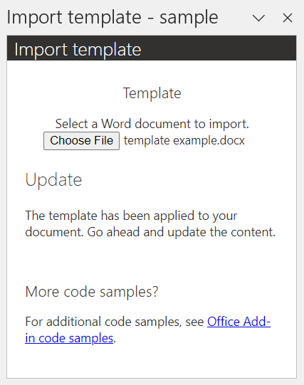
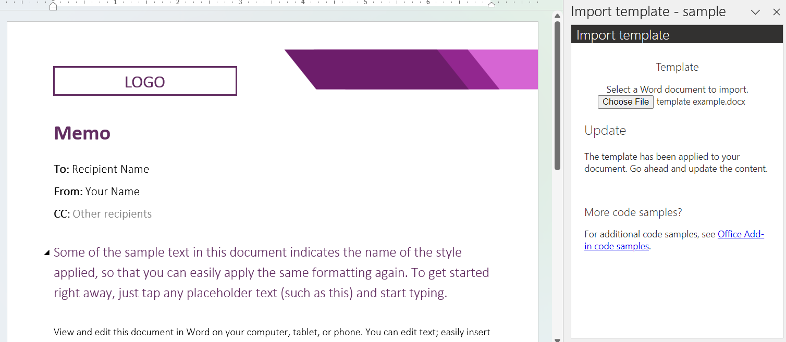

# Sample: Import a Word document template with a Word add-in

Templates enable users to quickly create consistent documents for their organizations. Templates can include company information and other critical details that users need for compliance, legal, or other reasons.

This article features a sample add-in that imports a .docx file to use as a template in a Word document. The add-in replaces the current document's content with the content from the template.

## Prerequisites

- Office connected to a Microsoft 365 subscription (including Office on the web).

## Run the sample code

The sample code for this article is named [Import templates in a Word document](https://github.com/OfficeDev/Office-Add-in-samples/tree/main/Samples/word-import-template). To run the sample, follow the instructions in the [readme](https://github.com/OfficeDev/Office-Add-in-samples/tree/main/Samples/word-import-template).

## Key steps in the sample

1. The user chooses a .docx file they'd like to use as a template.
1. The add-in reads the template .docx file then uses [Document.insertFileFromBase64](/javascript/api/word/word.document#word-word-document-insertfilefrombase64-member(1)) to replace the current document's content with the content from the template file.
1. The user can make updates to the content of the current document.

## Make it yours

The following are a few suggestions for how you could tailor this sample to your scenario.

### Manage user settings

[Enable single sign-on (SSO) in an Office Add-in](../develop/sso-in-office-add-ins.md) to support persisting user data and settings across multiple documents. If your service provides or hosts the bibliography library, an authorized user can access and select from that bibliography in their document.

You can also [persist add-in state and settings](../develop/persisting-add-in-state-and-settings.md) in the user's current document.

> [!CAUTION]
> Don't store sensitive information such as authentication tokens or connection strings. Properties in the document aren't encrypted or protected.

### Provide templates

Provide personalized or company-approved templates for users. These templates can be made accessible from a shared location as part of an authenticated experience.

You can use [content controls](/javascript/api/word/word.contentcontrol), [fields](/javascript/api/word/word.field), and other components as building blocks in your templates.

### Personalize templates

Allow users to personalize or refine templates. For templates that may be useful to others (on their team, in their company, etc.), users can upload to a shared location.

## See also

- [Office Add-in code samples](../overview/office-add-in-code-samples.md)
