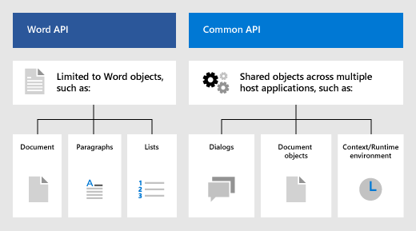

# Word JavaScript object model in Office Add-ins

This article describes concepts that are fundamental to using the [Word JavaScript API](../reference/overview/word-add-ins-reference-overview.md) to build add-ins. It introduces core concepts that are fundamental to using the API.

> [!IMPORTANT]
> See [Using the application-specific API model](../develop/application-specific-api-model.md) to learn about the asynchronous nature of the Word APIs and how they work with the document.

## Office.js APIs for Word

A Word add-in interacts with objects in Excel by using the Office JavaScript API, which includes two JavaScript object models:

* **Word JavaScript API**: The [Word JavaScript API](../reference/overview/word-add-ins-reference-overview.md) provides strongly-typed objects that you can use to access the document, ranges, tables, lists, formatting, and more.

* **Common APIs**: The [Common API](/javascript/api/office) can be used to access features such as UI, dialogs, and client settings that are common across multiple types of Office applications.

While you'll likely use the Word JavaScript API to develop the majority of functionality in add-ins that target Word, you'll also use objects in the Common API. For example:

* [Context](/javascript/api/office/office.context): The `Context` object represents the runtime environment of the add-in and provides access to key objects of the API. It consists of document configuration details such as `contentLanguage` and `officeTheme` and also provides information about the add-in's runtime environment such as `host` and `platform`. Additionally, it provides the `requirements.isSetSupported()` method, which you can use to check whether a specified requirement set is supported by the Excel application where the add-in is running.
* [Document](/javascript/api/office/office.document): The `Document` object provides the `getFileAsync()` method, which you can use to download the Word file where the add-in is running.

## Word-specific object model

To understand the Word APIs, you must understand how the components of a document are related to one another.

* The **Document** contains the **Section**s, and document-level entities such as settings and custom XML parts.
* A **Section** contains a **Body**.
* A **Body** gives access to **Paragraph**s, **ContentControl**s, and **Range** objects, among others.
* A **Range** represents a contiguous area of content, including text, white space, **Table**s, and images. It also contains most of the text manipulation methods.
* A **List** represents text in a numbered or bulleted list.

## See also

- [Word JavaScript API overview](../reference/overview/word-add-ins-reference-overview.md)
- [Build your first Word add-in](../quickstarts/word-quickstart.md)
- [Word add-in tutorial](../tutorials/word-tutorial.md)
- [Word JavaScript API reference](/javascript/api/word)
- [Learn about the Microsoft 365 Developer Program](https://developer.microsoft.com/microsoft-365/dev-program)
