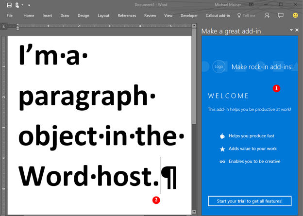

# Word add-ins overview

Do you want to create a solution that extends the functionality of Word - for example, one that involves automated document assembly, or that binds to and accesses data in a Word document from other data sources? You can use the Office Add-ins platform, which includes the Word JavaScript API and the JavaScript API for Office, to extend Word clients running on a Windows desktop, on a Mac, or in the cloud.

Word add-ins are one of the many development options that you have on the [Office Add-ins platform](../overview/office-add-ins.md). You can use add-in commands to extend the Word UI and launch task panes that run JavaScript that interacts with the content in a Word document. Any code that you can run in a browser can run in a Word add-in. Add-ins that interact with content in a Word document create requests to act on Word objects and synchronize object state. 

>**Note:** When you build your add-in, if you plan to [publish](../publish/publish.md) your add-in to the Office Store, make sure that you conform to the [Office Store validation policies](https://msdn.microsoft.com/en-us/library/jj220035.aspx). For example, to pass validation, your add-in must work across all platforms that support the methods that you define (for more information, see [section 4.12](https://msdn.microsoft.com/en-us/library/jj220035.aspx#Anchor_3) and the [Office Add-in host and availability page](https://dev.office.com/add-in-availability)).

The following figure shows an example of a Word add-in that runs in a task pane.

**Figure 1. Add-in running in a task pane in Word**



The Word add-in (1) can send requests to the Word document (2) and can use JavaScript to access the paragraph object and update, delete, or move the paragraph. For example, the following code shows how to append a new sentence to that paragraph.

```js
Word.run(function (context) {
    var paragraphs = context.document.getSelection().paragraphs;
    paragraphs.load();
    return context.sync().then(function () {
        paragraphs.items[0].insertText(' New sentence in the paragraph.',
                                       Word.InsertLocation.end);
    }).then(context.sync);
});

```

You can use any web server technology to host your Word add-in, such as ASP.NET, NodeJS, or Python. Use your favorite client-side framework -- Ember, Backbone, Angular, React -- or stick with VanillaJS to develop your solution and you can use services like Azure to [authenticate](../develop/use-the-oauth-authorization-framework-in-an-office-add-in.md) and host your application.

The Word JavaScript APIs give your application access to the objects and metadata found in a Word document. You can use these APIs to create add-ins that target:

* Word 2013 for Windows
* Word 2016 for Windows
* Word Online
* Word 2016 for Mac
* Word for iOS

Write your add-in once, and it will run in all versions of Word across multiple platforms. For details, see [Office Add-in host and platform availability](https://dev.office.com/add-in-availability).

## JavaScript APIs for Word

You can use two sets of JavaScript APIs to interact with the objects and metadata in a Word document. The first is the [JavaScript API for Office](https://dev.office.com/reference/add-ins/javascript-api-for-office?product=word), which was introduced in Office 2013. This is a shared API -- many of the objects can be used in add-ins hosted by two or more Office clients. This API uses callbacks extensively. 

The second is the [Word JavaScript API](../../reference/word/word-add-ins-reference-overview.md). This is a strongly-typed object model that you can use to create Word add-ins that target Word 2016 for Mac and Windows. This object model uses promises, and provides access to Word-specific objects like [body](../../reference/word/body.md), [content controls](../../reference/word/contentcontrol.md), [inline pictures](../../reference/word/inlinepicture.md), and [paragraphs](../../reference/word/paragraph.md). The Word JavaScript API includes TypeScript definitions and vsdoc files so that you can get code hints in your IDE.

Currently, all Word clients support the shared JavaScript API for Office, and most clients support the Word JavaScript API. For details about supported clients, see the [API reference documentation](https://dev.office.com/reference/add-ins/javascript-api-for-office?product=word).

We recommend that you start with the Word JavaScript API because the object model is easier to use. Use the Word JavaScript API if you need to:

* Access the objects in a Word document.

Use the shared JavaScript API for Office when you need to:

* Target Word 2013.
* Perform initial actions for the application.
* Check the supported requirement set.
* Access metadata, settings, and environmental information for the document.
* Bind to sections in a document and capture events.
* Use custom XML parts.
* Open a dialog box.

## Next steps

Ready to create your first Word add-in? See [Build your first Word add-in](word-add-ins.md). You can also try our interactive [Get started experience](http://dev.office.com/getting-started/addins?product=Word). Use the [add-in manifest](../overview/add-in-manifests.md) to describe where your add-in is hosted and how it is displayed, and define permissions and other information.

To learn more about how to design a world class Word add-in that creates a compelling experience for your users, see [Design guidelines](../design/add-in-design.md) and [Best practices](../design/add-in-development-best-practices.md).

After you develop your add-in, you can [publish](../publish/publish.md) it to a network share, to an app catalog, or to the Office Store.

## What's coming up for Word add-ins?

As we design and develop new APIs for Word add-ins, we'll make them available for your feedback on our [Open API specifications](../../reference/openspec.md) page. Find out what new features are in the pipeline for the Word JavaScript APIs, and provide your input on our design specifications.

You can also see what's new in the Word JavaScript API on the [change log](http://dev.office.com/changelog) page.

## Additional resources

* [Office Add-ins platform overview](../overview/office-add-ins.md)
* [Word JavaScript API reference](../../reference/word/word-add-ins-reference-overview.md)

