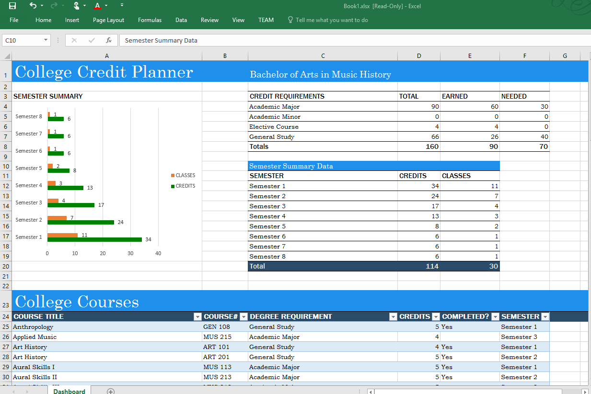
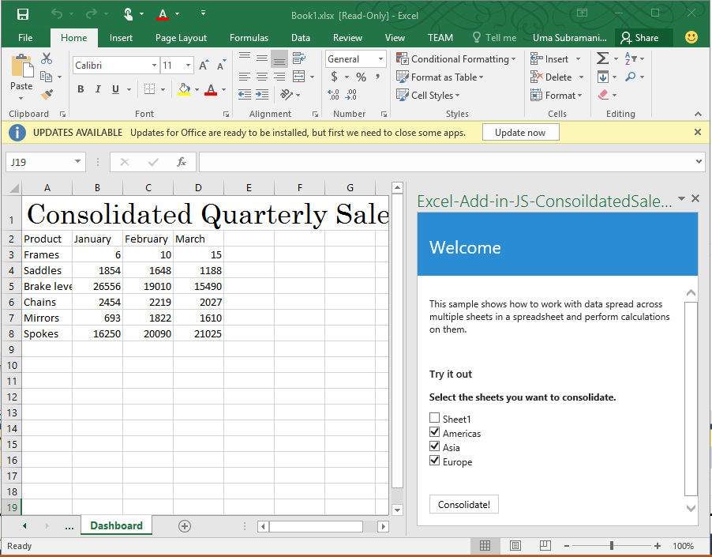

# Excel Add-in code samples

_Applies to: Excel 2016, Office 2016_

Add-in code samples that use the JavaScript API in Excel 2016 are listed below for quick reference. New samples are added frequently, so check back often.

**[Excel-Add-in-JS-QuarterlySalesReport](https://github.com/OfficeDev/Excel-Add-in-JS-QuarterlySalesReport)** : A simple task pane add-in that loads some data into a worksheet and creates a basic chart in Excel 2016. 

**[Excel-Add-in-JS-CollegeBudgetTracker](https://github.com/OfficeDev/Excel-Add-in-JS-CollegeBudgetTracker)** A task pane add-in that shows how to create a college budget tracker using the JavaScript APIs in Excel 2016. 

**[Excel-Add-in-JS-CollegeCreditsTracker](https://github.com/OfficeDev/Excel-Add-in-JS-CollegeCreditsTracker)** A task pane add-in that shows how to create a college credits tracker using the JavaScript APIs in Excel 2016. 

**[Excel-Add-in-JS-SheetSwitcher](https://github.com/OfficeDev/Excel-Add-in-JS-SheetSwitcher)** A task pane add-in that provides a way to add new sheets to a workbook and navigate to them in Excel 2016. 

**[Excel-Add-in-JS-ConsolidatedSalesReport](https://github.com/OfficeDev/Excel-Add-in-JS-ConsolidatedSalesReport)** A task pane add-in that shows how to consolidate data from multiple worksheets using the JavaScript APIs in Excel 2016. 

**[Excel-Add-in-JS-RangeHighlighter](https://github.com/OfficeDev/Excel-Add-in-JS-RangeHighlighter)** : A task pane add-in that shows how to do common operations using the Range API in Excel 2016.

We also a Snippet Explorer to let you browse through code snippets for common scenarios and learn how the new APIs work. Explore them [here](http://officesnippetexplorer.azurewebsites.net/#/snippets/excel). 

### Learn more

The Excel JavaScript APIs have much more to offer you as you develop add-ins. The following are just a few of the available resources. 

1.  [Build your first Excel Add-in](build-your-first-excel-add-in.md)
2.  [Excel Add-ins programming overview](excel-add-ins-programming-overview.md)
3.  [Excel Add-ins JavaScript API Reference](excel-add-ins-javascript-reference.md)