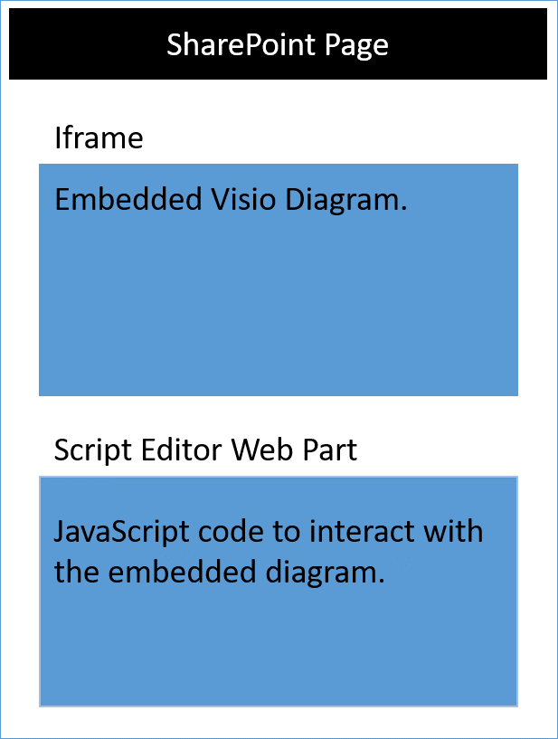

# Visio JavaScript APIs reference

>**Note:** The Visio JavaScript APIs are currently in preview and are subject to change. The Visio JavaScript APIs are not currently supported for use in production environments. 

You can use the Visio JavaScript APIs to embed Visio diagrams in SharePoint Online. An embedded Visio diagram is a diagram that is stored in a SharePoint document library and displayed on a SharePoint page. To embed a Visio diagram, display it in an HTML &lt;iframe&gt; element. Then you can use Visio JavaScript APIs to programmatically work with the embedded diagram.



You can use the Visio JavaScript APIs to:

* Interact with Visio diagram elements like pages and shapes 
* Create visual markup on the Visio diagram canvas 
* Write custom handlers for mouse events within the drawing 
* Expose diagram data, such as shape text, shape data, and hyperlinks, to your solution.

This article describes how to use the Visio JavaScript APIs with Visio Online to build your solutions for SharePoint Online. It introduces key concepts that are fundamental to using the APIs, such as **EmbeddedContext**, **RequestContext**, and JavaScript proxy objects, and the **sync()**, **Visio.run()**, and **load()** methods. The code examples show you how to apply these concepts.

## EmbeddedContext

The EmbeddedContext object initializes communication between the developer frame and the Visio Online frame.

```js
OfficeExtension.Embedded.getEmbeddedContext({
                sessionInfo: sessionInfo,
                timeoutInMilliseconds: 60000,
                forceRefresh: true
            })
```

## RequestContext

The RequestContext object facilitates requests to the Visio application. Because the developer frame and the Visio Online application run in two different iframes, request context is required to get access to Visio and related objects such as pages and shapes, from the developer frame. The following example shows how to create a request context.

```js
var ctx = new Visio.RequestContext();
```

## Proxy objects

The Visio JavaScript objects declared and used in an add-in are proxy objects for the real objects in a Visio document. All actions taken on proxy objects are not realized in Visio, and the state of the Visio document is not realized in the proxy objects until the document state has been synchronized. The document state is synchronized when ```context.sync()``` is run.

For example, the local JavaScript object getActivePage is declared to reference the selected page. This can be used to queue the setting of its properties and invoking methods. The actions on such objects are not realized until the sync() method is run.

```js
var activePage = ctx.document.getActivePage();
```

## sync()

The **sync()** method, available on the request context, synchronizes the state between JavaScript proxy objects and real objects in Visio by executing instructions queued on the context and retrieving properties of loaded Office objects for use in your code. This method returns a promise, which is resolved when synchronization is complete. 

## Visio.run(function(context) { batch })

**Visio.run()** executes a batch script that performs actions on the Visio object model. The batch commands include definitions of local JavaScript proxy objects and **sync()** methods that synchronize the state between local and Visio objects and promise resolution. The advantage of batching requests in **Visio.run()** is that when the promise is resolved, any tracked page objects that were allocated during the execution will be automatically released.
The run method takes in RequestContext and returns a promise (typically, just the result of **ctx.sync()**). It is possible to run the batch operation outside of the **Visio.run()**. However, in such a scenario, any page object references needs to be manually tracked and managed. 

## load()

The **load()** method is used to fill in the proxy objects created in the add-in JavaScript layer. When trying to retrieve an object such as a document, a local proxy object is created first in the JavaScript layer. Such an object can be used to queue the setting of its properties and invoking methods. However, for reading object properties or relations, the **load()** and **sync()** methods need to be invoked first. The load() method takes in the properties and relations that need to be loaded when the **sync()** method is called.

The following shows the syntax for the **load()** method.

```js
object.load(string: properties); //or object.load(array: properties); //or object.load({loadOption});
```

1. **properties** is the list of properties and/or relationship names to be loaded, specified as comma-delimited strings or array of names. See **.load()** methods under each object for details.
2. **loadOption** specifies an object that describes the selection, expansion, top, and skip options. See object load [options](https://dev.office.com/reference/add-ins/excel/loadoption) for details.

## Example: Printing all shapes text in active page

The following example shows you how to print shape text value from an array shapes object. 
The **Visio.run()** method contains a batch of instructions. As part of this batch, a proxy object is created that references shapes on the active document.
All these commands are queued and run when **ctx.sync()** is called. The **sync()** method returns a promise that can be used to chain it with other operations.

```js
Visio.run(function (ctx) {
   var page = ctx.document.getActivePage();
   var shapes = page.shapes;
   shapes.load();
   return ctx.sync().then(function () {
        for(var i=0; i<shapes.items.length;i++)
 {
            var shape = shapes.items[i];
     console.log("Shape Text: " + shape.text );
 }
});
}).catch(function(error) {
  richApiLog("Error: " + error);
  if (error instanceof OfficeExtension.Error) {
       console.log ("Debug info: " + JSON.stringify(error.debugInfo));
  }
});
```

## Error messages

Errors are returned using an error object that consists of a code and a message. The following table provides a list of possible error conditions that can occur.

| error.code            | error.message |
|-----------------------|----------------------------------------------------------------|
|  InvalidArgument      | The argument is invalid or missing or has an incorrect format. |
| GeneralException      | There was an internal error while processing the request. |
| NotImplemented        | The requested feature isn't implemented.  |
| UnsupportedOperation  | The operation being attempted is not supported. |
| AccessDenied          | You cannot perform the requested operation. |
| ItemNotFound          | The requested resource doesn't exist. |

## Get started

You can use the example in this section to get started. This example shows you how to display the shape text of the selected shape.
To begin, create a page in SharePoint Online or edit an existing page. Add a script editor webpart on the page, and copy and paste the following code. After that, all you need is to add the URL of a Visio diagram that is stored in SharePoint Online.

```js
<script src='https://visioonlineapi.azurewebsites.net/visio.embed.js' type='text/javascript'/> </script> 
 
Enter Visio File Url:<br/> 
<script language="javascript"> 
document.write("<input type='text' id='fileUrl' size='120'/>"); 
document.write("<input type='button' value='InitEmbeddedFrame' onclick='initEmbeddedFrame()' />"); 
document.write("<br />"); 
document.write("<input type='button' value='SelectedShapeText' onclick='getSelectedShapeText()' />"); 
document.write("<textarea id='ResultOutput' style='width:350px;height:60px'> </textarea>"); 
document.write("<div id='iframeHost' />"); 
 
var textArea; 
// Loads the Visio application and Initializes communication between developer frame and Visio online frame 
function initEmbeddedFrame() { 
        textArea = document.getElementById('ResultOutput'); 
 var sessionInfo = Math.random().toString(); 
 var origin = window.location["origin"] || window.location.protocol + "//" + window.location.host; 
 var iframeElement =  document.createElement("iframe"); 
 iframeElement.id = "embed-iframe"; 
 iframeElement.style.height = "900px"; 
 iframeElement.style.width = "100%"; 
 var url = document.getElementById('fileUrl').value; 
 if (!url) { 
     window.alert("File URL should not be empty"); 
 } 
 // APIs are enabled for EmbedView action only.    
 url = url.replace("action=view","action=embedview"); 
 url = url.replace("action=interactivepreview","action=embedview"); 
     
 iframeElement.src = url + "&EmbeddingPageOrigin=" + encodeURIComponent(origin) + "&EmbeddingPageSessionInfo=" + encodeURIComponent(sessionInfo); 
     // load the Visio online application in Iframe     
 document.getElementById("iframeHost").appendChild(iframeElement);   
          
      OfficeExtension.Embedded.getEmbeddedContext({ 
      sessionInfo: sessionInfo, 
     timeoutInMilliseconds: 60000, 
      forceRefresh: true 
 }).then(function (context) { 
     // Initilization is successful  
     OfficeExtension.Embedded._initInternalConfiguration("webembedrichapi.debug.js"); 
     textArea.value  = "Initilization is successful"; 
  }).catch(function (ex) { 
           // Initilization is failed :-( 
     textArea.value  = "Initilization is failed :-("; 
        }); 
     } 
 
// Code for getting selected Shape Text using the shapes collection object 
function getSelectedShapeText() { 
    Visio.run(function (ctx) {   
    var page = ctx.document.getActivePage(); 
     var shapes = page.shapes; 
       shapes.load(); 
           return ctx.sync().then(function () { 
          textArea.value = "Please select a Shape in the Diagram"; 
          for(var i=0; i<shapes.items.length;i++) 
      { 
         var shape = shapes.items[i]; 
                if ( shape.select == true) 
            { 
             textArea.value = shape.text; 
                 return; 
                } 
      } 
   }); 
     }).catch(function(error) { 
  textArea.value = "Error: "; 
  if (error instanceof OfficeExtension.Error) { 
   textArea.value += "Debug info: " + JSON.stringify(error.debugInfo); 
  } 
    }); 
} 
```

## Open API specifications

As we design and develop new APIs, we'll make them available for your feedback on our [Open API specifications](https://dev.office.com/reference/add-ins/openspec) page. Find out what new features are in the pipeline, and provide your input on our design specifications. 
